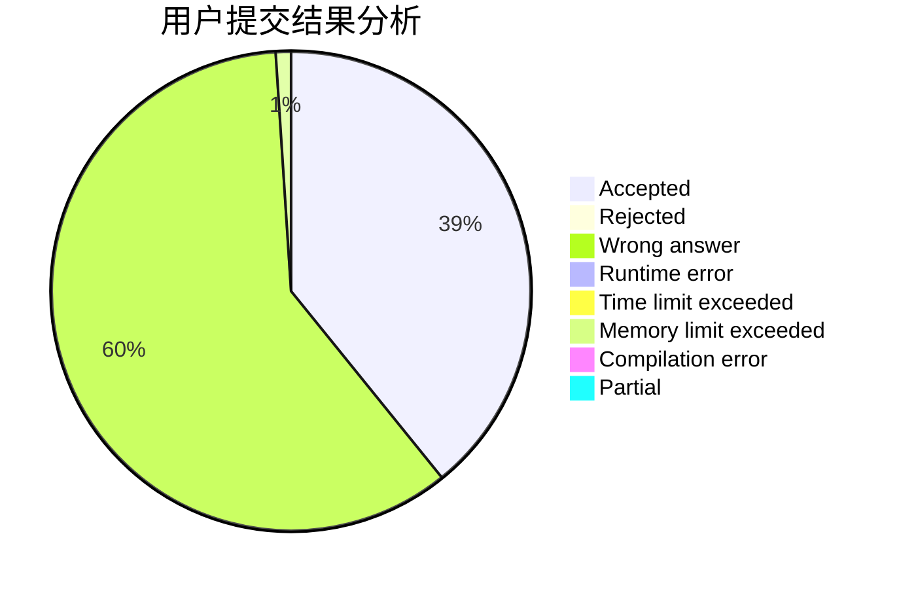
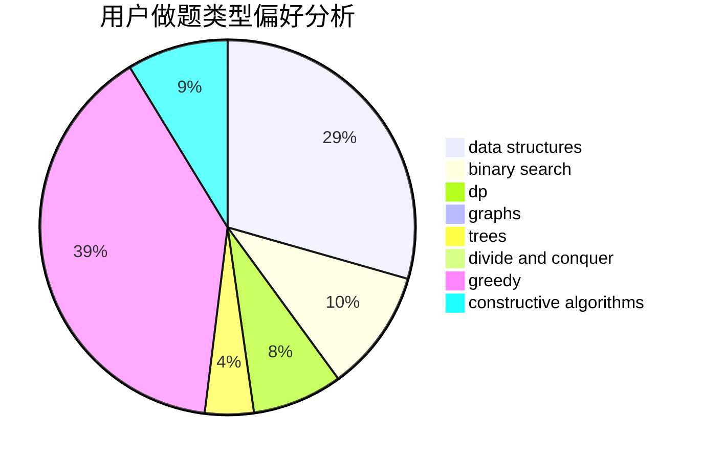

# huangda_

<!-- tabs:start -->

#### **用户提交结果分析**

#### **用户做题类型偏好分析**

#### **用户错题知识点分析**

<!-- tabs:end -->
# 推荐题目
[764A](https://codeforces.com/contest/764/problem/A)		brute force,
                        implementation,
                        math		  
[1295D](https://codeforces.com/contest/1295/problem/D)		math,
                        number theory		  
[1220E](https://codeforces.com/contest/1220/problem/E)		dfs and similar,
                        dp,
                        dsu,
                        graphs,
                        greedy,
                        trees		  
[25D](https://codeforces.com/contest/25/problem/D)		dsu,
                        graphs,
                        trees		  
[810A](https://codeforces.com/contest/810/problem/A)		implementation,
                        math		  
[456B](https://codeforces.com/contest/456/problem/B)		math,
                        number theory		  
[776D](https://codeforces.com/contest/776/problem/D)		2-sat,
                        dfs and similar,
                        dsu,
                        graphs		  
[1431D](https://codeforces.com/contest/1431/problem/D)		*special problem,
                        greedy		  
[13577](https://codeforces.com/contest/1357/problem/7)		dsu,graphs,sortings,trees		  
[1207F](https://codeforces.com/contest/1207/problem/F)		brute force,
                        data structures,
                        implementation		  
