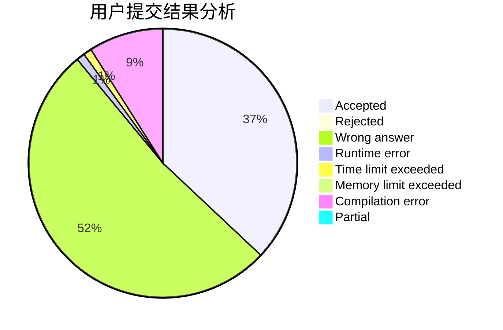
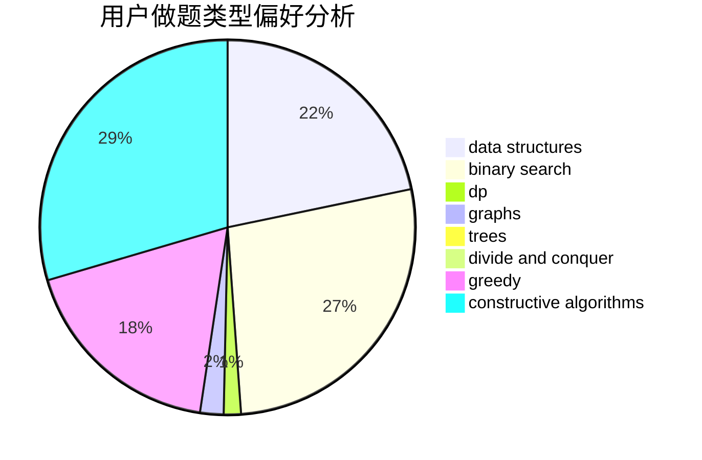
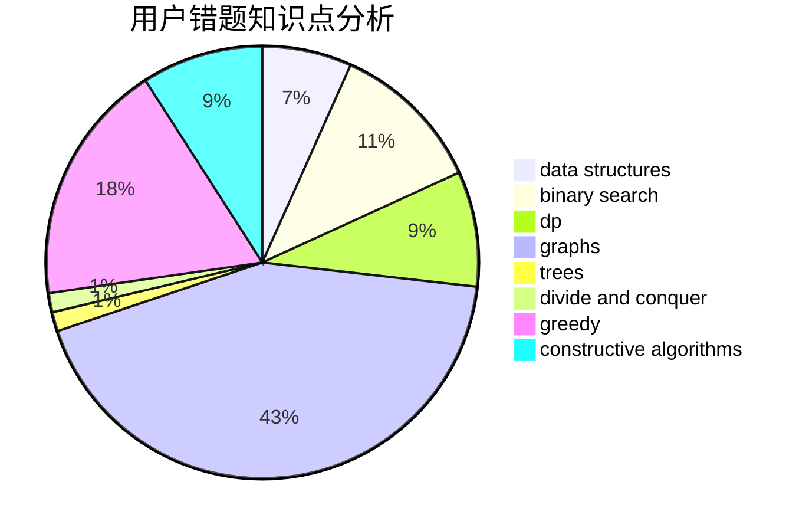

# Barry_W

<!-- tabs:start -->

#### **用户提交结果分析**

#### **用户做题类型偏好分析**

#### **用户错题知识点分析**

<!-- tabs:end -->
# 推荐题目
[148A](https://codeforces.com/contest/148/problem/A)		constructive algorithms,
                        implementation,
                        math		  
[451E](https://codeforces.com/contest/451/problem/E)		bitmasks,
                        combinatorics,
                        number theory		  
[1065B](https://codeforces.com/contest/1065/problem/B)		constructive algorithms,
                        graphs		  
[1053E](https://codeforces.com/contest/1053/problem/E)		constructive algorithms,
                        trees		  
[484E](https://codeforces.com/contest/484/problem/E)		binary search,
                        constructive algorithms,
                        data structures		  
[1089M](https://codeforces.com/contest/1089/problem/M)		constructive algorithms,
                        graphs		  
[125D](https://codeforces.com/contest/125/problem/D)		constructive algorithms,
                        greedy		  
[484A](https://codeforces.com/contest/484/problem/A)		bitmasks,
                        constructive algorithms		  
[483B](https://codeforces.com/contest/483/problem/B)		binary search,
                        math		  
[486A](https://codeforces.com/contest/486/problem/A)		implementation,
                        math		  
