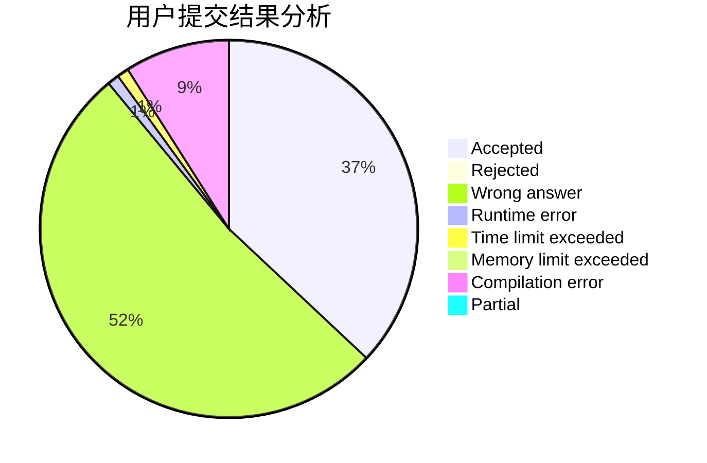
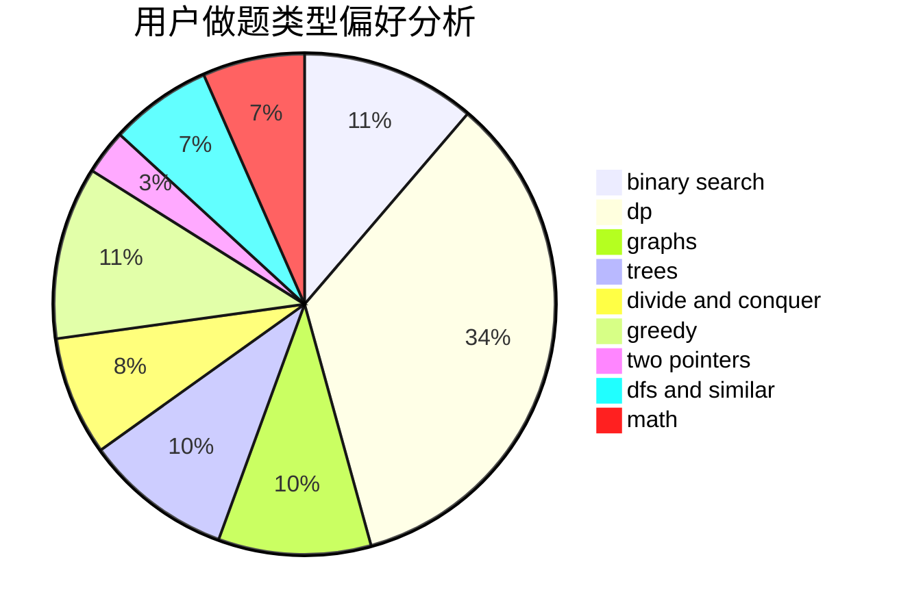

# Barry_W

<!-- tabs:start -->

#### **用户提交结果分析**

#### **用户做题类型偏好分析**

<!-- tabs:end -->
# 推荐题目
[1498C](https://codeforces.com/contest/1498/problem/C)
[472G](https://codeforces.com/contest/472/problem/G)
[1065F](https://codeforces.com/contest/1065/problem/F)
[1054C](https://codeforces.com/contest/1054/problem/C)
[506A](https://codeforces.com/contest/506/problem/A)
[1090B](https://codeforces.com/contest/1090/problem/B)
[1265D](https://codeforces.com/contest/1265/problem/D)
[505B](https://codeforces.com/contest/505/problem/B)
[504A](https://codeforces.com/contest/504/problem/A)
[506D](https://codeforces.com/contest/506/problem/D)
