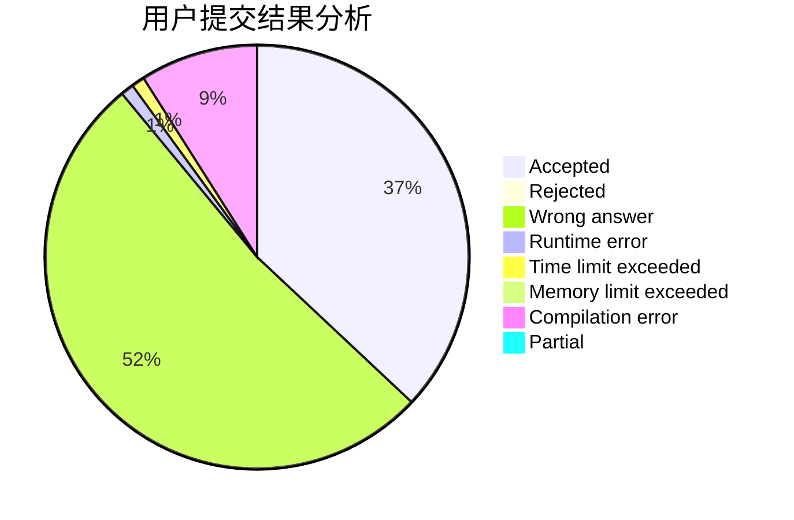
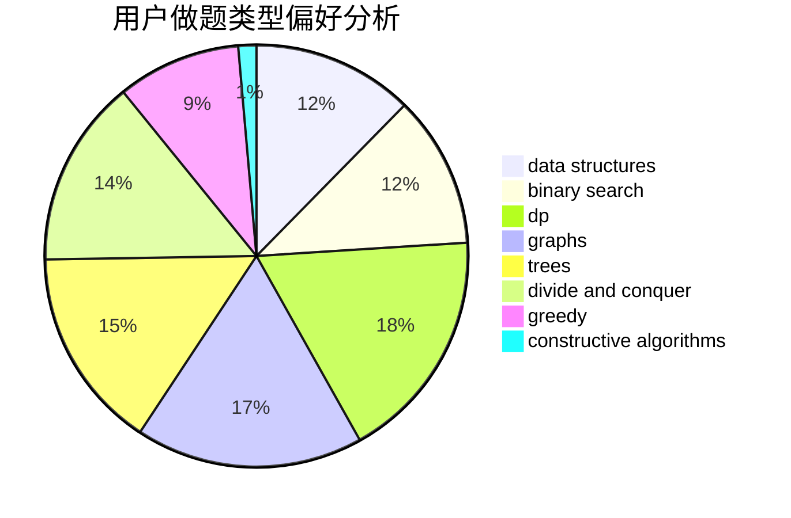
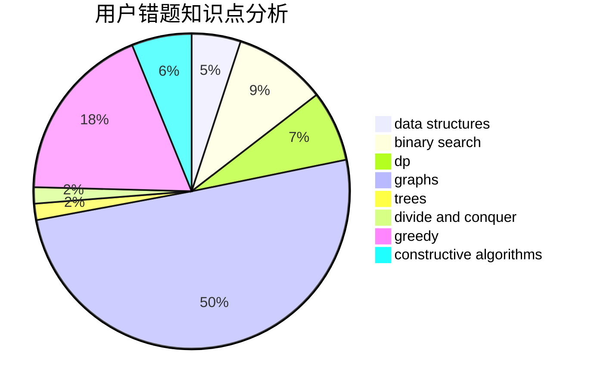

# Barry_W

<!-- tabs:start -->

#### **用户提交结果分析**

#### **用户做题类型偏好分析**

#### **用户错题知识点分析**

<!-- tabs:end -->
# 推荐题目
[1498C](https://codeforces.com/contest/1498/problem/C)		brute force,
                        data structures,
                        dp		  
[472G](https://codeforces.com/contest/472/problem/G)		bitmasks,
                        data structures,
                        fft		  
[1065F](https://codeforces.com/contest/1065/problem/F)		dfs and similar,
                        dp,
                        trees		  
[1054C](https://codeforces.com/contest/1054/problem/C)		constructive algorithms,
                        implementation		  
[506A](https://codeforces.com/contest/506/problem/A)		dsu,graphs,sortings,trees		  
[1090B](https://codeforces.com/contest/1090/problem/B)		nan		  
[1265D](https://codeforces.com/contest/1265/problem/D)		dsu,graphs,sortings,trees		  
[505B](https://codeforces.com/contest/505/problem/B)		dfs and similar,
                        dp,
                        dsu,
                        graphs		  
[504A](https://codeforces.com/contest/504/problem/A)		dsu,graphs,sortings,trees		  
[506D](https://codeforces.com/contest/506/problem/D)		brute force,
                        dfs and similar,
                        dsu,
                        graphs		  
