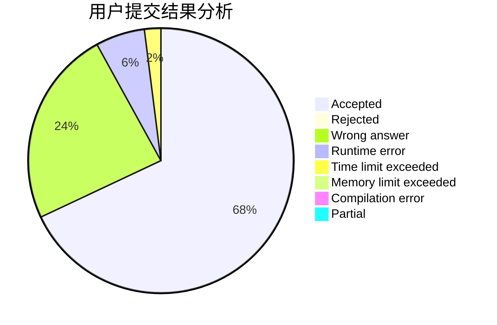
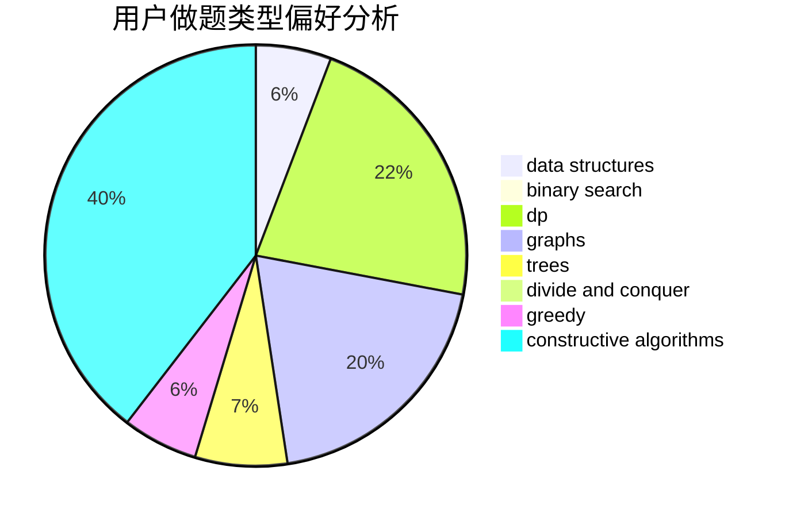
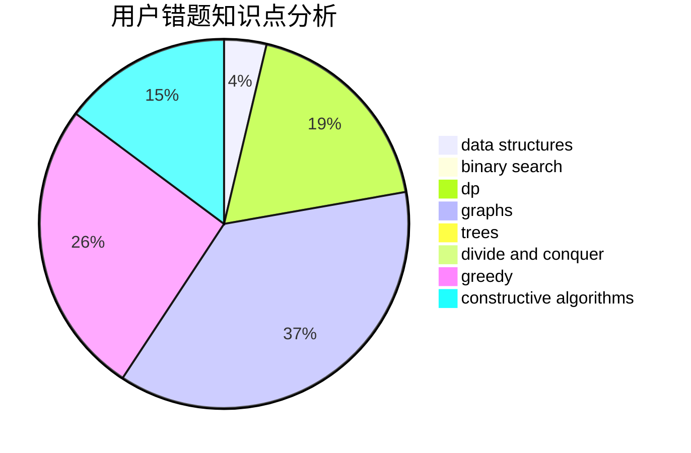

# huangdadaplus

<!-- tabs:start -->

#### **用户提交结果分析**

#### **用户做题类型偏好分析**

#### **用户错题知识点分析**

<!-- tabs:end -->
# 推荐题目
[717E](https://codeforces.com/contest/717/problem/E)		dfs and similar		  
[975D](https://codeforces.com/contest/975/problem/D)		geometry,
                        math		  
[106B](https://codeforces.com/contest/106/problem/B)		brute force,
                        implementation		  
[325E](https://codeforces.com/contest/325/problem/E)		combinatorics,
                        dfs and similar,
                        dsu,
                        graphs,
                        greedy		  
[276E](https://codeforces.com/contest/276/problem/E)		data structures,
                        graphs,
                        trees		  
[513A](https://codeforces.com/contest/513/problem/A)		constructive algorithms,
                        math		  
[935C](https://codeforces.com/contest/935/problem/C)		geometry		  
[39D](https://codeforces.com/contest/39/problem/D)		math		  
[1331A](https://codeforces.com/contest/1331/problem/A)		nan		  
[1255D](https://codeforces.com/contest/1255/problem/D)		dsu,graphs,sortings,trees		  
