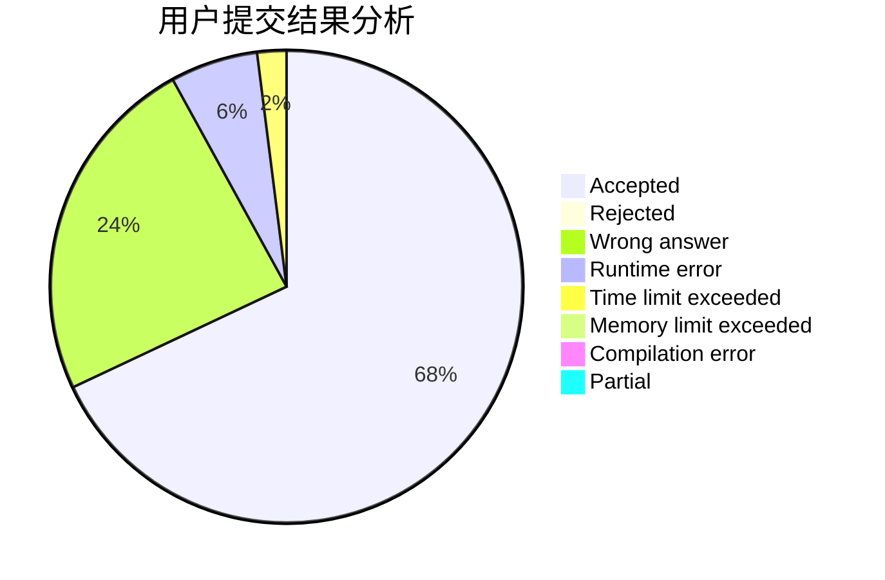
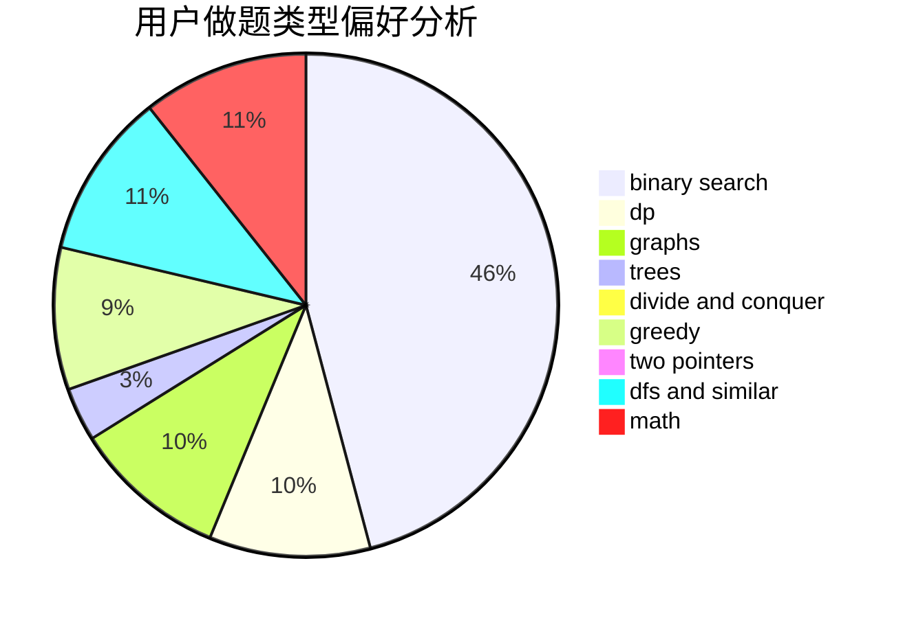

# huangdadaplus

<!-- tabs:start -->

#### **用户提交结果分析**

#### **用户做题类型偏好分析**

<!-- tabs:end -->
# 推荐题目
[717E](https://codeforces.com/contest/717/problem/E)
[975D](https://codeforces.com/contest/975/problem/D)
[106B](https://codeforces.com/contest/106/problem/B)
[325E](https://codeforces.com/contest/325/problem/E)
[276E](https://codeforces.com/contest/276/problem/E)
[513A](https://codeforces.com/contest/513/problem/A)
[935C](https://codeforces.com/contest/935/problem/C)
[39D](https://codeforces.com/contest/39/problem/D)
[1331A](https://codeforces.com/contest/1331/problem/A)
[1255D](https://codeforces.com/contest/1255/problem/D)
