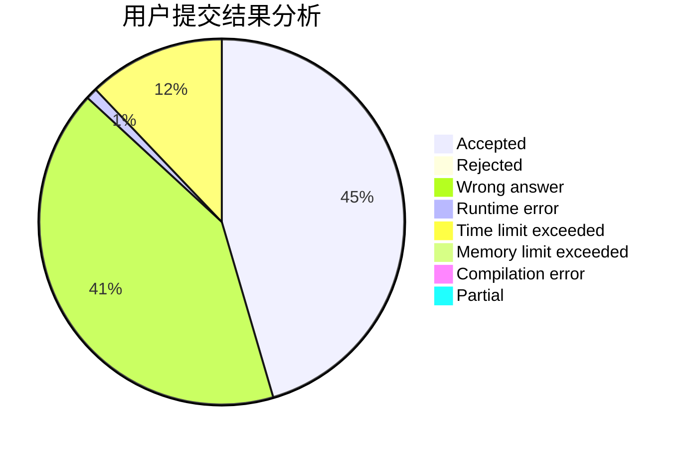
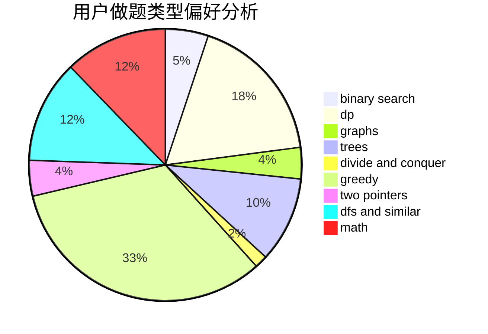

# huangtiehao

<!-- tabs:start -->

#### **用户提交结果分析**

#### **用户做题类型偏好分析**

<!-- tabs:end -->
# 推荐题目
[1391A](https://codeforces.com/contest/1391/problem/A)
[218B](https://codeforces.com/contest/218/problem/B)
[704E](https://codeforces.com/contest/704/problem/E)
[49A](https://codeforces.com/contest/49/problem/A)
[1137B](https://codeforces.com/contest/1137/problem/B)
[795K](https://codeforces.com/contest/795/problem/K)
[963B](https://codeforces.com/contest/963/problem/B)
[10024](https://codeforces.com/contest/1002/problem/4)
[1008E](https://codeforces.com/contest/1008/problem/E)
[1015B](https://codeforces.com/contest/1015/problem/B)
