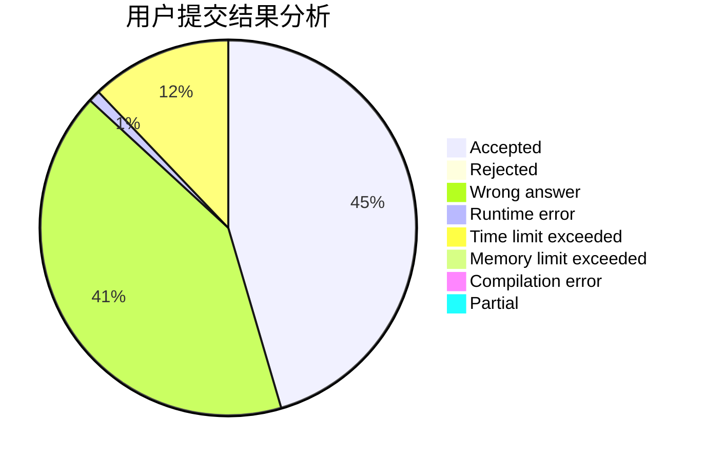
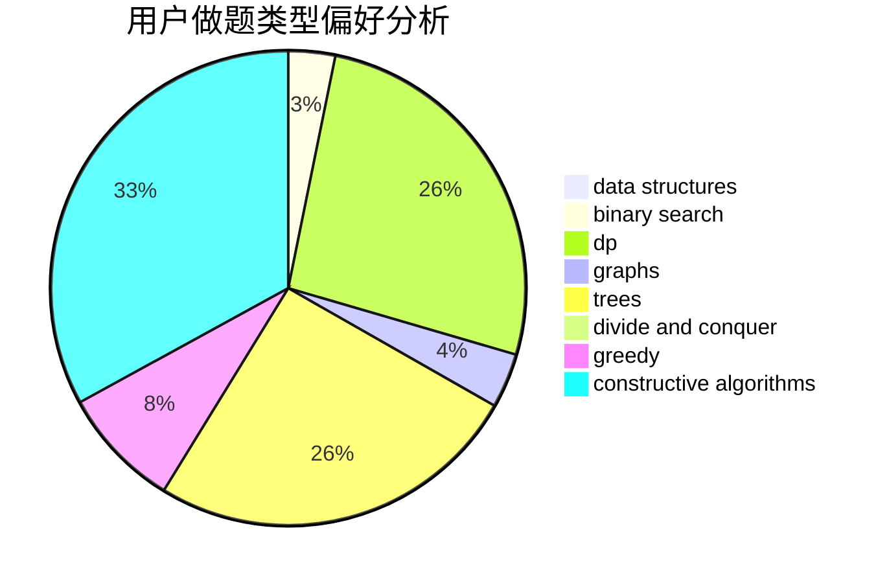
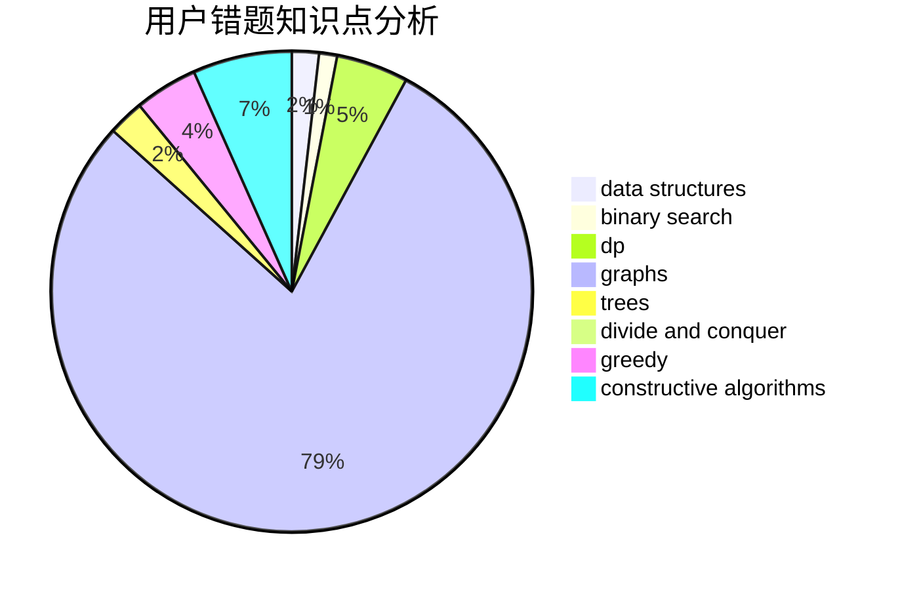

# huangtiehao

<!-- tabs:start -->

#### **用户提交结果分析**

#### **用户做题类型偏好分析**

#### **用户错题知识点分析**

<!-- tabs:end -->
# 推荐题目
[1380G](https://codeforces.com/contest/1380/problem/G)		greedy,
                        math,
                        probabilities		  
[195B](https://codeforces.com/contest/195/problem/B)		data structures,
                        implementation,
                        math		  
[681A](https://codeforces.com/contest/681/problem/A)		implementation		  
[479B](https://codeforces.com/contest/479/problem/B)		brute force,
                        constructive algorithms,
                        greedy,
                        implementation,
                        sortings		  
[1133A](https://codeforces.com/contest/1133/problem/A)		implementation		  
[777C](https://codeforces.com/contest/777/problem/C)		binary search,
                        data structures,
                        dp,
                        greedy,
                        implementation,
                        two pointers		  
[946E](https://codeforces.com/contest/946/problem/E)		greedy,
                        implementation		  
[1002C2](https://codeforces.com/contest/1002C/problem/2)		nan		  
[1008B](https://codeforces.com/contest/1008/problem/B)		greedy,
                        sortings		  
[1015A](https://codeforces.com/contest/1015/problem/A)		implementation		  
