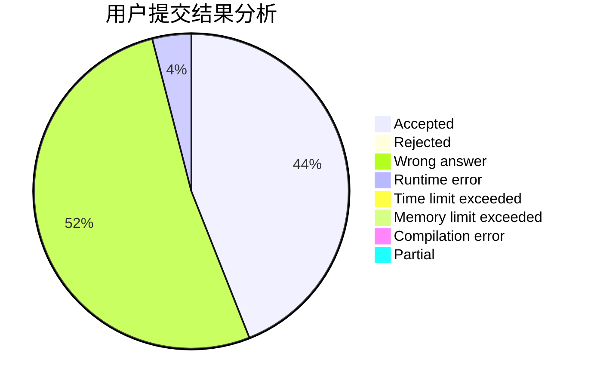
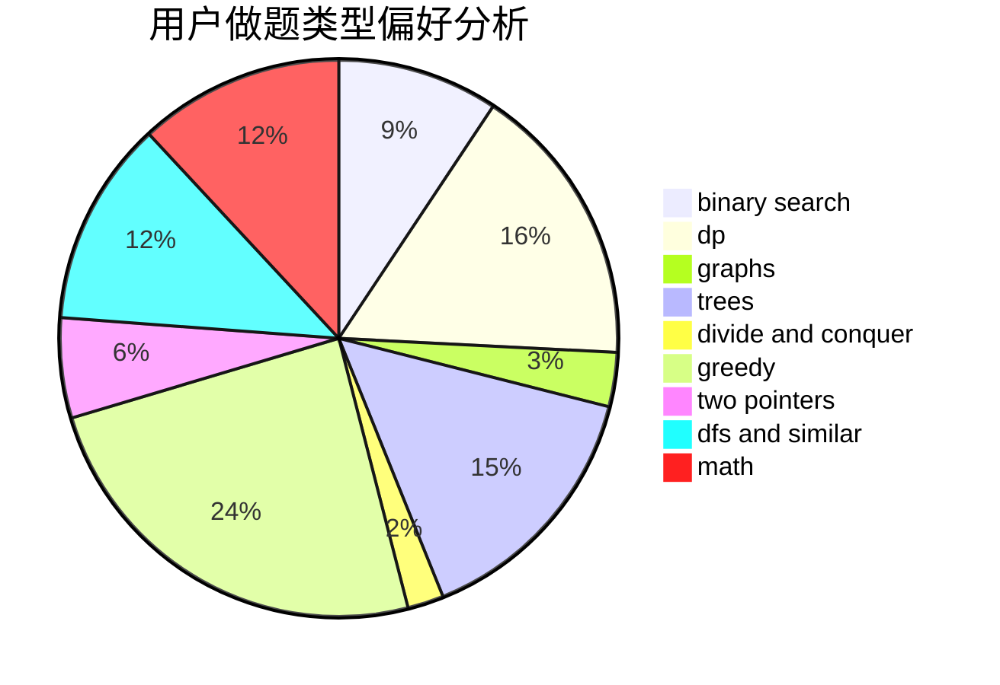

# huangxubin

<!-- tabs:start -->

#### **用户提交结果分析**

#### **用户做题类型偏好分析**

<!-- tabs:end -->
# 推荐题目
[1481F](https://codeforces.com/contest/1481/problem/F)
[306D](https://codeforces.com/contest/306/problem/D)
[182D](https://codeforces.com/contest/182/problem/D)
[291A](https://codeforces.com/contest/291/problem/A)
[11892](https://codeforces.com/contest/1189/problem/2)
[356A](https://codeforces.com/contest/356/problem/A)
[1085B](https://codeforces.com/contest/1085/problem/B)
[379D](https://codeforces.com/contest/379/problem/D)
[1271F](https://codeforces.com/contest/1271/problem/F)
[817B](https://codeforces.com/contest/817/problem/B)
