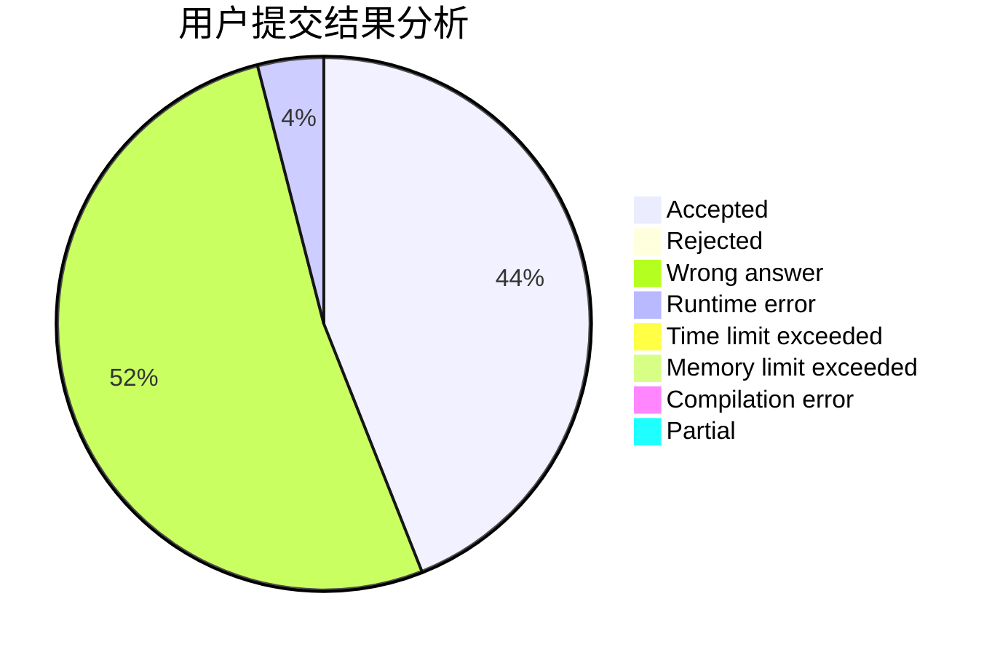
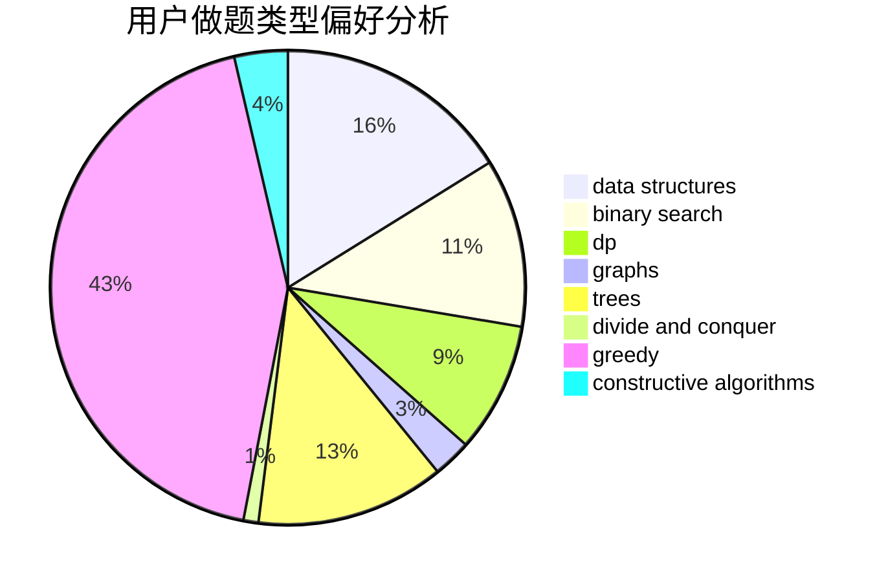
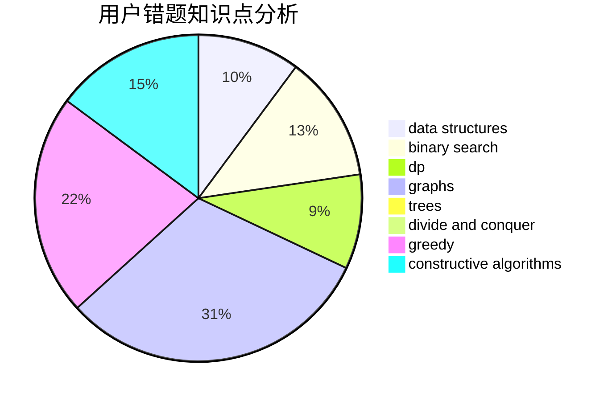

# huangxubin
<!-- tabs:start -->
#### **用户提交结果分析**

#### **用户做题类型偏好分析**

#### **用户错题知识点分析**

<!-- tabs:end -->
# 推荐题目
[Industrial Nim](http://codeforces.com/problemset/problem/15/C)		games		  
[SMSC](http://codeforces.com/problemset/problem/292/A)		implementation		  
[Little Girl and Maximum XOR](http://codeforces.com/problemset/problem/276/D)		bitmasks,
                        dp,
                        greedy,
                        implementation,
                        math		  
[Misha and Palindrome Degree](https://codeforces.com/contest/504/problem/C)		binary search,
                        combinatorics,
                        implementation		  
[The Fair Nut and String](http://codeforces.com/problemset/problem/1084/C)		combinatorics,
                        dp,
                        implementation		  
[Spaceship Solitaire](http://codeforces.com/problemset/problem/1266/E)		data structures,
                        greedy,
                        implementation		  
[Broken Keyboard](http://codeforces.com/problemset/problem/1251/A)		brute force,
                        strings,
                        two pointers		  
[Have You Ever Heard About the Word?](http://codeforces.com/problemset/problem/319/D)		greedy,
                        hashing,
                        string suffix structures,
                        strings		  
[Fox and Number Game](http://codeforces.com/problemset/problem/389/A)		greedy,
                        math		  
[Great Vova Wall (Version 1)](http://codeforces.com/problemset/problem/1092/D1)		greedy,
                        implementation,
                        math		  
<!-- tabs:start -->
#### **data structures**
[Industrial Nim](http://codeforces.com/problemset/problem/1266/E)		data structures,
                        greedy,
                        implementation		  
[SMSC](http://codeforces.com/problemset/problem/930/D)		data structures,
                        games,
                        implementation		  
[Little Girl and Maximum XOR](http://codeforces.com/problemset/problem/909/D)		data structures,
                        greedy,
                        implementation		  
[Misha and Palindrome Degree](http://codeforces.com/problemset/problem/1042/F)		data structures,
                        dfs and similar,
                        dsu,
                        graphs,
                        greedy,
                        sortings,
                        trees		  
[The Fair Nut and String](https://codeforces.com/contest/1150/problem/E)		data structures,
                        implementation,
                        trees		  
[Spaceship Solitaire](http://codeforces.com/problemset/problem/241/B)		binary search,
                        bitmasks,
                        data structures,
                        math		  
[Broken Keyboard](https://codeforces.com/contest/1350/problem/C)		data structures,
                        math,
                        number theory		  
[Have You Ever Heard About the Word?](http://codeforces.com/problemset/problem/903/G)		data structures,
                        flows,
                        graphs		  
[Fox and Number Game](http://codeforces.com/problemset/problem/1296/E2)		data structures,
                        dp		  
[Great Vova Wall (Version 1)](http://codeforces.com/problemset/problem/1492/C)		binary search,
                        data structures,
                        dp,
                        greedy,
                        two pointers		  
#### **binary search**
[Industrial Nim](https://codeforces.com/contest/504/problem/C)		binary search,
                        combinatorics,
                        implementation		  
[SMSC](http://codeforces.com/problemset/problem/553/D)		binary search,
                        graphs,
                        greedy		  
[Little Girl and Maximum XOR](http://codeforces.com/problemset/problem/241/B)		binary search,
                        bitmasks,
                        data structures,
                        math		  
[Misha and Palindrome Degree](http://codeforces.com/problemset/problem/1426/C)		binary search,
                        constructive algorithms,
                        math		  
[The Fair Nut and String](http://codeforces.com/problemset/problem/912/E)		binary search,
                        dfs and similar,
                        math,
                        meet-in-the-middle,
                        number theory,
                        two pointers		  
[Spaceship Solitaire](http://codeforces.com/problemset/problem/1492/C)		binary search,
                        data structures,
                        dp,
                        greedy,
                        two pointers		  
[Broken Keyboard](http://codeforces.com/problemset/problem/1463/D)		binary search,
                        constructive algorithms,
                        greedy,
                        two pointers		  
[Have You Ever Heard About the Word?](http://codeforces.com/problemset/problem/1490/G)		binary search,
                        data structures,
                        math		  
[Fox and Number Game](http://codeforces.com/problemset/problem/1479/D)		binary search,
                        bitmasks,
                        brute force,
                        data structures,
                        probabilities,
                        trees		  
[Great Vova Wall (Version 1)](http://codeforces.com/problemset/problem/1436/E)		binary search,
                        data structures,
                        two pointers		  
#### **dp**
[Industrial Nim](http://codeforces.com/problemset/problem/276/D)		bitmasks,
                        dp,
                        greedy,
                        implementation,
                        math		  
[SMSC](http://codeforces.com/problemset/problem/1084/C)		combinatorics,
                        dp,
                        implementation		  
[Little Girl and Maximum XOR](https://codeforces.com/contest/352/problem/E)		dp,
                        matrices		  
[Misha and Palindrome Degree](http://codeforces.com/problemset/problem/1401/D)		dfs and similar,
                        dp,
                        greedy,
                        implementation,
                        math,
                        number theory,
                        sortings,
                        trees		  
[The Fair Nut and String](http://codeforces.com/problemset/problem/1296/E2)		data structures,
                        dp		  
[Spaceship Solitaire](https://codeforces.com/contest/1405/problem/D)		dfs and similar,
                        dp,
                        games,
                        trees		  
[Broken Keyboard](http://codeforces.com/problemset/problem/1389/B)		brute force,
                        dp,
                        greedy		  
[Have You Ever Heard About the Word?](http://codeforces.com/problemset/problem/1492/C)		binary search,
                        data structures,
                        dp,
                        greedy,
                        two pointers		  
[Fox and Number Game](https://codeforces.com/contest/1457/problem/C)		brute force,
                        dp,
                        implementation		  
[Great Vova Wall (Version 1)](http://codeforces.com/problemset/problem/1491/C)		brute force,
                        data structures,
                        dp,
                        greedy,
                        implementation		  
#### **graph**
[Industrial Nim](http://codeforces.com/problemset/problem/1283/D)		graphs,
                        greedy,
                        shortest paths		  
[SMSC](http://codeforces.com/problemset/problem/1042/F)		data structures,
                        dfs and similar,
                        dsu,
                        graphs,
                        greedy,
                        sortings,
                        trees		  
[Little Girl and Maximum XOR](http://codeforces.com/problemset/problem/553/D)		binary search,
                        graphs,
                        greedy		  
[Misha and Palindrome Degree](https://codeforces.com/contest/602/problem/C)		graphs,
                        shortest paths		  
[The Fair Nut and String](http://codeforces.com/problemset/problem/325/E)		combinatorics,
                        dfs and similar,
                        dsu,
                        graphs,
                        greedy		  
[Spaceship Solitaire](http://codeforces.com/problemset/problem/580/C)		dfs and similar,
                        graphs,
                        trees		  
[Broken Keyboard](http://codeforces.com/problemset/problem/903/G)		data structures,
                        flows,
                        graphs		  
[Have You Ever Heard About the Word?](http://codeforces.com/problemset/problem/744/A)		dfs and similar,
                        graphs		  
[Fox and Number Game](http://codeforces.com/problemset/problem/1487/C)		brute force,
                        constructive algorithms,
                        dfs and similar,
                        graphs,
                        greedy,
                        implementation,
                        math		  
[Great Vova Wall (Version 1)](http://codeforces.com/problemset/problem/1437/C)		dp,
                        flows,
                        graph matchings,
                        greedy,
                        math,
                        sortings		  
#### **trees**
[Industrial Nim](https://codeforces.com/contest/1086/problem/B)		constructive algorithms,
                        implementation,
                        trees		  
[SMSC](http://codeforces.com/problemset/problem/1042/F)		data structures,
                        dfs and similar,
                        dsu,
                        graphs,
                        greedy,
                        sortings,
                        trees		  
[Little Girl and Maximum XOR](https://codeforces.com/contest/1150/problem/E)		data structures,
                        implementation,
                        trees		  
[Misha and Palindrome Degree](http://codeforces.com/problemset/problem/580/C)		dfs and similar,
                        graphs,
                        trees		  
[The Fair Nut and String](http://codeforces.com/problemset/problem/1401/D)		dfs and similar,
                        dp,
                        greedy,
                        implementation,
                        math,
                        number theory,
                        sortings,
                        trees		  
[Spaceship Solitaire](https://codeforces.com/contest/1405/problem/D)		dfs and similar,
                        dp,
                        games,
                        trees		  
[Broken Keyboard](http://codeforces.com/problemset/problem/1110/G)		constructive algorithms,
                        games,
                        trees		  
[Have You Ever Heard About the Word?](http://codeforces.com/problemset/problem/1479/D)		binary search,
                        bitmasks,
                        brute force,
                        data structures,
                        probabilities,
                        trees		  
[Fox and Number Game](http://codeforces.com/problemset/problem/1511/C)		brute force,
                        data structures,
                        implementation,
                        trees		  
[Great Vova Wall (Version 1)](http://codeforces.com/problemset/problem/1499/F)		combinatorics,
                        dfs and similar,
                        dp,
                        trees		  
#### **divide and conquer**
[Industrial Nim](http://codeforces.com/problemset/problem/1461/D)		binary search,
                        brute force,
                        data structures,
                        divide and conquer,
                        implementation,
                        sortings		  
[SMSC](http://codeforces.com/problemset/problem/1466/G)		combinatorics,
                        divide and conquer,
                        hashing,
                        math,
                        string suffix structures,
                        strings		  
[Little Girl and Maximum XOR](http://codeforces.com/problemset/problem/1490/D)		dfs and similar,
                        divide and conquer,
                        implementation		  
[Misha and Palindrome Degree](https://codeforces.com/contest/1483/problem/C)		data structures,
                        divide and conquer,
                        dp		  
[The Fair Nut and String](http://codeforces.com/problemset/problem/1491/E)		brute force,
                        dfs and similar,
                        divide and conquer,
                        number theory,
                        trees		  
[Spaceship Solitaire](http://codeforces.com/problemset/problem/1303/G)		data structures,
                        divide and conquer,
                        geometry,
                        trees		  
[Broken Keyboard](http://codeforces.com/problemset/problem/1494/D)		constructive algorithms,
                        data structures,
                        dfs and similar,
                        divide and conquer,
                        dsu,
                        greedy,
                        sortings,
                        trees		  
[Have You Ever Heard About the Word?](http://codeforces.com/problemset/problem/1482/E)		data structures,
                        divide and conquer,
                        dp		  
[Fox and Number Game](http://codeforces.com/problemset/problem/566/C)		dfs and similar,
                        divide and conquer,
                        trees		  
[Great Vova Wall (Version 1)](http://codeforces.com/problemset/problem/1428/F)		binary search,
                        data structures,
                        divide and conquer,
                        dp,
                        two pointers		  
#### **greedy**
[Industrial Nim](http://codeforces.com/problemset/problem/276/D)		bitmasks,
                        dp,
                        greedy,
                        implementation,
                        math		  
[SMSC](http://codeforces.com/problemset/problem/1266/E)		data structures,
                        greedy,
                        implementation		  
[Little Girl and Maximum XOR](http://codeforces.com/problemset/problem/319/D)		greedy,
                        hashing,
                        string suffix structures,
                        strings		  
[Misha and Palindrome Degree](http://codeforces.com/problemset/problem/389/A)		greedy,
                        math		  
[The Fair Nut and String](http://codeforces.com/problemset/problem/1092/D1)		greedy,
                        implementation,
                        math		  
[Spaceship Solitaire](http://codeforces.com/problemset/problem/1283/D)		graphs,
                        greedy,
                        shortest paths		  
[Broken Keyboard](http://codeforces.com/problemset/problem/909/D)		data structures,
                        greedy,
                        implementation		  
[Have You Ever Heard About the Word?](http://codeforces.com/problemset/problem/1042/F)		data structures,
                        dfs and similar,
                        dsu,
                        graphs,
                        greedy,
                        sortings,
                        trees		  
[Fox and Number Game](http://codeforces.com/problemset/problem/553/D)		binary search,
                        graphs,
                        greedy		  
[Great Vova Wall (Version 1)](http://codeforces.com/problemset/problem/1055/D)		greedy,
                        implementation,
                        strings		  
#### **constructive algorithms**
[Industrial Nim](https://codeforces.com/contest/1086/problem/B)		constructive algorithms,
                        implementation,
                        trees		  
[SMSC](http://codeforces.com/problemset/problem/1473/C)		constructive algorithms,
                        math		  
[Little Girl and Maximum XOR](http://codeforces.com/problemset/problem/622/D)		constructive algorithms		  
[Misha and Palindrome Degree](http://codeforces.com/problemset/problem/1426/C)		binary search,
                        constructive algorithms,
                        math		  
[The Fair Nut and String](http://codeforces.com/problemset/problem/1110/G)		constructive algorithms,
                        games,
                        trees		  
[Spaceship Solitaire](http://codeforces.com/problemset/problem/1493/A)		constructive algorithms,
                        greedy		  
[Broken Keyboard](http://codeforces.com/problemset/problem/1463/D)		binary search,
                        constructive algorithms,
                        greedy,
                        two pointers		  
[Have You Ever Heard About the Word?](https://codeforces.com/contest/1456/problem/B)		bitmasks,
                        brute force,
                        constructive algorithms		  
[Fox and Number Game](http://codeforces.com/problemset/problem/1492/D)		bitmasks,
                        constructive algorithms,
                        greedy,
                        math		  
[Great Vova Wall (Version 1)](https://codeforces.com/contest/1504/problem/D)		constructive algorithms,
                        games,
                        interactive		  
#### **sortings**
[Industrial Nim](http://codeforces.com/problemset/problem/1042/F)		data structures,
                        dfs and similar,
                        dsu,
                        graphs,
                        greedy,
                        sortings,
                        trees		  
[SMSC](http://codeforces.com/problemset/problem/459/B)		combinatorics,
                        implementation,
                        sortings		  
[Little Girl and Maximum XOR](http://codeforces.com/problemset/problem/425/A)		brute force,
                        sortings		  
[Misha and Palindrome Degree](http://codeforces.com/problemset/problem/1401/D)		dfs and similar,
                        dp,
                        greedy,
                        implementation,
                        math,
                        number theory,
                        sortings,
                        trees		  
[The Fair Nut and String](https://codeforces.com/contest/1496/problem/C)		geometry,
                        greedy,
                        math,
                        sortings		  
[Spaceship Solitaire](http://codeforces.com/problemset/problem/1495/A)		geometry,
                        greedy,
                        math,
                        sortings		  
[Broken Keyboard](http://codeforces.com/problemset/problem/1497/A)		brute force,
                        data structures,
                        greedy,
                        sortings		  
[Have You Ever Heard About the Word?](http://codeforces.com/problemset/problem/1427/A)		math,
                        sortings		  
[Fox and Number Game](http://codeforces.com/problemset/problem/1461/D)		binary search,
                        brute force,
                        data structures,
                        divide and conquer,
                        implementation,
                        sortings		  
[Great Vova Wall (Version 1)](http://codeforces.com/problemset/problem/1437/C)		dp,
                        flows,
                        graph matchings,
                        greedy,
                        math,
                        sortings		  
<!-- tabs:end -->
