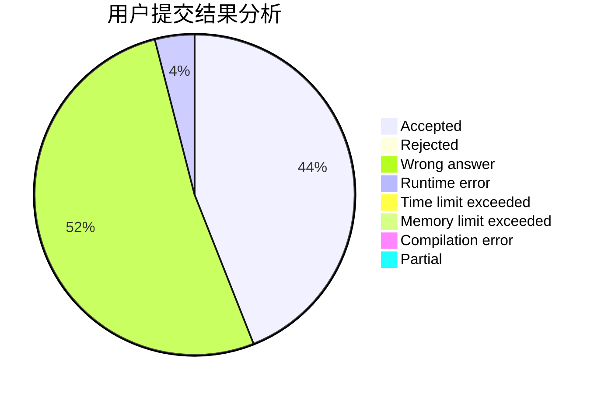
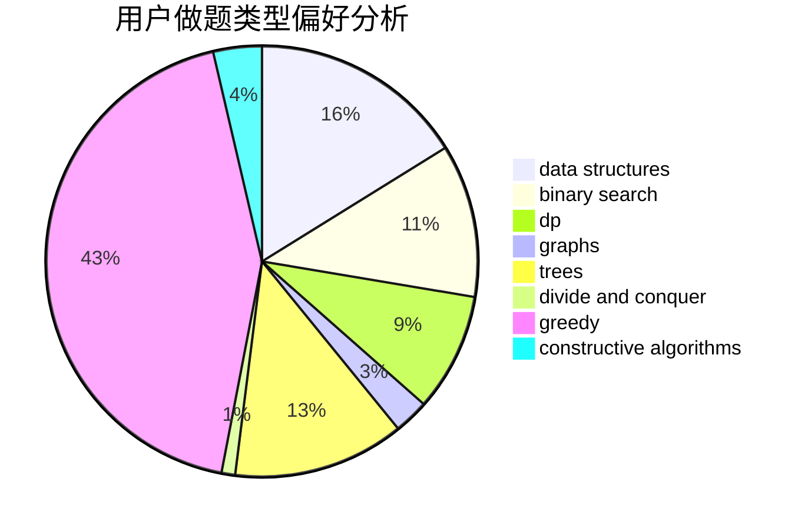
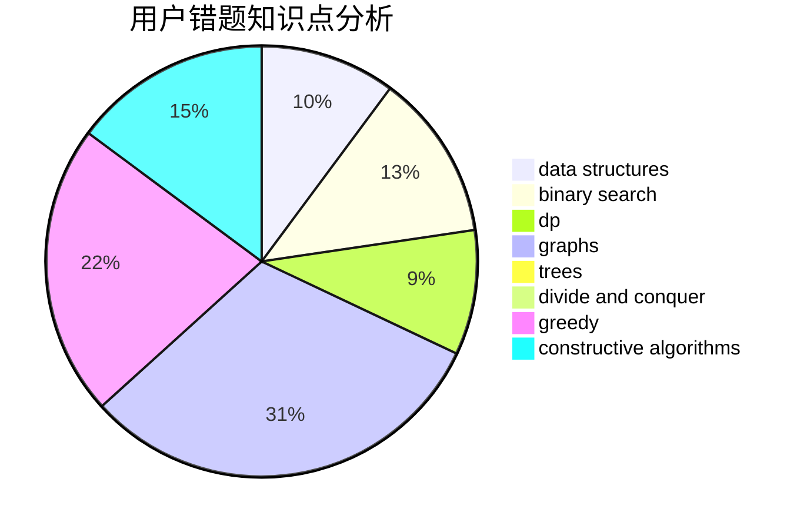

# huangxubin

<!-- tabs:start -->

#### **用户提交结果分析**

#### **用户做题类型偏好分析**

#### **用户错题知识点分析**

<!-- tabs:end -->
# 推荐题目
[1473C](https://codeforces.com/contest/1473/problem/C)		constructive algorithms,
                        math		  
[292A](https://codeforces.com/contest/292/problem/A)		implementation		  
[15C](https://codeforces.com/contest/15/problem/C)		games		  
[276D](https://codeforces.com/contest/276/problem/D)		bitmasks,
                        dp,
                        greedy,
                        implementation,
                        math		  
[1185B](https://codeforces.com/contest/1185/problem/B)		implementation,
                        strings		  
[325E](https://codeforces.com/contest/325/problem/E)		combinatorics,
                        dfs and similar,
                        dsu,
                        graphs,
                        greedy		  
[1084C](https://codeforces.com/contest/1084/problem/C)		combinatorics,
                        dp,
                        implementation		  
[352E](https://codeforces.com/contest/352/problem/E)		dsu,graphs,sortings,trees		  
[1266E](https://codeforces.com/contest/1266/problem/E)		data structures,
                        greedy,
                        implementation		  
[802C](https://codeforces.com/contest/802/problem/C)		flows		  
