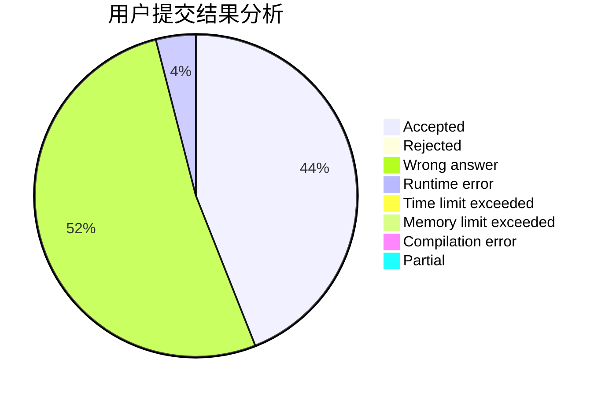
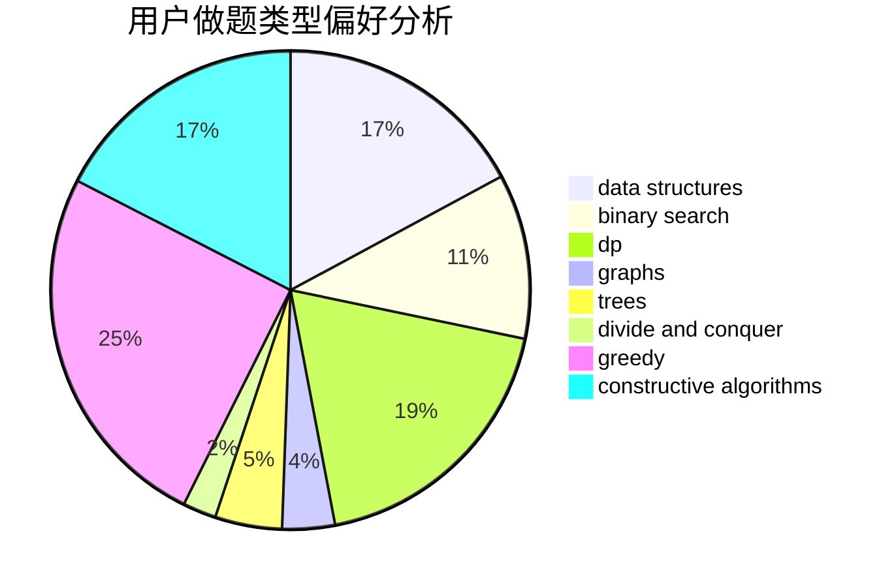
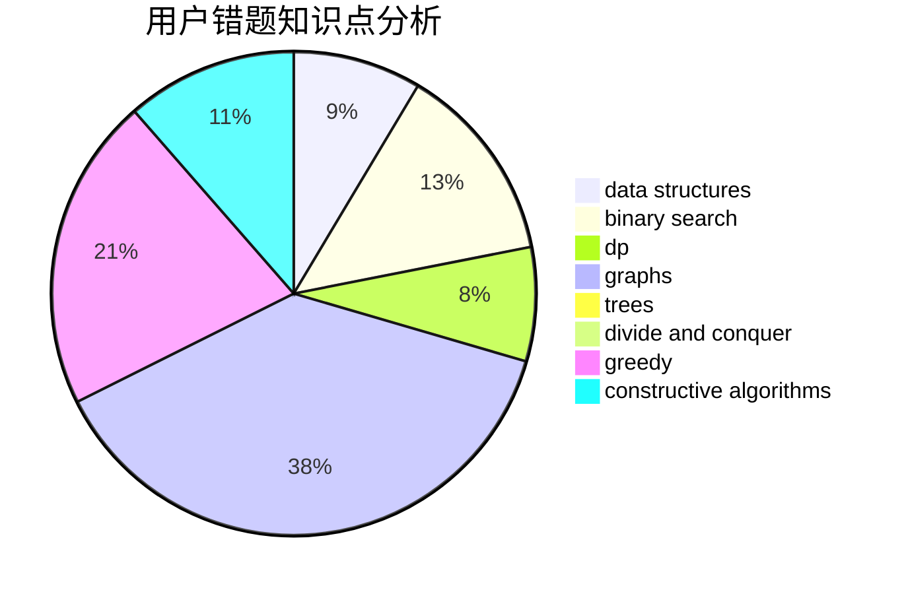

# huangxubin

<!-- tabs:start -->

#### **用户提交结果分析**

#### **用户做题类型偏好分析**

#### **用户错题知识点分析**

<!-- tabs:end -->
# 推荐题目
[1481F](https://codeforces.com/contest/1481/problem/F)		dp,
                        greedy,
                        trees		  
[306D](https://codeforces.com/contest/306/problem/D)		constructive algorithms,
                        geometry		  
[182D](https://codeforces.com/contest/182/problem/D)		brute force,
                        hashing,
                        implementation,
                        math,
                        strings		  
[291A](https://codeforces.com/contest/291/problem/A)		*special problem,
                        implementation,
                        sortings		  
[11892](https://codeforces.com/contest/1189/problem/2)		dsu,graphs,sortings,trees		  
[356A](https://codeforces.com/contest/356/problem/A)		data structures,
                        dsu		  
[1085B](https://codeforces.com/contest/1085/problem/B)		math		  
[379D](https://codeforces.com/contest/379/problem/D)		bitmasks,
                        brute force,
                        dp		  
[1271F](https://codeforces.com/contest/1271/problem/F)		brute force		  
[817B](https://codeforces.com/contest/817/problem/B)		combinatorics,
                        implementation,
                        math,
                        sortings		  
