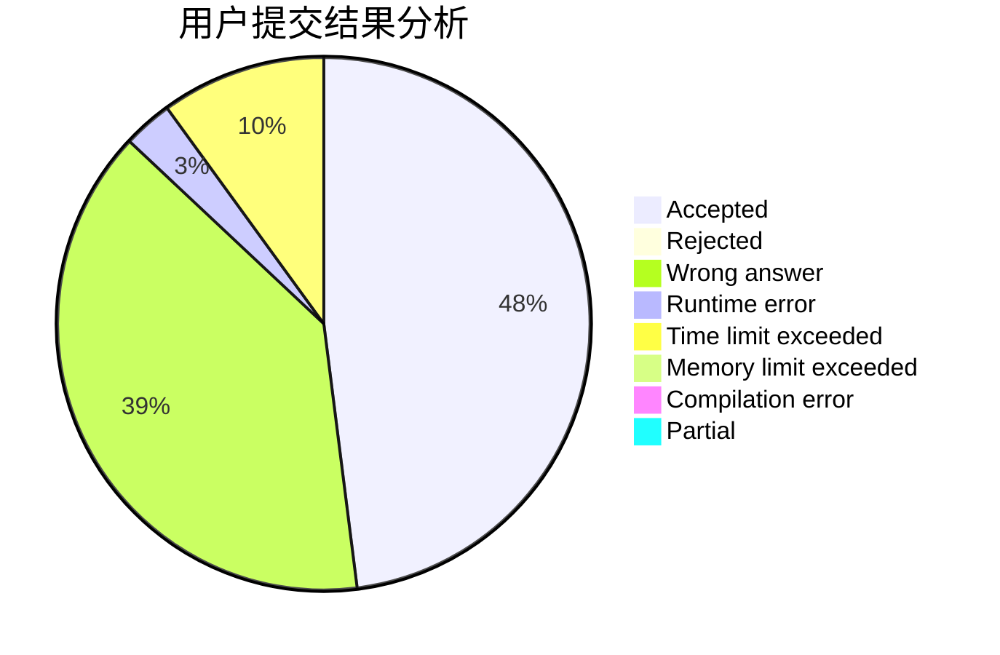
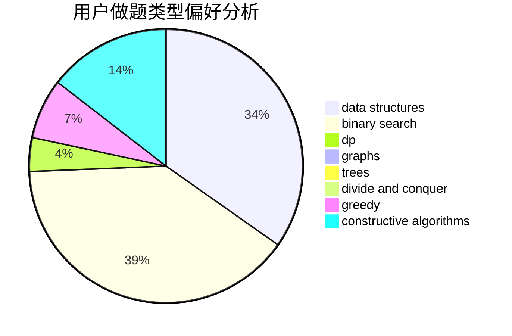
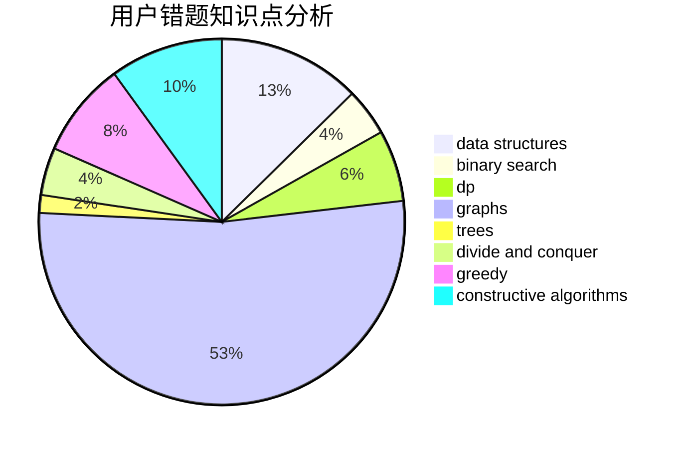

# huangyi10040

<!-- tabs:start -->

#### **用户提交结果分析**

#### **用户做题类型偏好分析**

#### **用户错题知识点分析**

<!-- tabs:end -->
# 推荐题目
[955A](https://codeforces.com/contest/955/problem/A)		greedy,
                        math		  
[272E](https://codeforces.com/contest/272/problem/E)		combinatorics,
                        constructive algorithms,
                        graphs		  
[165C](https://codeforces.com/contest/165/problem/C)		binary search,
                        brute force,
                        dp,
                        math,
                        strings,
                        two pointers		  
[427B](https://codeforces.com/contest/427/problem/B)		data structures,
                        implementation		  
[1025E](https://codeforces.com/contest/1025/problem/E)		constructive algorithms,
                        implementation,
                        matrices		  
[233A](https://codeforces.com/contest/233/problem/A)		implementation,
                        math		  
[1176A](https://codeforces.com/contest/1176/problem/A)		brute force,
                        greedy,
                        implementation		  
[1310E](https://codeforces.com/contest/1310/problem/E)		dp		  
[452C](https://codeforces.com/contest/452/problem/C)		combinatorics,
                        math,
                        probabilities		  
[1034E](https://codeforces.com/contest/1034/problem/E)		bitmasks,
                        dp,
                        math		  
