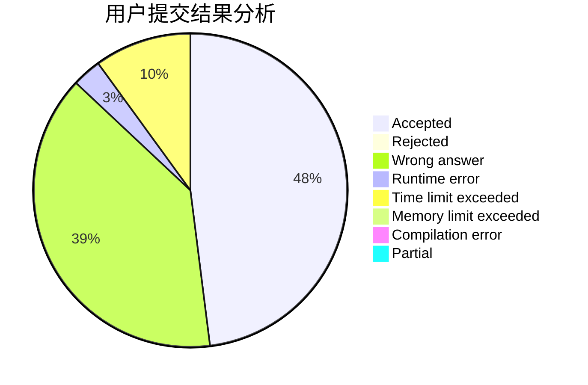
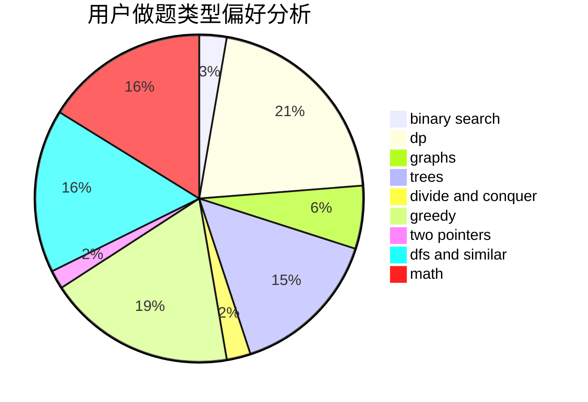

# huangyi10040

<!-- tabs:start -->

#### **用户提交结果分析**

#### **用户做题类型偏好分析**

<!-- tabs:end -->
# 推荐题目
[977A](https://codeforces.com/contest/977/problem/A)
[288E](https://codeforces.com/contest/288/problem/E)
[18E](https://codeforces.com/contest/18/problem/E)
[44A](https://codeforces.com/contest/44/problem/A)
[1027A](https://codeforces.com/contest/1027/problem/A)
[255C](https://codeforces.com/contest/255/problem/C)
[1179B](https://codeforces.com/contest/1179/problem/B)
[131D](https://codeforces.com/contest/131/problem/D)
[474C](https://codeforces.com/contest/474/problem/C)
[1036C](https://codeforces.com/contest/1036/problem/C)
