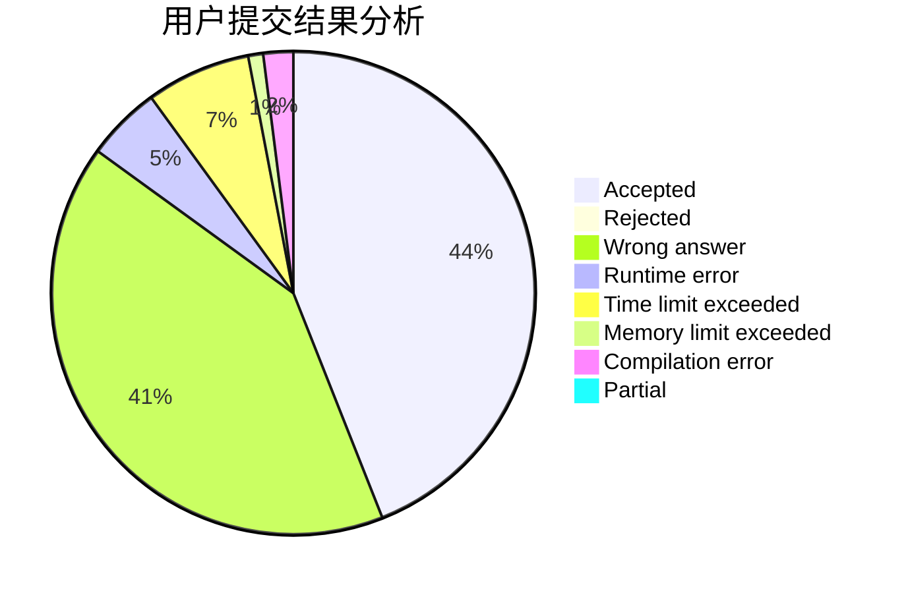
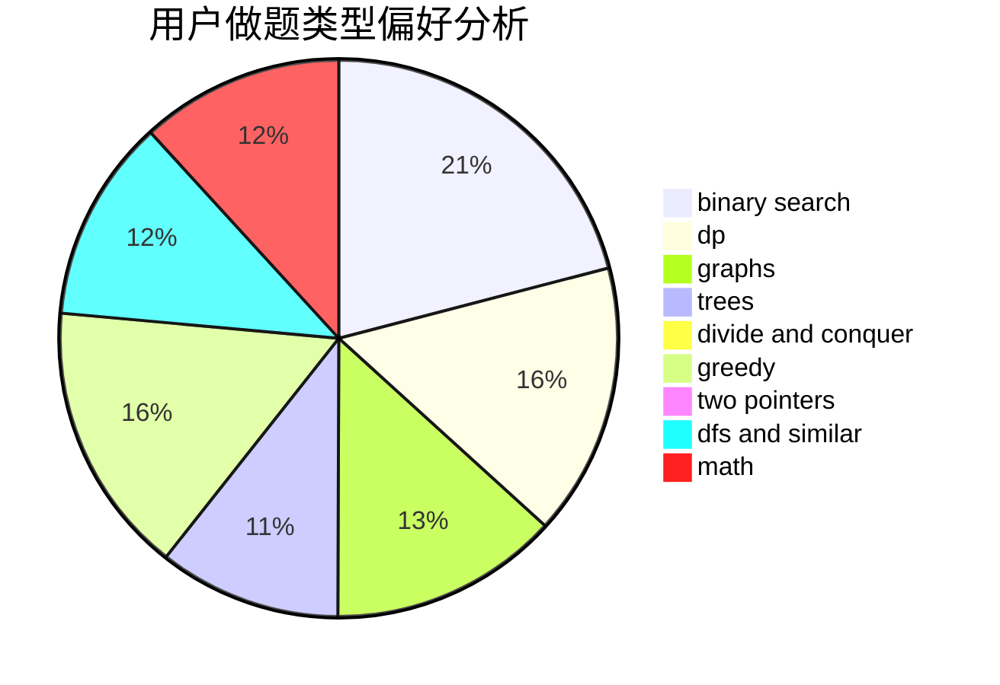

# huangzirui

<!-- tabs:start -->

#### **用户提交结果分析**

#### **用户做题类型偏好分析**

<!-- tabs:end -->
# 推荐题目
[975E](https://codeforces.com/contest/975/problem/E)
[1028G](https://codeforces.com/contest/1028/problem/G)
[81C](https://codeforces.com/contest/81/problem/C)
[739D](https://codeforces.com/contest/739/problem/D)
[1017B](https://codeforces.com/contest/1017/problem/B)
[669D](https://codeforces.com/contest/669/problem/D)
[865B](https://codeforces.com/contest/865/problem/B)
[1272A](https://codeforces.com/contest/1272/problem/A)
[1242D](https://codeforces.com/contest/1242/problem/D)
[604C](https://codeforces.com/contest/604/problem/C)
