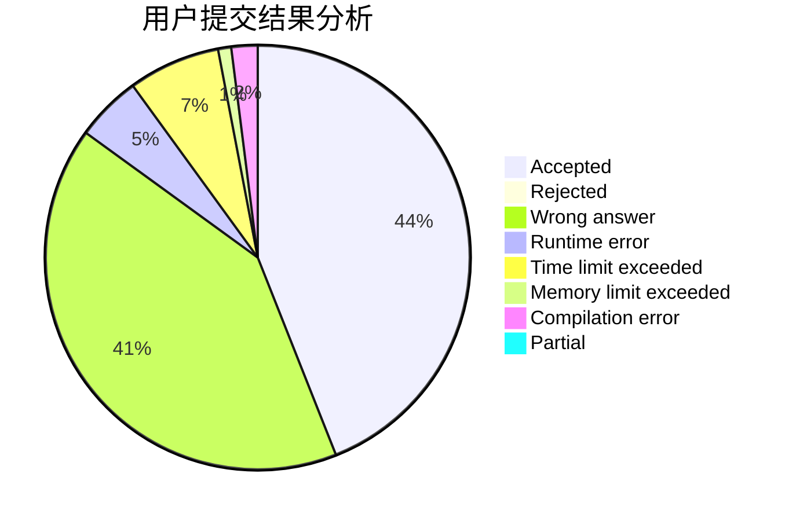
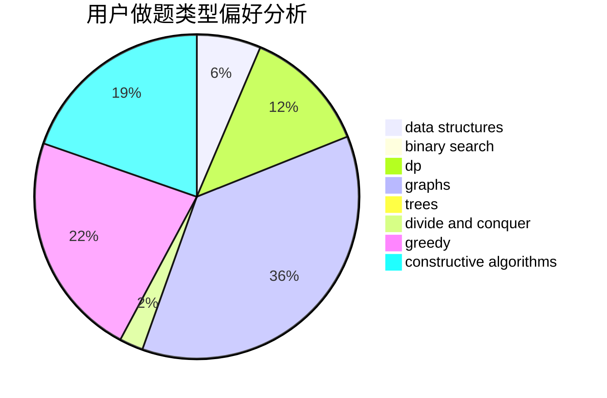

# huangzirui

<!-- tabs:start -->

#### **用户提交结果分析**

#### **用户做题类型偏好分析**

#### **用户错题知识点分析**

<!-- tabs:end -->
# 推荐题目
[952F](https://codeforces.com/contest/952/problem/F)		nan		  
[1028C](https://codeforces.com/contest/1028/problem/C)		geometry,
                        implementation,
                        sortings		  
[803G](https://codeforces.com/contest/803/problem/G)		data structures		  
[722C](https://codeforces.com/contest/722/problem/C)		data structures,
                        dsu		  
[1016F](https://codeforces.com/contest/1016/problem/F)		dfs and similar,
                        dp,
                        trees		  
[639F](https://codeforces.com/contest/639/problem/F)		data structures,
                        dfs and similar,
                        graphs,
                        trees		  
[847B](https://codeforces.com/contest/847/problem/B)		binary search,
                        data structures		  
[1266F](https://codeforces.com/contest/1266/problem/F)		dfs and similar,
                        graphs		  
[1237F](https://codeforces.com/contest/1237/problem/F)		combinatorics,
                        dp		  
[584C](https://codeforces.com/contest/584/problem/C)		constructive algorithms,
                        greedy,
                        strings		  
