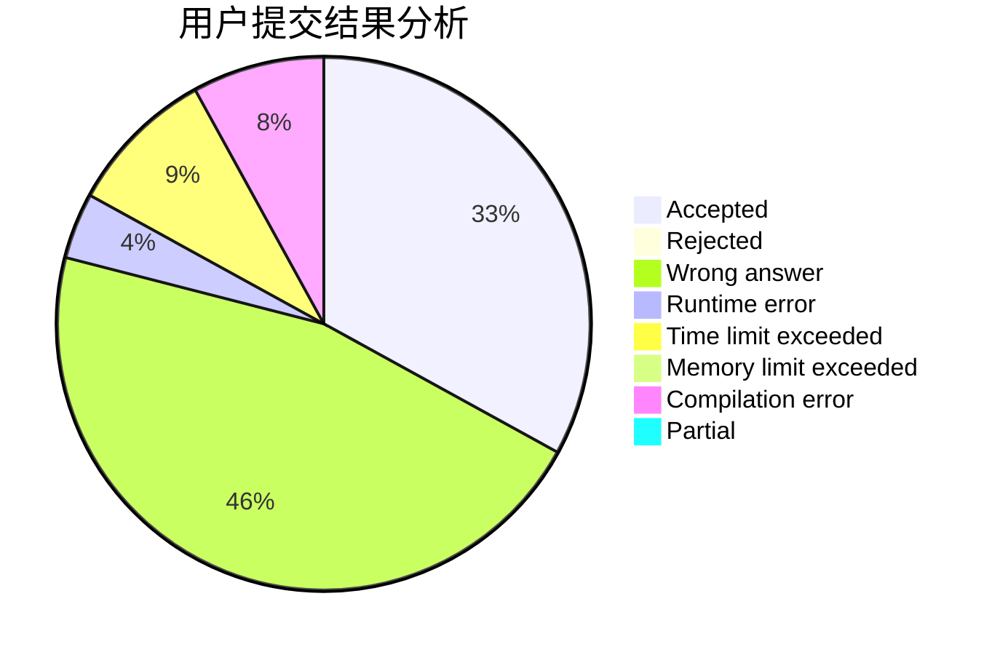
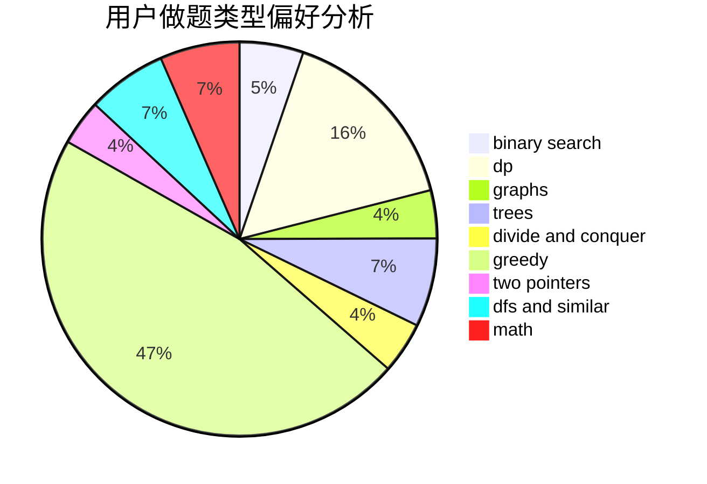

# huashuixiaoxingaa

<!-- tabs:start -->

#### **用户提交结果分析**

#### **用户做题类型偏好分析**

<!-- tabs:end -->
# 推荐题目
[817E](https://codeforces.com/contest/817/problem/E)
[600D](https://codeforces.com/contest/600/problem/D)
[665C](https://codeforces.com/contest/665/problem/C)
[182D](https://codeforces.com/contest/182/problem/D)
[909A](https://codeforces.com/contest/909/problem/A)
[833C](https://codeforces.com/contest/833/problem/C)
[817F](https://codeforces.com/contest/817/problem/F)
[1386B](https://codeforces.com/contest/1386/problem/B)
[1395B](https://codeforces.com/contest/1395/problem/B)
[1439E](https://codeforces.com/contest/1439/problem/E)
