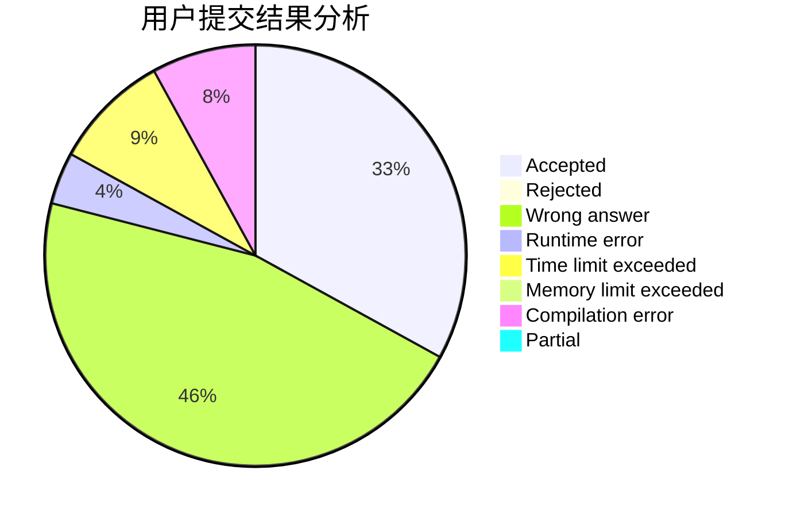
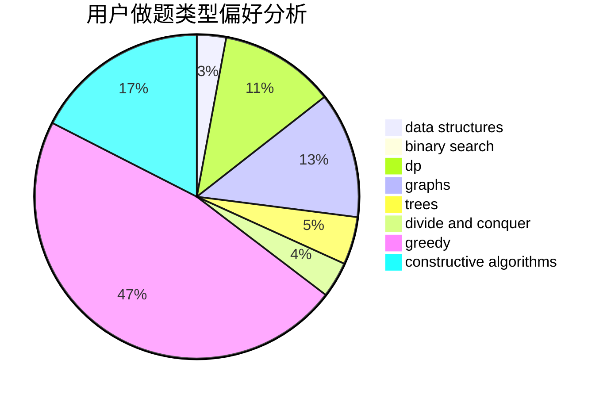
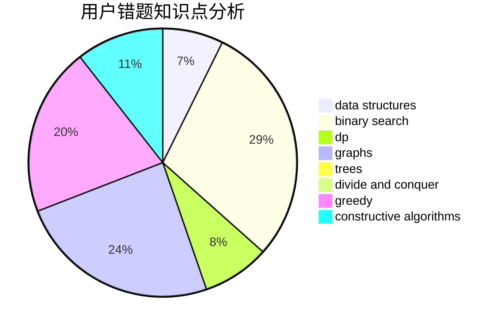

# huashuixiaoxingaa

<!-- tabs:start -->

#### **用户提交结果分析**

#### **用户做题类型偏好分析**

#### **用户错题知识点分析**

<!-- tabs:end -->
# 推荐题目
[802H](https://codeforces.com/contest/802/problem/H)		constructive algorithms,
                        strings		  
[580B](https://codeforces.com/contest/580/problem/B)		binary search,
                        sortings,
                        two pointers		  
[633A](https://codeforces.com/contest/633/problem/A)		brute force,
                        math,
                        number theory		  
[15C](https://codeforces.com/contest/15/problem/C)		games		  
[88A](https://codeforces.com/contest/88/problem/A)		brute force,
                        implementation		  
[814E](https://codeforces.com/contest/814/problem/E)		combinatorics,
                        dp,
                        graphs,
                        shortest paths		  
[802I](https://codeforces.com/contest/802/problem/I)		string suffix structures		  
[1377A1](https://codeforces.com/contest/1377A/problem/1)		dsu,graphs,sortings,trees		  
[1385B](https://codeforces.com/contest/1385/problem/B)		greedy		  
[1430G](https://codeforces.com/contest/1430/problem/G)		bitmasks,
                        dfs and similar,
                        dp,
                        flows,
                        graphs,
                        math		  
