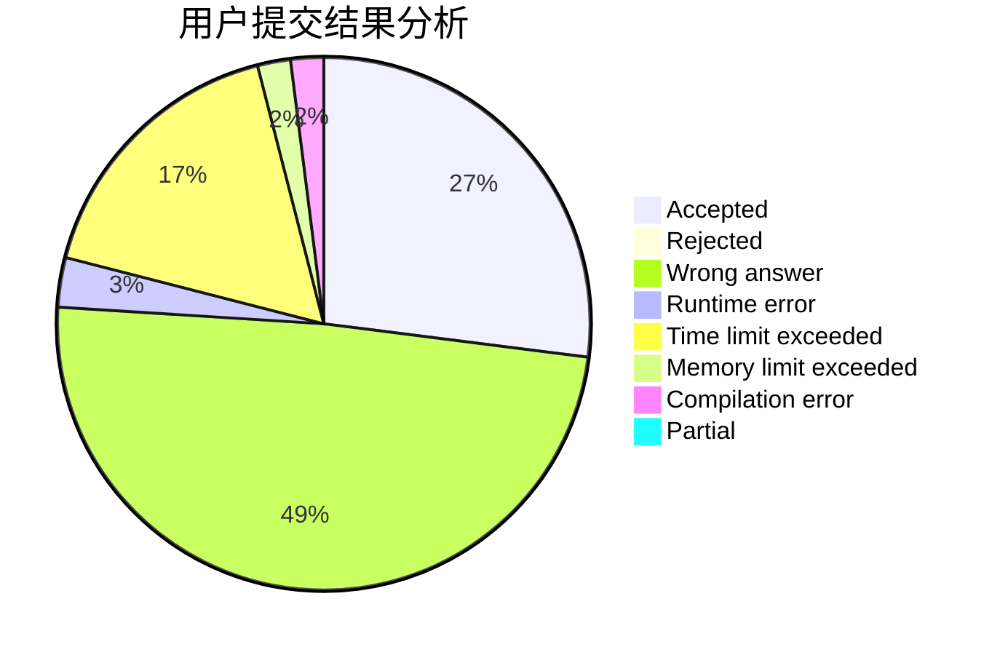
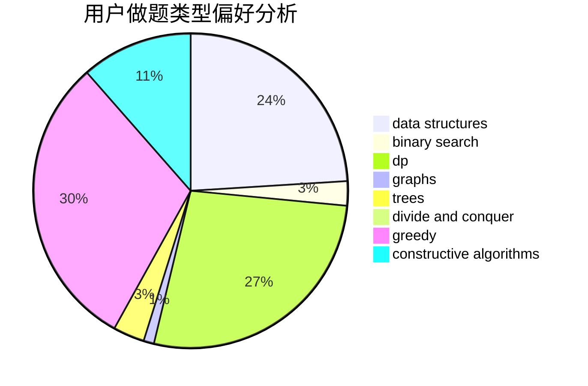
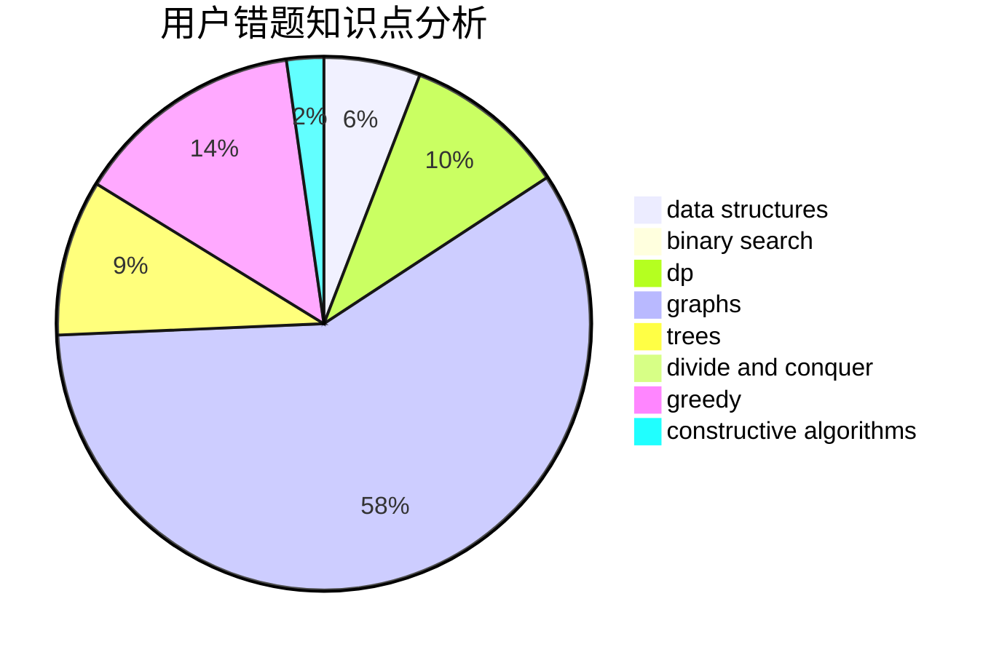

# huayiyan

<!-- tabs:start -->

#### **用户提交结果分析**

#### **用户做题类型偏好分析**

#### **用户错题知识点分析**

<!-- tabs:end -->
# 推荐题目
[991E](https://codeforces.com/contest/991/problem/E)		brute force,
                        combinatorics,
                        math		  
[367B](https://codeforces.com/contest/367/problem/B)		binary search,
                        data structures		  
[1316F](https://codeforces.com/contest/1316/problem/F)		data structures,
                        divide and conquer,
                        probabilities		  
[965B](https://codeforces.com/contest/965/problem/B)		implementation		  
[1060G](https://codeforces.com/contest/1060/problem/G)		data structures		  
[700B](https://codeforces.com/contest/700/problem/B)		dfs and similar,
                        dp,
                        graphs,
                        trees		  
[1393D](https://codeforces.com/contest/1393/problem/D)		dfs and similar,
                        dp,
                        implementation,
                        shortest paths		  
[672D](https://codeforces.com/contest/672/problem/D)		dsu,graphs,sortings,trees		  
[122B](https://codeforces.com/contest/122/problem/B)		brute force,
                        implementation		  
[667A](https://codeforces.com/contest/667/problem/A)		geometry,
                        math		  
