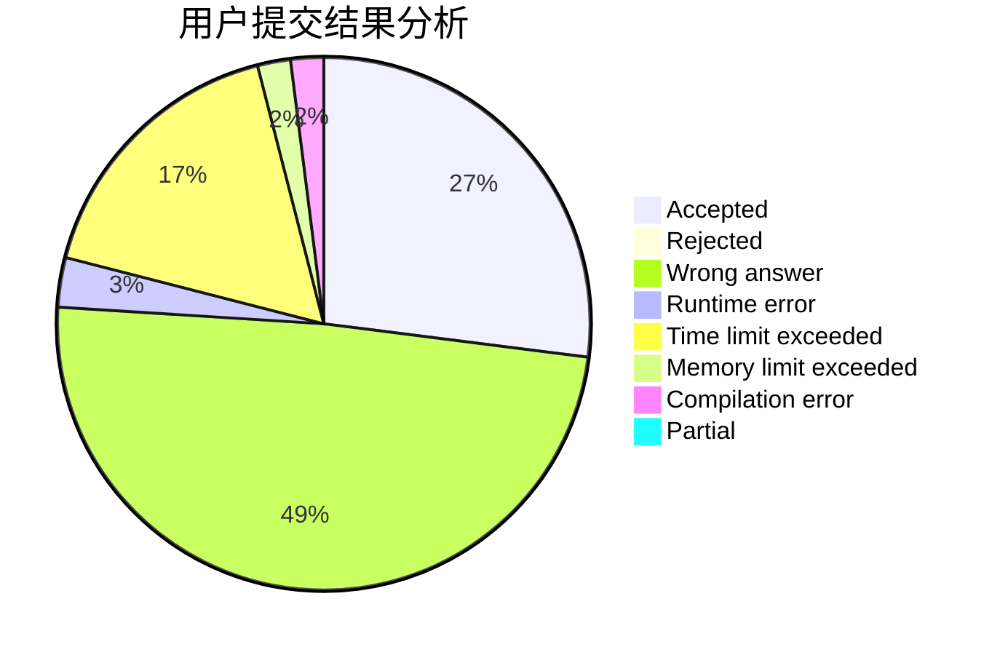
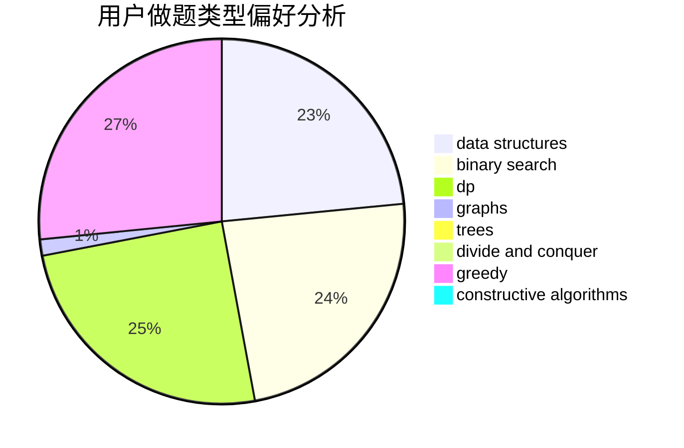
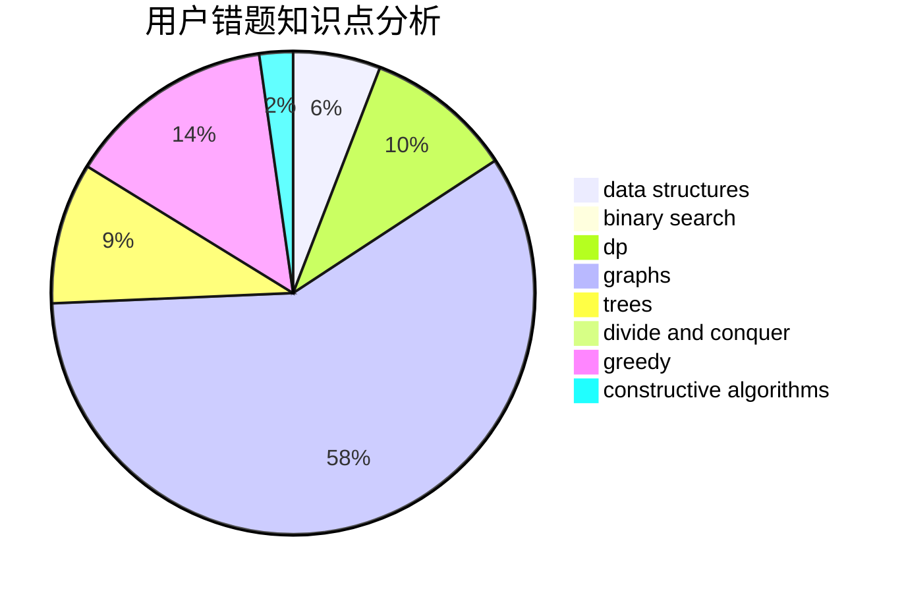

# huayiyan

<!-- tabs:start -->

#### **用户提交结果分析**

#### **用户做题类型偏好分析**

#### **用户错题知识点分析**

<!-- tabs:end -->
# 推荐题目
[978A](https://codeforces.com/contest/978/problem/A)		implementation		  
[33A](https://codeforces.com/contest/33/problem/A)		greedy,
                        implementation		  
[1310C](https://codeforces.com/contest/1310/problem/C)		binary search,
                        dp,
                        strings		  
[948A](https://codeforces.com/contest/948/problem/A)		brute force,
                        dfs and similar,
                        graphs,
                        implementation		  
[1060D](https://codeforces.com/contest/1060/problem/D)		greedy,
                        math		  
[676B](https://codeforces.com/contest/676/problem/B)		implementation,
                        math,
                        math		  
[1384A](https://codeforces.com/contest/1384/problem/A)		constructive algorithms,
                        greedy,
                        strings		  
[650A](https://codeforces.com/contest/650/problem/A)		data structures,
                        geometry,
                        math		  
[1221F](https://codeforces.com/contest/1221/problem/F)		binary search,
                        data structures,
                        sortings		  
[634D](https://codeforces.com/contest/634/problem/D)		dsu,graphs,sortings,trees		  
