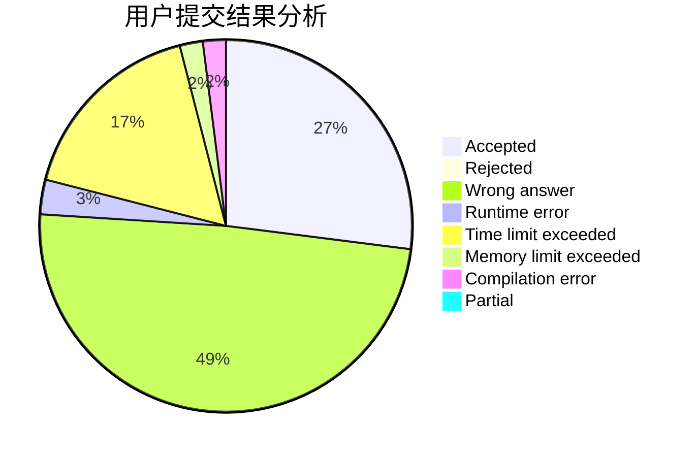
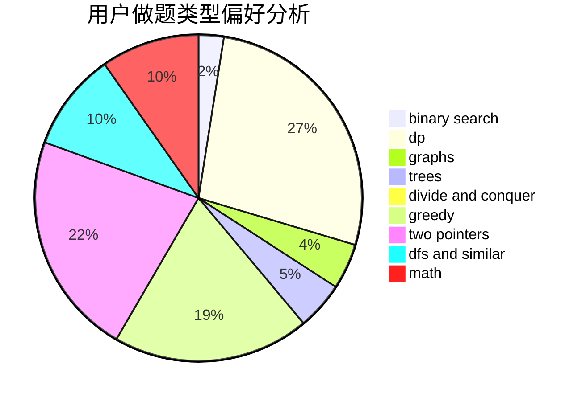

# huayiyan

<!-- tabs:start -->

#### **用户提交结果分析**

#### **用户做题类型偏好分析**

<!-- tabs:end -->
# 推荐题目
[991E](https://codeforces.com/contest/991/problem/E)
[367B](https://codeforces.com/contest/367/problem/B)
[1316F](https://codeforces.com/contest/1316/problem/F)
[965B](https://codeforces.com/contest/965/problem/B)
[1060G](https://codeforces.com/contest/1060/problem/G)
[700B](https://codeforces.com/contest/700/problem/B)
[1393D](https://codeforces.com/contest/1393/problem/D)
[672D](https://codeforces.com/contest/672/problem/D)
[122B](https://codeforces.com/contest/122/problem/B)
[667A](https://codeforces.com/contest/667/problem/A)
