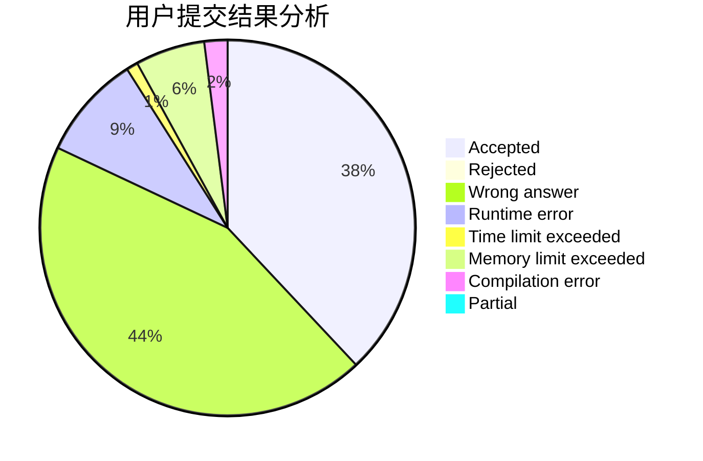
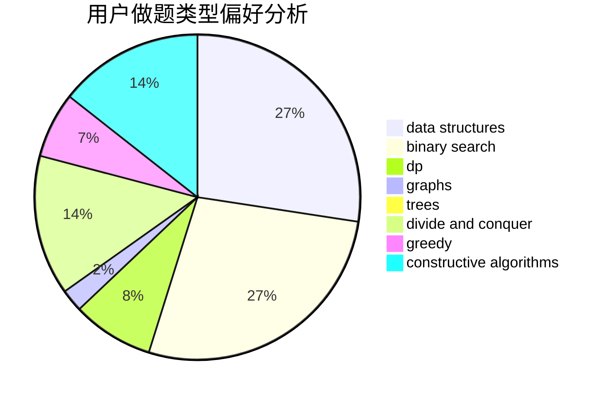

# huayucaiji

<!-- tabs:start -->

#### **用户提交结果分析**

#### **用户做题类型偏好分析**

#### **用户错题知识点分析**

<!-- tabs:end -->
# 推荐题目
[1033B](https://codeforces.com/contest/1033/problem/B)		math,
                        number theory		  
[610C](https://codeforces.com/contest/610/problem/C)		constructive algorithms		  
[449B](https://codeforces.com/contest/449/problem/B)		graphs,
                        greedy,
                        shortest paths		  
[472C](https://codeforces.com/contest/472/problem/C)		greedy		  
[886F](https://codeforces.com/contest/886/problem/F)		geometry		  
[725D](https://codeforces.com/contest/725/problem/D)		data structures,
                        greedy		  
[1167D](https://codeforces.com/contest/1167/problem/D)		constructive algorithms,
                        greedy		  
[1227A](https://codeforces.com/contest/1227/problem/A)		math		  
[1136D](https://codeforces.com/contest/1136/problem/D)		greedy		  
[602A](https://codeforces.com/contest/602/problem/A)		brute force,
                        implementation		  
