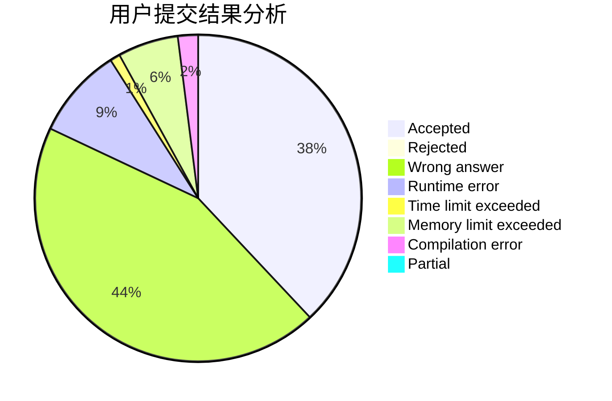
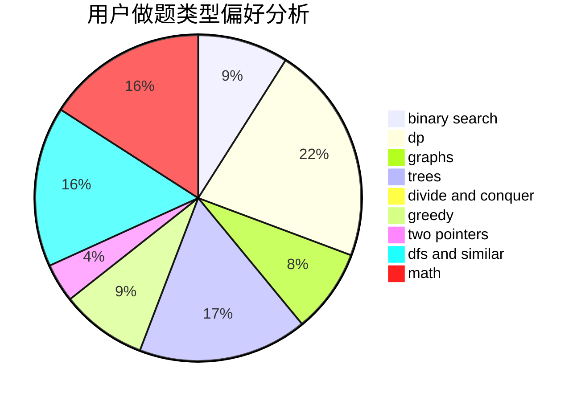

# huayucaiji

<!-- tabs:start -->

#### **用户提交结果分析**

#### **用户做题类型偏好分析**

<!-- tabs:end -->
# 推荐题目
[1033E](https://codeforces.com/contest/1033/problem/E)
[629E](https://codeforces.com/contest/629/problem/E)
[468E](https://codeforces.com/contest/468/problem/E)
[490F](https://codeforces.com/contest/490/problem/F)
[906A](https://codeforces.com/contest/906/problem/A)
[743D](https://codeforces.com/contest/743/problem/D)
[1172A](https://codeforces.com/contest/1172/problem/A)
[1234E](https://codeforces.com/contest/1234/problem/E)
[1138F](https://codeforces.com/contest/1138/problem/F)
[621B](https://codeforces.com/contest/621/problem/B)
