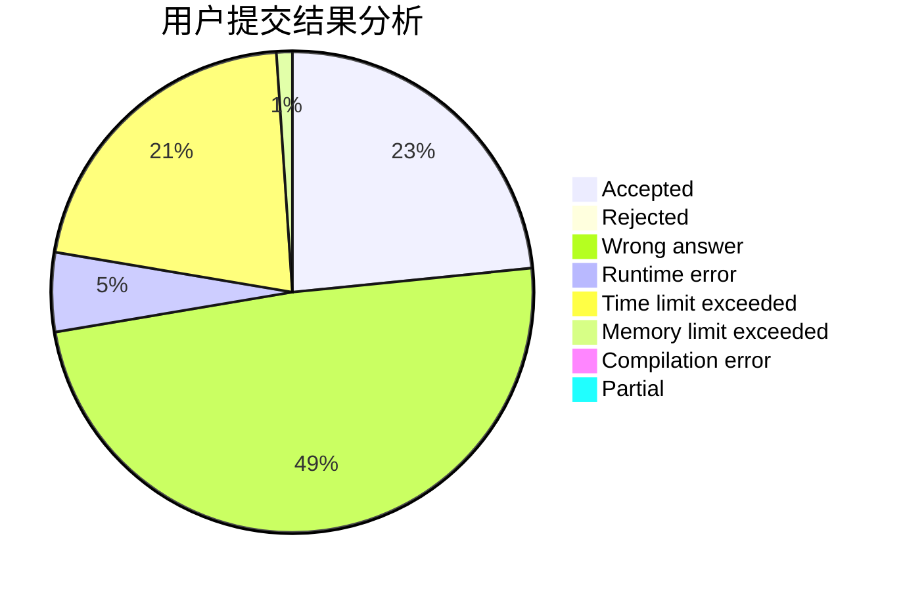
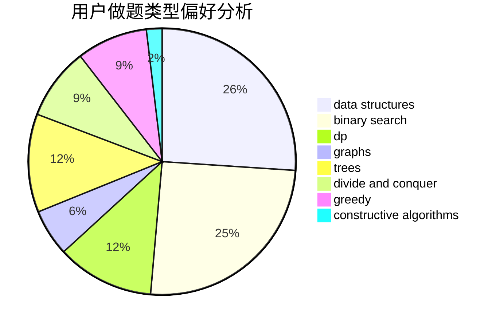

# huhaoo

<!-- tabs:start -->

#### **用户提交结果分析**

#### **用户做题类型偏好分析**

#### **用户错题知识点分析**

<!-- tabs:end -->
# 推荐题目
[1143F](https://codeforces.com/contest/1143/problem/F)		dsu,graphs,sortings,trees		  
[609C](https://codeforces.com/contest/609/problem/C)		implementation,
                        math		  
[15C](https://codeforces.com/contest/15/problem/C)		games		  
[1219C](https://codeforces.com/contest/1219/problem/C)		implementation,
                        strings		  
[197A](https://codeforces.com/contest/197/problem/A)		constructive algorithms,
                        games,
                        math		  
[934E](https://codeforces.com/contest/934/problem/E)		dsu,graphs,sortings,trees		  
[462C](https://codeforces.com/contest/462/problem/C)		dsu,graphs,sortings,trees		  
[1370B](https://codeforces.com/contest/1370/problem/B)		constructive algorithms,
                        math,
                        number theory		  
[482D](https://codeforces.com/contest/482/problem/D)		combinatorics,
                        dp,
                        trees		  
[237A](https://codeforces.com/contest/237/problem/A)		implementation		  
