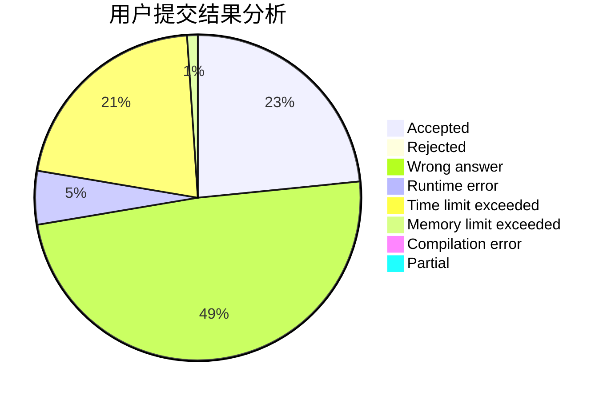
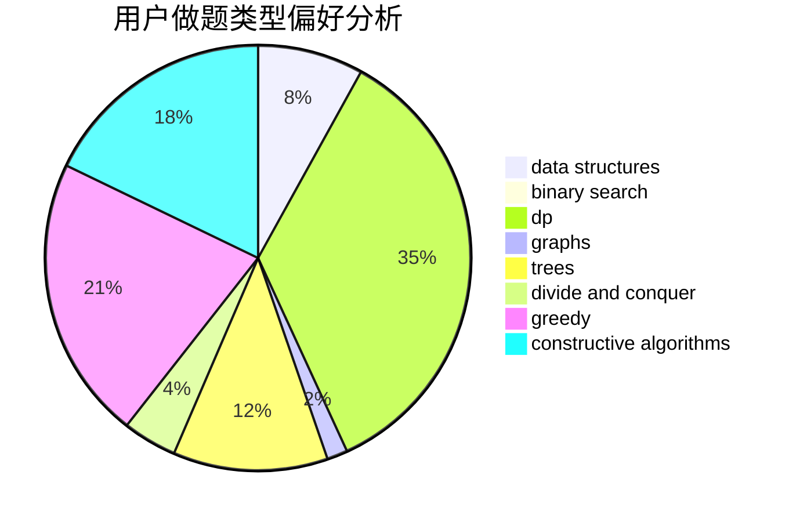

# huhaoo

<!-- tabs:start -->

#### **用户提交结果分析**

#### **用户做题类型偏好分析**

#### **用户错题知识点分析**

<!-- tabs:end -->
# 推荐题目
[1146A](https://codeforces.com/contest/1146/problem/A)		implementation,
                        strings		  
[628C](https://codeforces.com/contest/628/problem/C)		greedy,
                        strings		  
[182D](https://codeforces.com/contest/182/problem/D)		brute force,
                        hashing,
                        implementation,
                        math,
                        strings		  
[12272](https://codeforces.com/contest/1227/problem/2)		dsu,graphs,sortings,trees		  
[219A](https://codeforces.com/contest/219/problem/A)		implementation,
                        strings		  
[956D](https://codeforces.com/contest/956/problem/D)		dsu,graphs,sortings,trees		  
[482C](https://codeforces.com/contest/482/problem/C)		bitmasks,
                        dp,
                        probabilities		  
[13791](https://codeforces.com/contest/1379/problem/1)		dsu,graphs,sortings,trees		  
[501C](https://codeforces.com/contest/501/problem/C)		constructive algorithms,
                        data structures,
                        greedy,
                        sortings,
                        trees		  
[25B](https://codeforces.com/contest/25/problem/B)		implementation		  
