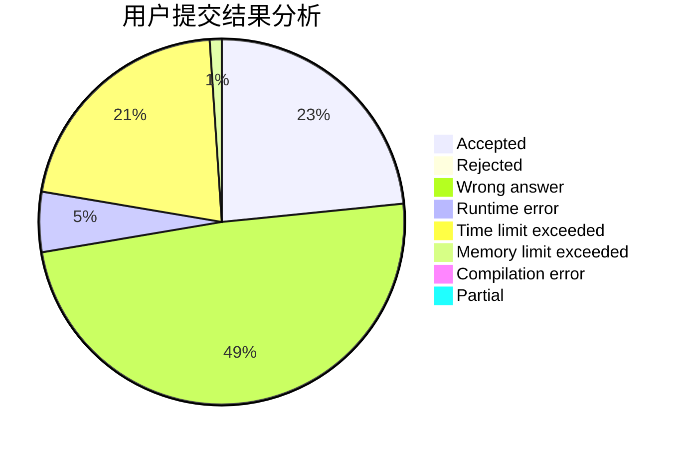
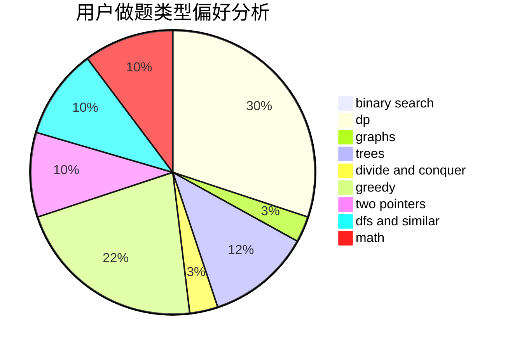

# huhaoo

<!-- tabs:start -->

#### **用户提交结果分析**

#### **用户做题类型偏好分析**

<!-- tabs:end -->
# 推荐题目
[1146A](https://codeforces.com/contest/1146/problem/A)
[628C](https://codeforces.com/contest/628/problem/C)
[182D](https://codeforces.com/contest/182/problem/D)
[12272](https://codeforces.com/contest/1227/problem/2)
[219A](https://codeforces.com/contest/219/problem/A)
[956D](https://codeforces.com/contest/956/problem/D)
[482C](https://codeforces.com/contest/482/problem/C)
[13791](https://codeforces.com/contest/1379/problem/1)
[501C](https://codeforces.com/contest/501/problem/C)
[25B](https://codeforces.com/contest/25/problem/B)
