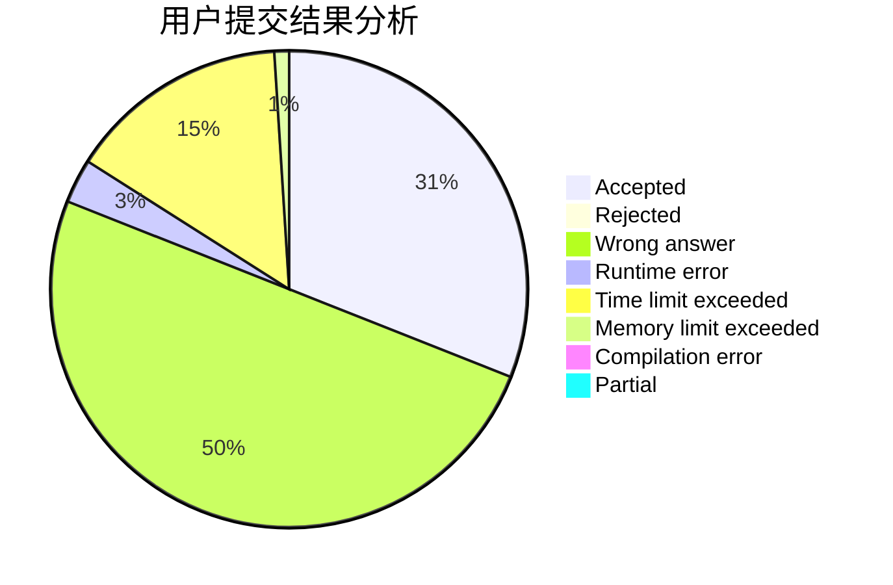
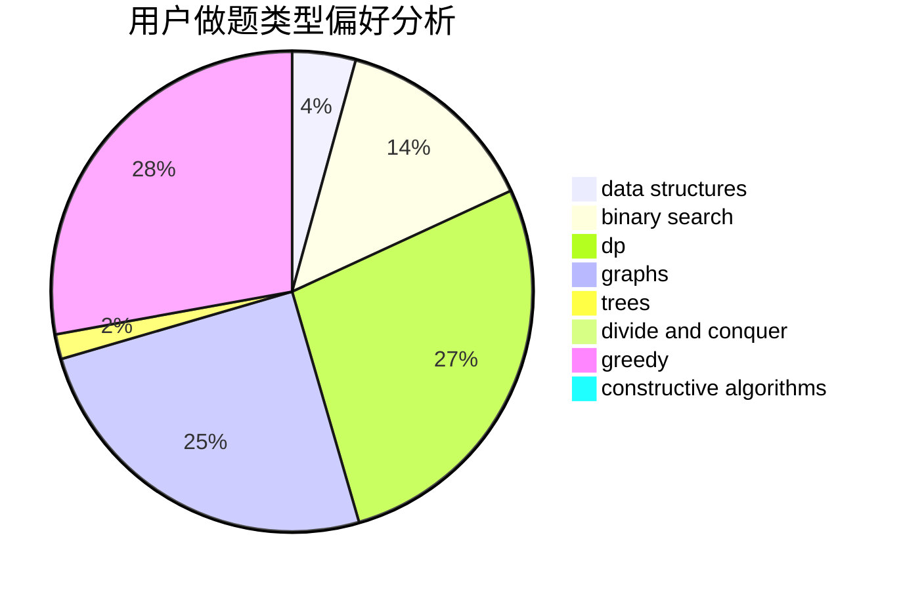

# hujin

<!-- tabs:start -->

#### **用户提交结果分析**

#### **用户做题类型偏好分析**

#### **用户错题知识点分析**

<!-- tabs:end -->
# 推荐题目
[913C](https://codeforces.com/contest/913/problem/C)		bitmasks,
                        dp,
                        greedy		  
[1241C](https://codeforces.com/contest/1241/problem/C)		dsu,graphs,sortings,trees		  
[313E](https://codeforces.com/contest/313/problem/E)		constructive algorithms,
                        data structures,
                        dsu,
                        greedy		  
[1161B](https://codeforces.com/contest/1161/problem/B)		dsu,graphs,sortings,trees		  
[984D](https://codeforces.com/contest/984/problem/D)		dsu,graphs,sortings,trees		  
[879A](https://codeforces.com/contest/879/problem/A)		implementation		  
[1355F](https://codeforces.com/contest/1355/problem/F)		constructive algorithms,
                        interactive,
                        number theory		  
[1017C](https://codeforces.com/contest/1017/problem/C)		constructive algorithms,
                        greedy		  
[717A](https://codeforces.com/contest/717/problem/A)		math,
                        number theory		  
[271E](https://codeforces.com/contest/271/problem/E)		constructive algorithms,
                        math,
                        number theory		  
