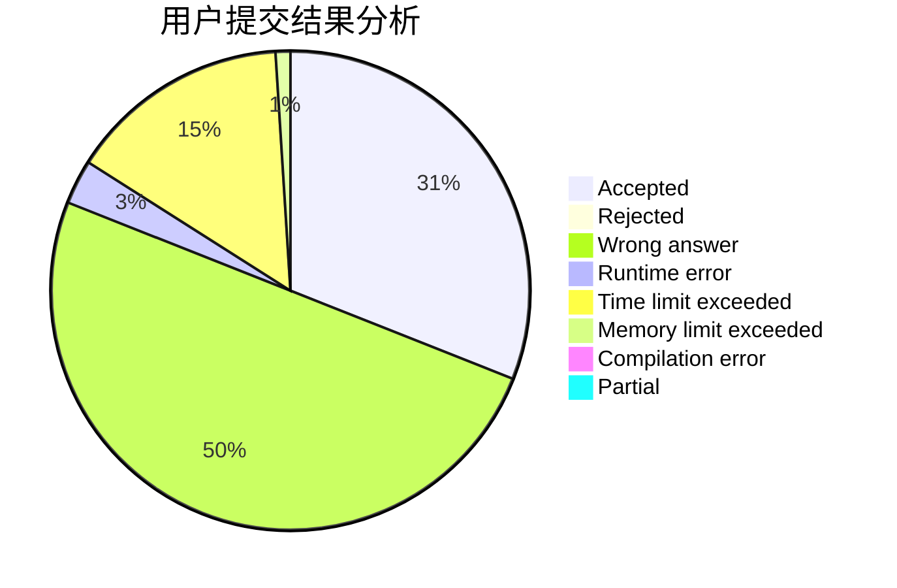
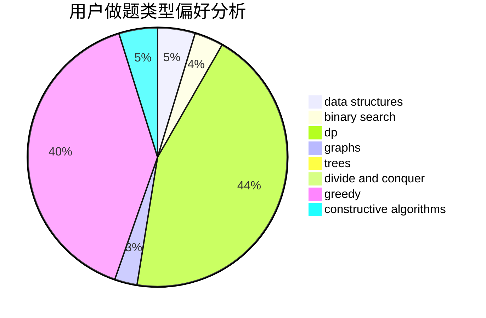

# hujin

<!-- tabs:start -->

#### **用户提交结果分析**

#### **用户做题类型偏好分析**

#### **用户错题知识点分析**

<!-- tabs:end -->
# 推荐题目
[932A](https://codeforces.com/contest/932/problem/A)		constructive algorithms		  
[12471](https://codeforces.com/contest/1247/problem/1)		dsu,graphs,sortings,trees		  
[338D](https://codeforces.com/contest/338/problem/D)		chinese remainder theorem,
                        math,
                        number theory		  
[1163E](https://codeforces.com/contest/1163/problem/E)		bitmasks,
                        brute force,
                        constructive algorithms,
                        data structures,
                        graphs,
                        math		  
[99C](https://codeforces.com/contest/99/problem/C)		dsu,graphs,sortings,trees		  
[899E](https://codeforces.com/contest/899/problem/E)		data structures,
                        dsu,
                        flows,
                        implementation,
                        two pointers		  
[1362E](https://codeforces.com/contest/1362/problem/E)		dsu,graphs,sortings,trees		  
[1017F](https://codeforces.com/contest/1017/problem/F)		brute force,
                        math		  
[734D](https://codeforces.com/contest/734/problem/D)		implementation		  
[288C](https://codeforces.com/contest/288/problem/C)		implementation,
                        math		  
