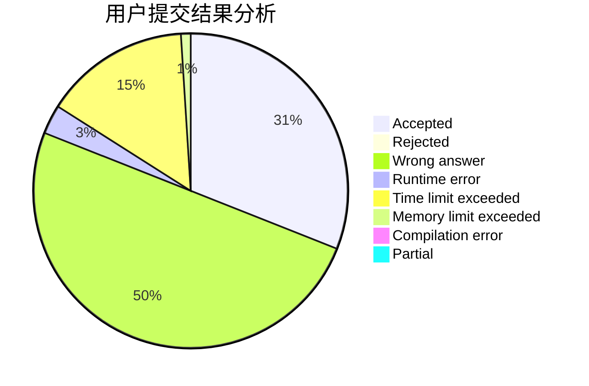
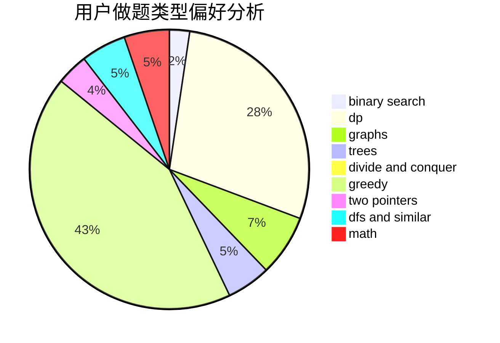

# hujin

<!-- tabs:start -->

#### **用户提交结果分析**

#### **用户做题类型偏好分析**

<!-- tabs:end -->
# 推荐题目
[932A](https://codeforces.com/contest/932/problem/A)
[12471](https://codeforces.com/contest/1247/problem/1)
[338D](https://codeforces.com/contest/338/problem/D)
[1163E](https://codeforces.com/contest/1163/problem/E)
[99C](https://codeforces.com/contest/99/problem/C)
[899E](https://codeforces.com/contest/899/problem/E)
[1362E](https://codeforces.com/contest/1362/problem/E)
[1017F](https://codeforces.com/contest/1017/problem/F)
[734D](https://codeforces.com/contest/734/problem/D)
[288C](https://codeforces.com/contest/288/problem/C)
