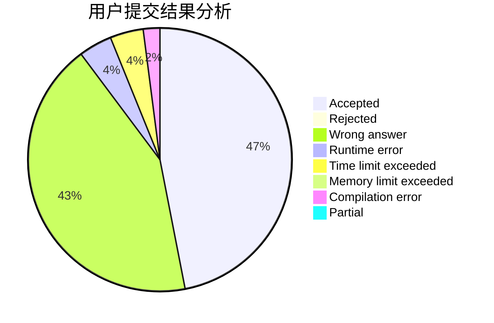
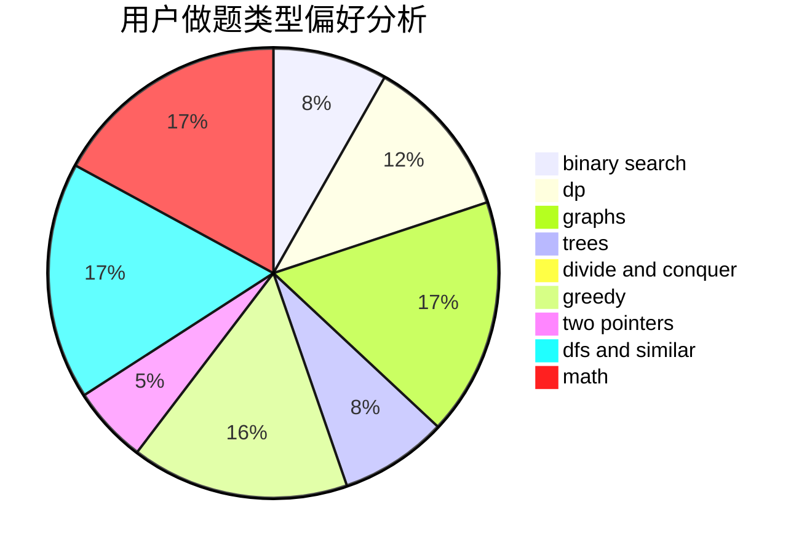

# BaseAI

<!-- tabs:start -->

#### **用户提交结果分析**

#### **用户做题类型偏好分析**

<!-- tabs:end -->
# 推荐题目
[1433E](https://codeforces.com/contest/1433/problem/E)
[1417C](https://codeforces.com/contest/1417/problem/C)
[1434C](https://codeforces.com/contest/1434/problem/C)
[508B](https://codeforces.com/contest/508/problem/B)
[1494F](https://codeforces.com/contest/1494/problem/F)
[1341D](https://codeforces.com/contest/1341/problem/D)
[1207B](https://codeforces.com/contest/1207/problem/B)
[11521](https://codeforces.com/contest/1152/problem/1)
[1099B](https://codeforces.com/contest/1099/problem/B)
[1139A](https://codeforces.com/contest/1139/problem/A)
