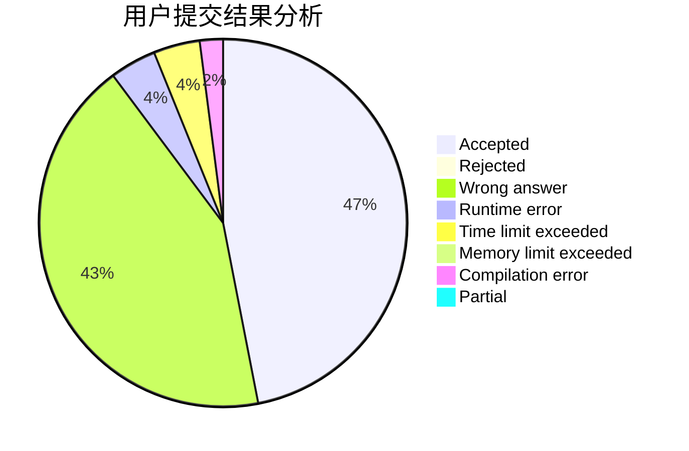
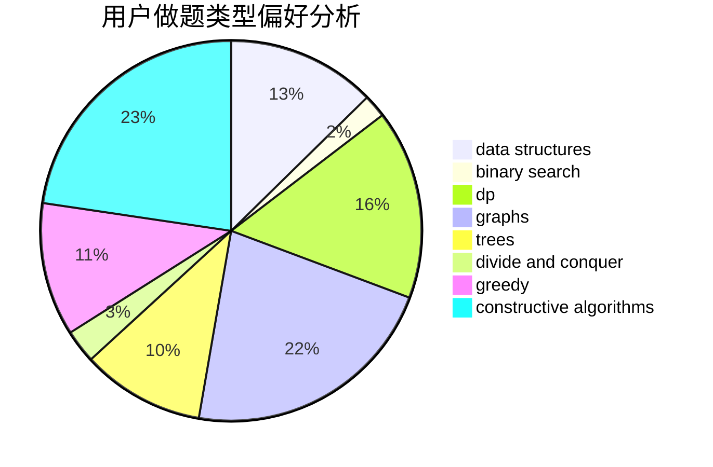
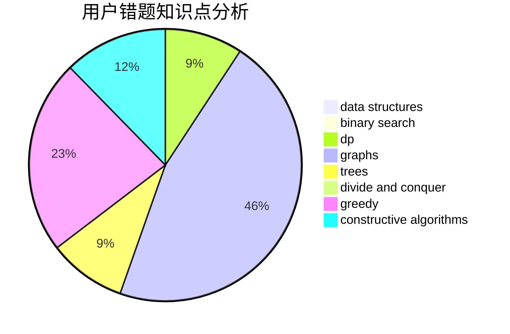

# BaseAI

<!-- tabs:start -->

#### **用户提交结果分析**

#### **用户做题类型偏好分析**

#### **用户错题知识点分析**

<!-- tabs:end -->
# 推荐题目
[1425B](https://codeforces.com/contest/1425/problem/B)		divide and conquer,
                        dp		  
[1406C](https://codeforces.com/contest/1406/problem/C)		constructive algorithms,
                        dfs and similar,
                        graphs,
                        trees		  
[1426A](https://codeforces.com/contest/1426/problem/A)		implementation,
                        math		  
[487B](https://codeforces.com/contest/487/problem/B)		binary search,
                        data structures,
                        dp,
                        two pointers		  
[1487C](https://codeforces.com/contest/1487/problem/C)		brute force,
                        constructive algorithms,
                        dfs and similar,
                        graphs,
                        greedy,
                        implementation,
                        math		  
[1334E](https://codeforces.com/contest/1334/problem/E)		combinatorics,
                        graphs,
                        greedy,
                        math,
                        number theory		  
[1202D](https://codeforces.com/contest/1202/problem/D)		combinatorics,
                        constructive algorithms,
                        math,
                        strings		  
[114D](https://codeforces.com/contest/114/problem/D)		dsu,graphs,sortings,trees		  
[1098E](https://codeforces.com/contest/1098/problem/E)		binary search,
                        implementation,
                        math,
                        number theory		  
[1136E](https://codeforces.com/contest/1136/problem/E)		binary search,
                        data structures		  
