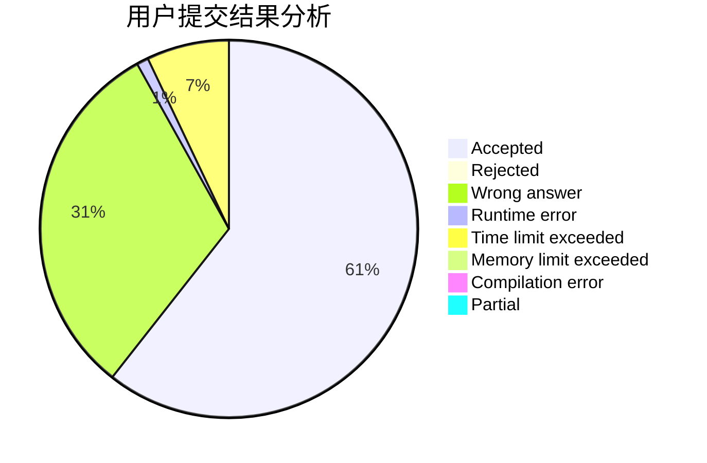
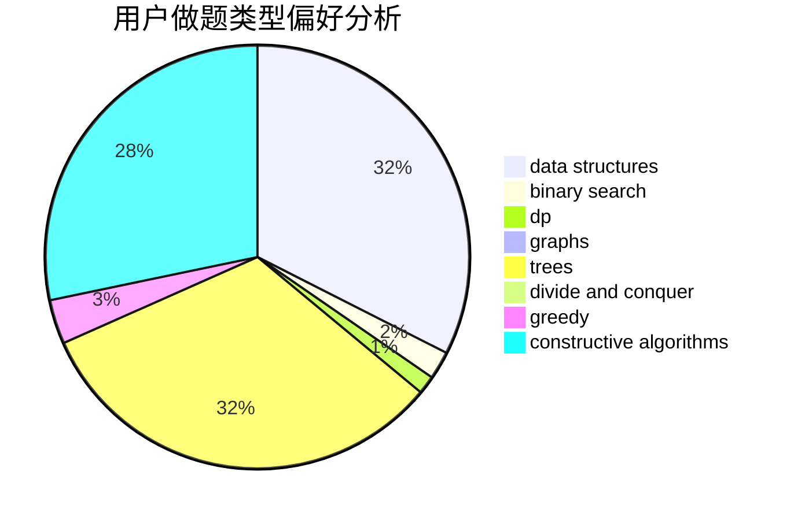

# hunst_panhuixian

<!-- tabs:start -->

#### **用户提交结果分析**

#### **用户做题类型偏好分析**

#### **用户错题知识点分析**

<!-- tabs:end -->
# 推荐题目
[848C](https://codeforces.com/contest/848/problem/C)		data structures,
                        divide and conquer		  
[1145A](https://codeforces.com/contest/1145/problem/A)		implementation		  
[1342A](https://codeforces.com/contest/1342/problem/A)		greedy,
                        math		  
[566D](https://codeforces.com/contest/566/problem/D)		data structures,
                        dsu		  
[1425D](https://codeforces.com/contest/1425/problem/D)		combinatorics,
                        dp,
                        math		  
[879B](https://codeforces.com/contest/879/problem/B)		data structures,
                        implementation		  
[580B](https://codeforces.com/contest/580/problem/B)		binary search,
                        sortings,
                        two pointers		  
[839A](https://codeforces.com/contest/839/problem/A)		implementation		  
[516B](https://codeforces.com/contest/516/problem/B)		dsu,graphs,sortings,trees		  
[750D](https://codeforces.com/contest/750/problem/D)		brute force,
                        data structures,
                        dfs and similar,
                        dp,
                        implementation		  
