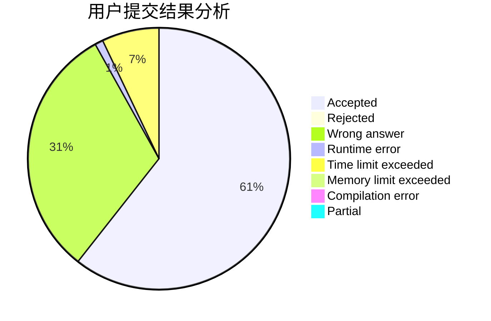
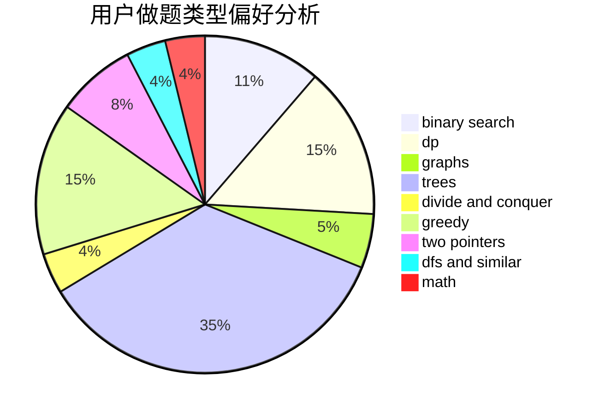

# hunst_panhuixian

<!-- tabs:start -->

#### **用户提交结果分析**

#### **用户做题类型偏好分析**

<!-- tabs:end -->
# 推荐题目
[848C](https://codeforces.com/contest/848/problem/C)
[1145A](https://codeforces.com/contest/1145/problem/A)
[1342A](https://codeforces.com/contest/1342/problem/A)
[566D](https://codeforces.com/contest/566/problem/D)
[1425D](https://codeforces.com/contest/1425/problem/D)
[879B](https://codeforces.com/contest/879/problem/B)
[580B](https://codeforces.com/contest/580/problem/B)
[839A](https://codeforces.com/contest/839/problem/A)
[516B](https://codeforces.com/contest/516/problem/B)
[750D](https://codeforces.com/contest/750/problem/D)
