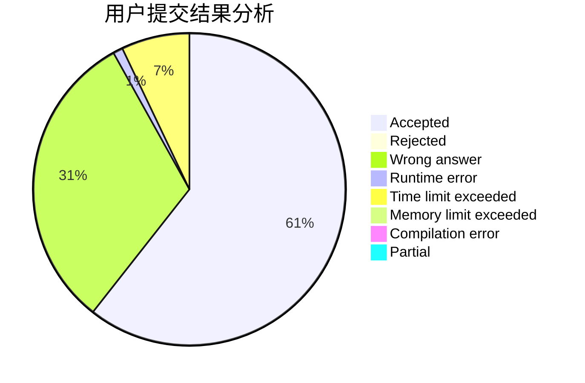
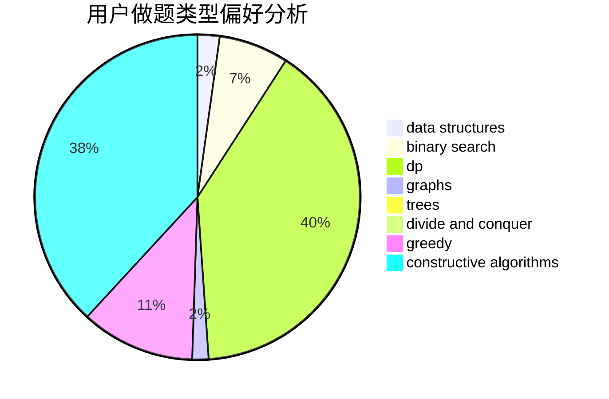

# hunst_panhuixian

<!-- tabs:start -->

#### **用户提交结果分析**

#### **用户做题类型偏好分析**

#### **用户错题知识点分析**

<!-- tabs:end -->
# 推荐题目
[830C](https://codeforces.com/contest/830/problem/C)		brute force,
                        data structures,
                        implementation,
                        math,
                        number theory,
                        sortings,
                        two pointers		  
[1143A](https://codeforces.com/contest/1143/problem/A)		implementation		  
[1335A](https://codeforces.com/contest/1335/problem/A)		math		  
[540C](https://codeforces.com/contest/540/problem/C)		dfs and similar		  
[1417F](https://codeforces.com/contest/1417/problem/F)		dsu,graphs,sortings,trees		  
[861B](https://codeforces.com/contest/861/problem/B)		dsu,graphs,sortings,trees		  
[555E](https://codeforces.com/contest/555/problem/E)		dfs and similar,
                        graphs,
                        trees		  
[819A](https://codeforces.com/contest/819/problem/A)		games,
                        greedy		  
[497A](https://codeforces.com/contest/497/problem/A)		dsu,graphs,sortings,trees		  
[732E](https://codeforces.com/contest/732/problem/E)		greedy,
                        sortings		  
