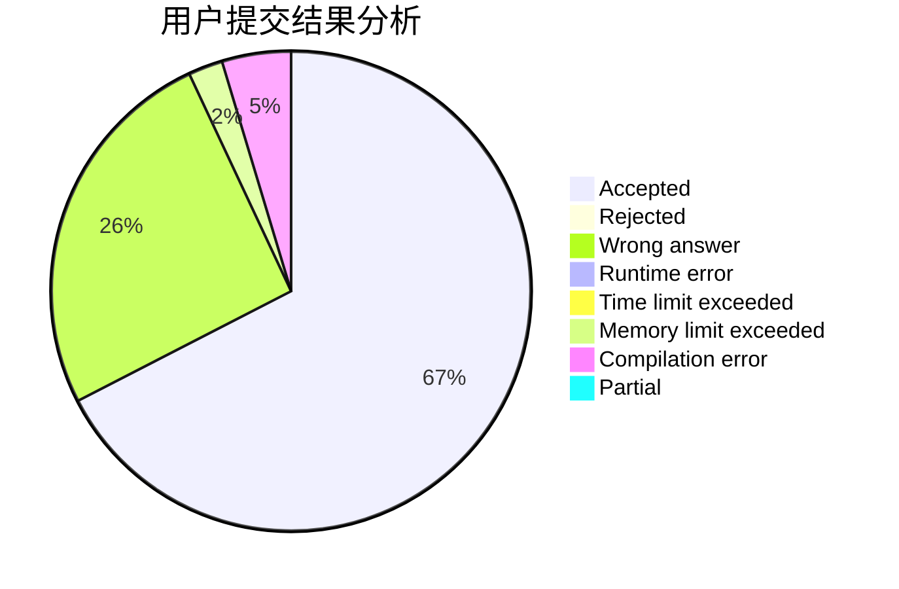
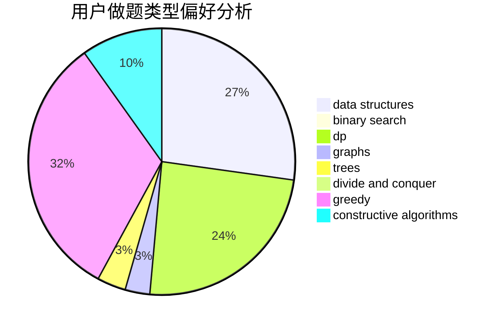
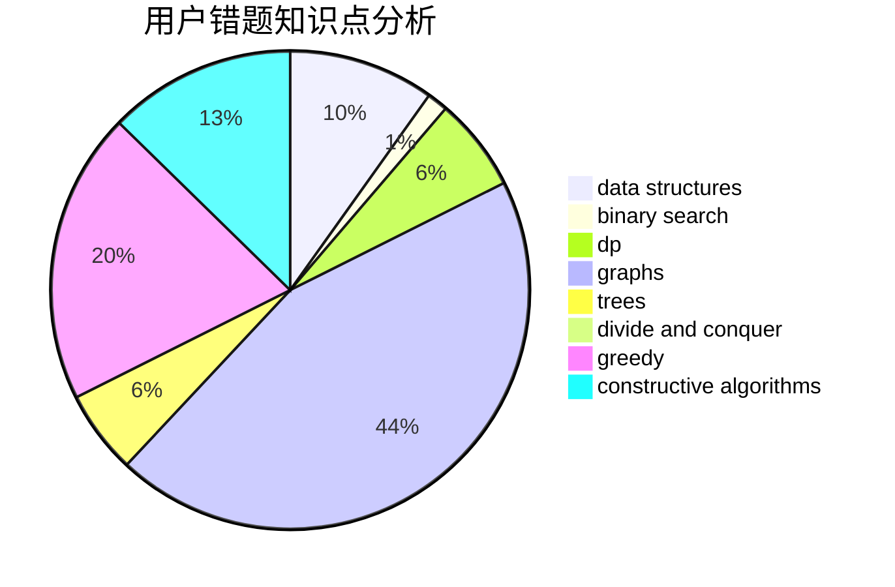

# huxch12345

<!-- tabs:start -->

#### **用户提交结果分析**

#### **用户做题类型偏好分析**

#### **用户错题知识点分析**

<!-- tabs:end -->
# 推荐题目
[1457C](https://codeforces.com/contest/1457/problem/C)		dsu,graphs,sortings,trees		  
[949C](https://codeforces.com/contest/949/problem/C)		dfs and similar,
                        graphs		  
[710D](https://codeforces.com/contest/710/problem/D)		math,
                        number theory		  
[584E](https://codeforces.com/contest/584/problem/E)		constructive algorithms,
                        greedy,
                        math		  
[371D](https://codeforces.com/contest/371/problem/D)		data structures,
                        dsu,
                        implementation,
                        trees		  
[1071A](https://codeforces.com/contest/1071/problem/A)		dsu,graphs,sortings,trees		  
[743E](https://codeforces.com/contest/743/problem/E)		binary search,
                        bitmasks,
                        brute force,
                        dp		  
[1109A](https://codeforces.com/contest/1109/problem/A)		dp,
                        implementation		  
[1482B](https://codeforces.com/contest/1482/problem/B)		implementation,
                        math		  
[835A](https://codeforces.com/contest/835/problem/A)		math		  
