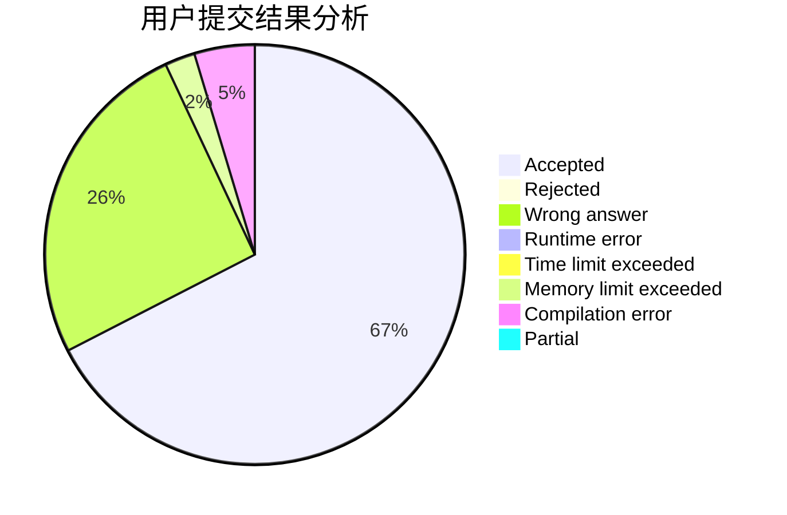
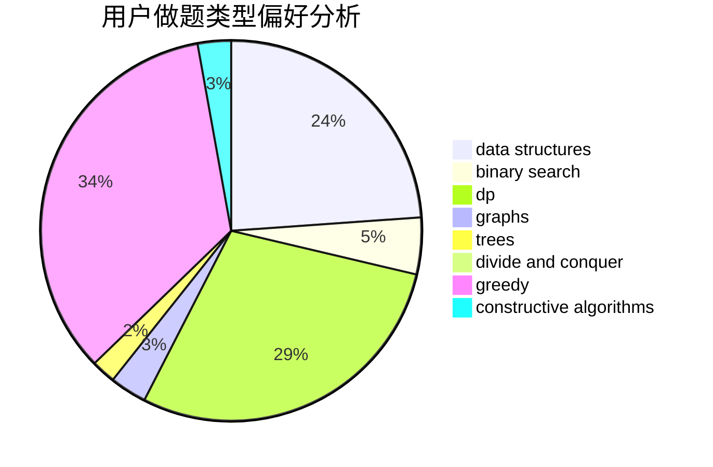
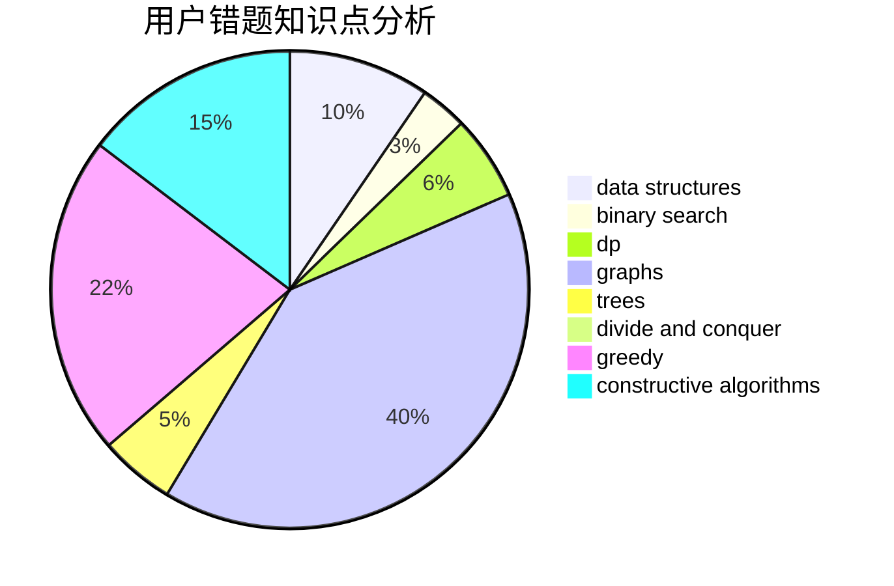

# huxch12345
<!-- tabs:start -->
#### **用户提交结果分析**

#### **用户做题类型偏好分析**

#### **用户错题知识点分析**

<!-- tabs:end -->
# 推荐题目
[Book Reading](http://codeforces.com/problemset/problem/1213/C)		math		  
[Too Much Money](http://codeforces.com/problemset/problem/725/E)		brute force,
                        greedy		  
[DZY Loves Chessboard](http://codeforces.com/problemset/problem/445/A)		dfs and similar,
                        implementation		  
[Matching Names](http://codeforces.com/problemset/problem/566/A)		dfs and similar,
                        strings,
                        trees		  
[The Wall (easy)](http://codeforces.com/problemset/problem/690/D1)		nan		  
[Alice and Bob](http://codeforces.com/problemset/problem/346/A)		games,
                        math,
                        number theory		  
[Growing flowers](http://codeforces.com/problemset/problem/1423/G)		data structures		  
[The Same Calendar](http://codeforces.com/problemset/problem/678/B)		implementation		  
[Collective Mindsets (medium)](http://codeforces.com/problemset/problem/690/A2)		nan		  
[Generate W state](http://codeforces.com/problemset/problem/1002/A4)		nan		  
<!-- tabs:start -->
#### **data structures**
[Book Reading](http://codeforces.com/problemset/problem/1423/G)		data structures		  
[Too Much Money](https://codeforces.com/contest/841/problem/D)		constructive algorithms,
                        data structures,
                        dfs and similar,
                        dp,
                        graphs		  
[DZY Loves Chessboard](http://codeforces.com/problemset/problem/484/E)		binary search,
                        constructive algorithms,
                        data structures		  
[Matching Names](https://codeforces.com/contest/1417/problem/F)		data structures,
                        dsu,
                        graphs,
                        implementation,
                        trees		  
[The Wall (easy)](http://codeforces.com/problemset/problem/1336/F)		data structures,
                        divide and conquer,
                        graphs,
                        trees		  
[Alice and Bob](https://codeforces.com/contest/1447/problem/F1)		data structures,
                        greedy		  
[Growing flowers](http://codeforces.com/problemset/problem/1253/E)		data structures,
                        dp,
                        greedy,
                        sortings		  
[The Same Calendar](http://codeforces.com/problemset/problem/425/C)		data structures,
                        dp		  
[Collective Mindsets (medium)](http://codeforces.com/problemset/problem/292/E)		data structures		  
[Generate W state](http://codeforces.com/problemset/problem/1163/F)		data structures,
                        graphs,
                        shortest paths		  
#### **binary search**
[Book Reading](http://codeforces.com/problemset/problem/925/F)		binary search,
                        flows		  
[Too Much Money](http://codeforces.com/problemset/problem/484/E)		binary search,
                        constructive algorithms,
                        data structures		  
[DZY Loves Chessboard](http://codeforces.com/problemset/problem/815/E)		binary search,
                        constructive algorithms,
                        implementation		  
[Matching Names](http://codeforces.com/problemset/problem/696/F)		binary search,
                        geometry,
                        two pointers		  
[The Wall (easy)](http://codeforces.com/problemset/problem/1182/F)		binary search,
                        data structures,
                        number theory		  
[Alice and Bob](http://codeforces.com/problemset/problem/1492/C)		binary search,
                        data structures,
                        dp,
                        greedy,
                        two pointers		  
[Growing flowers](http://codeforces.com/problemset/problem/1463/D)		binary search,
                        constructive algorithms,
                        greedy,
                        two pointers		  
[The Same Calendar](http://codeforces.com/problemset/problem/1490/G)		binary search,
                        data structures,
                        math		  
[Collective Mindsets (medium)](http://codeforces.com/problemset/problem/1479/D)		binary search,
                        bitmasks,
                        brute force,
                        data structures,
                        probabilities,
                        trees		  
[Generate W state](http://codeforces.com/problemset/problem/1436/E)		binary search,
                        data structures,
                        two pointers		  
#### **dp**
[Book Reading](https://codeforces.com/contest/841/problem/D)		constructive algorithms,
                        data structures,
                        dfs and similar,
                        dp,
                        graphs		  
[Too Much Money](http://codeforces.com/problemset/problem/453/B)		bitmasks,
                        brute force,
                        dp		  
[DZY Loves Chessboard](https://codeforces.com/contest/296/problem/D)		dp,
                        graphs,
                        shortest paths		  
[Matching Names](http://codeforces.com/problemset/problem/1392/H)		combinatorics,
                        dp,
                        math,
                        probabilities		  
[The Wall (easy)](http://codeforces.com/problemset/problem/1253/E)		data structures,
                        dp,
                        greedy,
                        sortings		  
[Alice and Bob](http://codeforces.com/problemset/problem/425/C)		data structures,
                        dp		  
[Growing flowers](http://codeforces.com/problemset/problem/1188/C)		dp		  
[The Same Calendar](http://codeforces.com/problemset/problem/1456/E)		dp,
                        greedy		  
[Collective Mindsets (medium)](https://codeforces.com/contest/418/problem/B)		bitmasks,
                        dp,
                        greedy,
                        sortings		  
[Generate W state](http://codeforces.com/problemset/problem/1392/G)		bitmasks,
                        dfs and similar,
                        dp,
                        math,
                        shortest paths		  
#### **graph**
[Book Reading](http://codeforces.com/problemset/problem/1322/C)		graphs,
                        hashing,
                        math,
                        number theory		  
[Too Much Money](https://codeforces.com/contest/841/problem/D)		constructive algorithms,
                        data structures,
                        dfs and similar,
                        dp,
                        graphs		  
[DZY Loves Chessboard](http://codeforces.com/problemset/problem/1176/D)		dfs and similar,
                        graphs,
                        greedy,
                        number theory,
                        sortings		  
[Matching Names](https://codeforces.com/contest/1417/problem/F)		data structures,
                        dsu,
                        graphs,
                        implementation,
                        trees		  
[The Wall (easy)](https://codeforces.com/contest/296/problem/D)		dp,
                        graphs,
                        shortest paths		  
[Alice and Bob](http://codeforces.com/problemset/problem/1336/F)		data structures,
                        divide and conquer,
                        graphs,
                        trees		  
[Growing flowers](http://codeforces.com/problemset/problem/1473/E)		graphs,
                        shortest paths		  
[The Same Calendar](http://codeforces.com/problemset/problem/1163/F)		data structures,
                        graphs,
                        shortest paths		  
[Collective Mindsets (medium)](http://codeforces.com/problemset/problem/223/E)		flows,
                        geometry,
                        graphs		  
[Generate W state](http://codeforces.com/problemset/problem/164/C)		flows,
                        graphs		  
#### **trees**
[Book Reading](http://codeforces.com/problemset/problem/566/A)		dfs and similar,
                        strings,
                        trees		  
[Too Much Money](https://codeforces.com/contest/1417/problem/F)		data structures,
                        dsu,
                        graphs,
                        implementation,
                        trees		  
[DZY Loves Chessboard](http://codeforces.com/problemset/problem/1336/F)		data structures,
                        divide and conquer,
                        graphs,
                        trees		  
[Matching Names](http://codeforces.com/problemset/problem/923/C)		data structures,
                        greedy,
                        strings,
                        trees		  
[The Wall (easy)](http://codeforces.com/problemset/problem/1479/D)		binary search,
                        bitmasks,
                        brute force,
                        data structures,
                        probabilities,
                        trees		  
[Alice and Bob](http://codeforces.com/problemset/problem/1511/C)		brute force,
                        data structures,
                        implementation,
                        trees		  
[Growing flowers](http://codeforces.com/problemset/problem/1499/F)		combinatorics,
                        dfs and similar,
                        dp,
                        trees		  
[The Same Calendar](http://codeforces.com/problemset/problem/1491/E)		brute force,
                        dfs and similar,
                        divide and conquer,
                        number theory,
                        trees		  
[Collective Mindsets (medium)](http://codeforces.com/problemset/problem/1466/D)		data structures,
                        greedy,
                        sortings,
                        trees		  
[Generate W state](http://codeforces.com/problemset/problem/1495/D)		combinatorics,
                        dfs and similar,
                        graphs,
                        math,
                        shortest paths,
                        trees		  
#### **divide and conquer**
[Book Reading](http://codeforces.com/problemset/problem/1336/F)		data structures,
                        divide and conquer,
                        graphs,
                        trees		  
[Too Much Money](http://codeforces.com/problemset/problem/512/E)		constructive algorithms,
                        divide and conquer		  
[DZY Loves Chessboard](http://codeforces.com/problemset/problem/1461/D)		binary search,
                        brute force,
                        data structures,
                        divide and conquer,
                        implementation,
                        sortings		  
[Matching Names](http://codeforces.com/problemset/problem/1466/G)		combinatorics,
                        divide and conquer,
                        hashing,
                        math,
                        string suffix structures,
                        strings		  
[The Wall (easy)](http://codeforces.com/problemset/problem/1490/D)		dfs and similar,
                        divide and conquer,
                        implementation		  
[Alice and Bob](https://codeforces.com/contest/1483/problem/C)		data structures,
                        divide and conquer,
                        dp		  
[Growing flowers](http://codeforces.com/problemset/problem/1491/E)		brute force,
                        dfs and similar,
                        divide and conquer,
                        number theory,
                        trees		  
[The Same Calendar](http://codeforces.com/problemset/problem/1303/G)		data structures,
                        divide and conquer,
                        geometry,
                        trees		  
[Collective Mindsets (medium)](http://codeforces.com/problemset/problem/1494/D)		constructive algorithms,
                        data structures,
                        dfs and similar,
                        divide and conquer,
                        dsu,
                        greedy,
                        sortings,
                        trees		  
[Generate W state](http://codeforces.com/problemset/problem/1482/E)		data structures,
                        divide and conquer,
                        dp		  
#### **greedy**
[Book Reading](http://codeforces.com/problemset/problem/725/E)		brute force,
                        greedy		  
[Too Much Money](http://codeforces.com/problemset/problem/891/B)		constructive algorithms,
                        greedy		  
[DZY Loves Chessboard](http://codeforces.com/problemset/problem/1176/D)		dfs and similar,
                        graphs,
                        greedy,
                        number theory,
                        sortings		  
[Matching Names](http://codeforces.com/problemset/problem/1452/F)		constructive algorithms,
                        greedy		  
[The Wall (easy)](http://codeforces.com/problemset/problem/1198/F)		greedy,
                        number theory,
                        probabilities		  
[Alice and Bob](https://codeforces.com/contest/516/problem/A)		greedy,
                        math,
                        sortings		  
[Growing flowers](http://codeforces.com/problemset/problem/1108/E1)		brute force,
                        greedy,
                        implementation		  
[The Same Calendar](https://codeforces.com/contest/1447/problem/F1)		data structures,
                        greedy		  
[Collective Mindsets (medium)](http://codeforces.com/problemset/problem/1253/E)		data structures,
                        dp,
                        greedy,
                        sortings		  
[Generate W state](http://codeforces.com/problemset/problem/1456/E)		dp,
                        greedy		  
#### **constructive algorithms**
[Book Reading](http://codeforces.com/problemset/problem/891/B)		constructive algorithms,
                        greedy		  
[Too Much Money](https://codeforces.com/contest/841/problem/D)		constructive algorithms,
                        data structures,
                        dfs and similar,
                        dp,
                        graphs		  
[DZY Loves Chessboard](http://codeforces.com/problemset/problem/484/E)		binary search,
                        constructive algorithms,
                        data structures		  
[Matching Names](http://codeforces.com/problemset/problem/659/B)		constructive algorithms,
                        sortings		  
[The Wall (easy)](http://codeforces.com/problemset/problem/1452/F)		constructive algorithms,
                        greedy		  
[Alice and Bob](http://codeforces.com/problemset/problem/815/E)		binary search,
                        constructive algorithms,
                        implementation		  
[Growing flowers](http://codeforces.com/problemset/problem/711/B)		constructive algorithms,
                        implementation		  
[The Same Calendar](http://codeforces.com/problemset/problem/1137/D)		constructive algorithms,
                        interactive,
                        number theory		  
[Collective Mindsets (medium)](http://codeforces.com/problemset/problem/512/E)		constructive algorithms,
                        divide and conquer		  
[Generate W state](http://codeforces.com/problemset/problem/1118/E)		constructive algorithms,
                        implementation		  
#### **sortings**
[Book Reading](http://codeforces.com/problemset/problem/659/B)		constructive algorithms,
                        sortings		  
[Too Much Money](http://codeforces.com/problemset/problem/1176/D)		dfs and similar,
                        graphs,
                        greedy,
                        number theory,
                        sortings		  
[DZY Loves Chessboard](https://codeforces.com/contest/516/problem/A)		greedy,
                        math,
                        sortings		  
[Matching Names](http://codeforces.com/problemset/problem/1253/E)		data structures,
                        dp,
                        greedy,
                        sortings		  
[The Wall (easy)](https://codeforces.com/contest/418/problem/B)		bitmasks,
                        dp,
                        greedy,
                        sortings		  
[Alice and Bob](http://codeforces.com/problemset/problem/1175/D)		greedy,
                        sortings		  
[Growing flowers](http://codeforces.com/problemset/problem/1418/B)		greedy,
                        sortings		  
[The Same Calendar](https://codeforces.com/contest/1496/problem/C)		geometry,
                        greedy,
                        math,
                        sortings		  
[Collective Mindsets (medium)](http://codeforces.com/problemset/problem/1495/A)		geometry,
                        greedy,
                        math,
                        sortings		  
[Generate W state](http://codeforces.com/problemset/problem/1497/A)		brute force,
                        data structures,
                        greedy,
                        sortings		  
<!-- tabs:end -->
