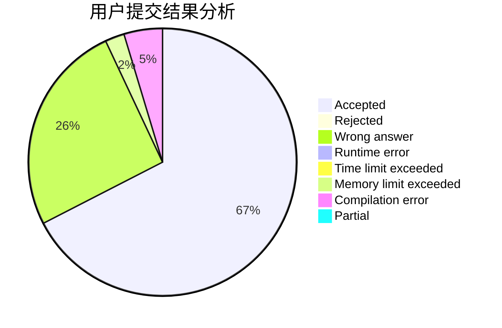
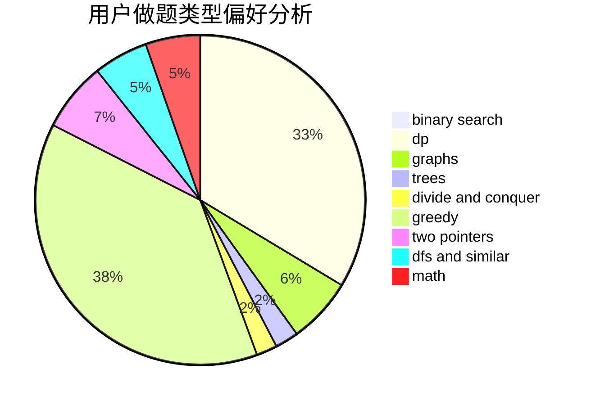

# huxch12345

<!-- tabs:start -->

#### **用户提交结果分析**

#### **用户做题类型偏好分析**

<!-- tabs:end -->
# 推荐题目
[1457C](https://codeforces.com/contest/1457/problem/C)
[949C](https://codeforces.com/contest/949/problem/C)
[710D](https://codeforces.com/contest/710/problem/D)
[584E](https://codeforces.com/contest/584/problem/E)
[371D](https://codeforces.com/contest/371/problem/D)
[1071A](https://codeforces.com/contest/1071/problem/A)
[743E](https://codeforces.com/contest/743/problem/E)
[1109A](https://codeforces.com/contest/1109/problem/A)
[1482B](https://codeforces.com/contest/1482/problem/B)
[835A](https://codeforces.com/contest/835/problem/A)
