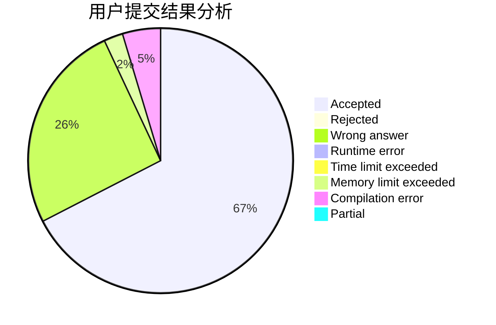
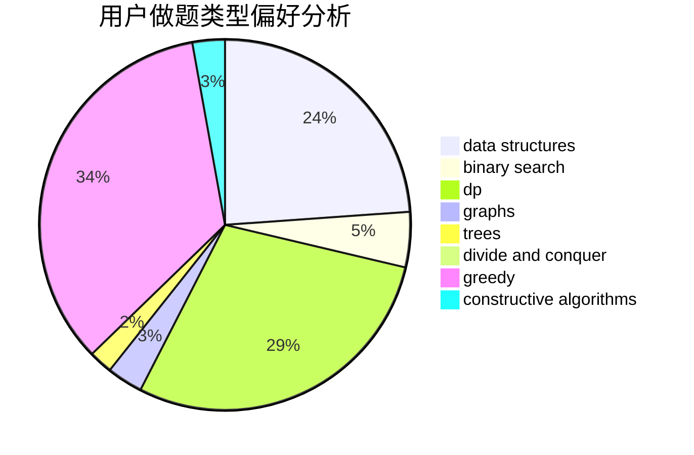
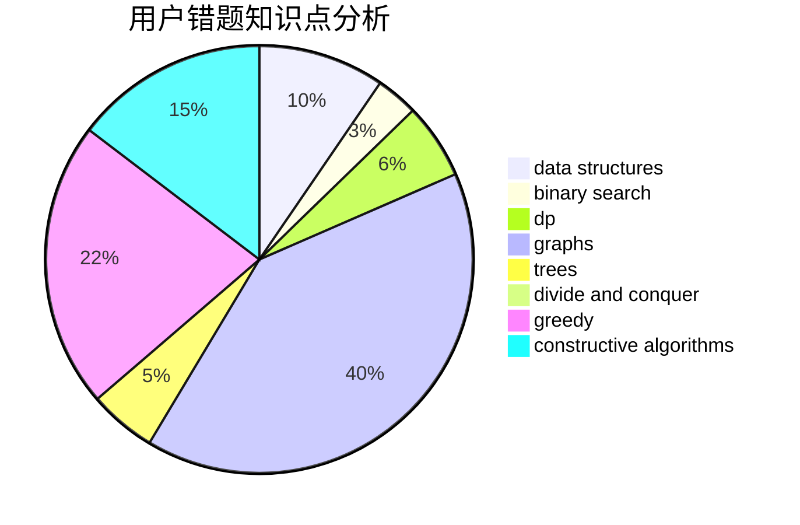

# huxch12345

<!-- tabs:start -->

#### **用户提交结果分析**

#### **用户做题类型偏好分析**

#### **用户错题知识点分析**

<!-- tabs:end -->
# 推荐题目
[1447F1](https://codeforces.com/contest/1447F/problem/1)		dsu,graphs,sortings,trees		  
[925F](https://codeforces.com/contest/925/problem/F)		binary search,
                        flows		  
[690D1](https://codeforces.com/contest/690D/problem/1)		nan		  
[566A](https://codeforces.com/contest/566/problem/A)		dfs and similar,
                        strings,
                        trees		  
[346A](https://codeforces.com/contest/346/problem/A)		games,
                        math,
                        number theory		  
[1070K](https://codeforces.com/contest/1070/problem/K)		implementation		  
[725E](https://codeforces.com/contest/725/problem/E)		brute force,
                        greedy		  
[1108E1](https://codeforces.com/contest/1108E/problem/1)		brute force,
                        greedy,
                        implementation		  
[1473E](https://codeforces.com/contest/1473/problem/E)		graphs,
                        shortest paths		  
[815E](https://codeforces.com/contest/815/problem/E)		binary search,
                        constructive algorithms,
                        implementation		  
