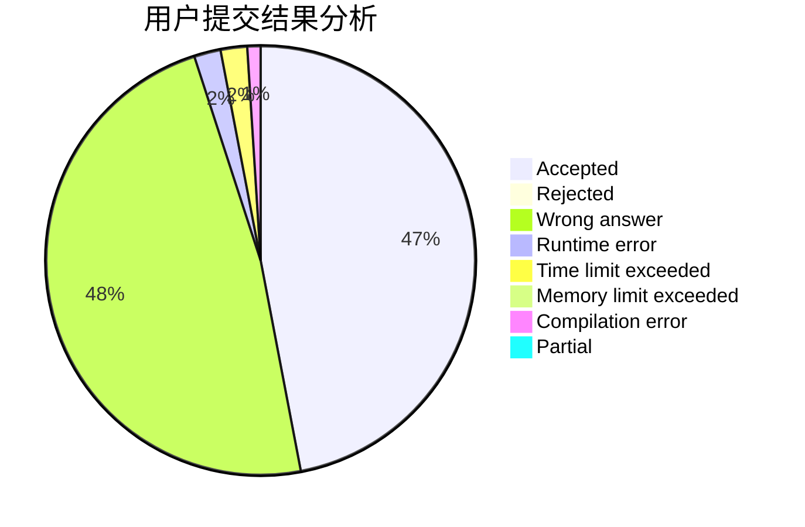
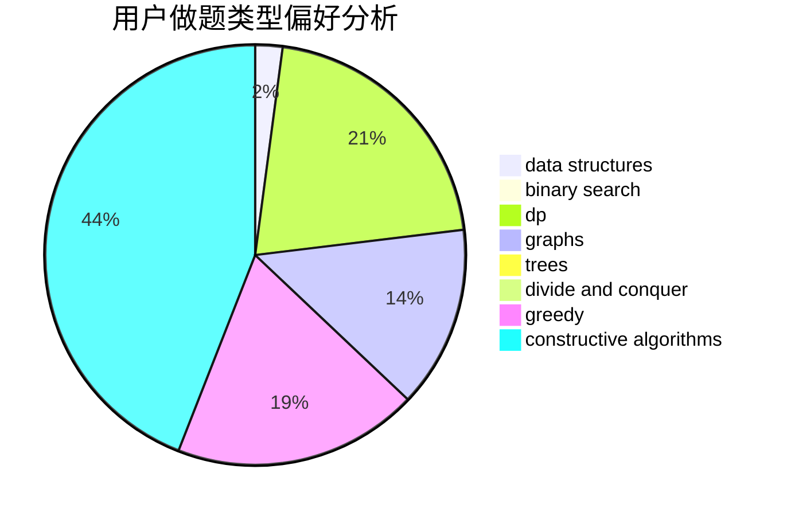
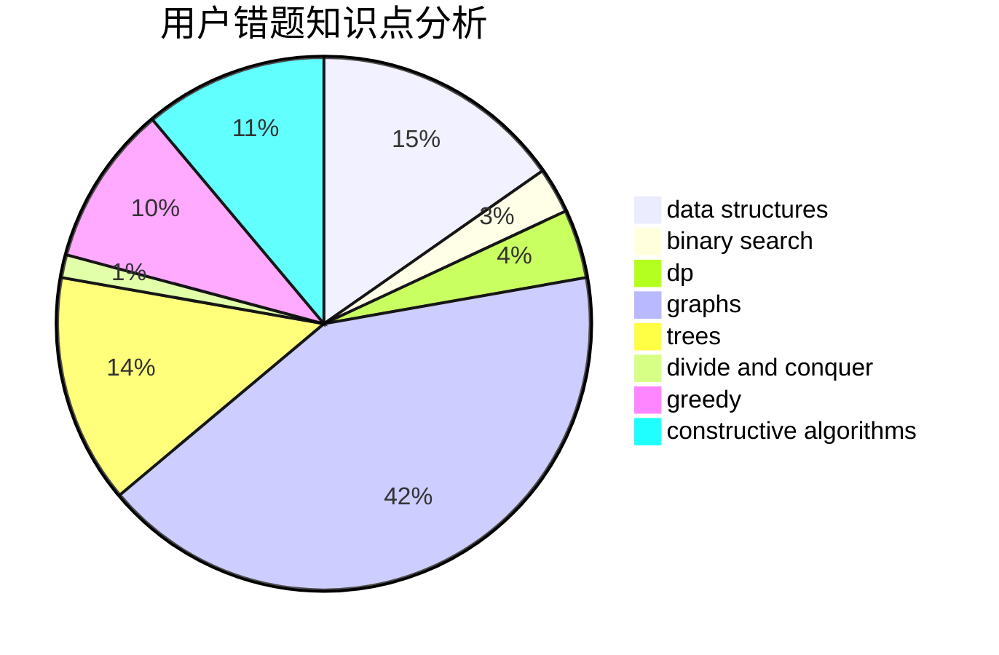

# hx24

<!-- tabs:start -->

#### **用户提交结果分析**

#### **用户做题类型偏好分析**

#### **用户错题知识点分析**

<!-- tabs:end -->
# 推荐题目
[1099C](https://codeforces.com/contest/1099/problem/C)		constructive algorithms,
                        implementation		  
[543E](https://codeforces.com/contest/543/problem/E)		constructive algorithms,
                        data structures		  
[841D](https://codeforces.com/contest/841/problem/D)		dsu,graphs,sortings,trees		  
[216B](https://codeforces.com/contest/216/problem/B)		dfs and similar,
                        implementation		  
[1236E](https://codeforces.com/contest/1236/problem/E)		binary search,
                        data structures,
                        dp,
                        dsu		  
[862B](https://codeforces.com/contest/862/problem/B)		dfs and similar,
                        graphs,
                        trees		  
[1271F](https://codeforces.com/contest/1271/problem/F)		brute force		  
[1070M](https://codeforces.com/contest/1070/problem/M)		constructive algorithms,
                        divide and conquer,
                        geometry		  
[939B](https://codeforces.com/contest/939/problem/B)		implementation		  
[1314C](https://codeforces.com/contest/1314/problem/C)		dsu,graphs,sortings,trees		  
