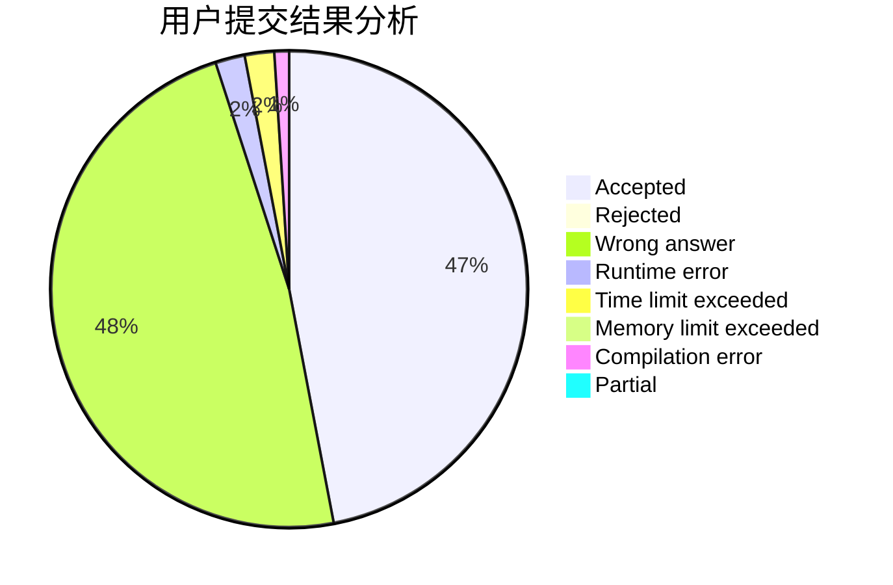
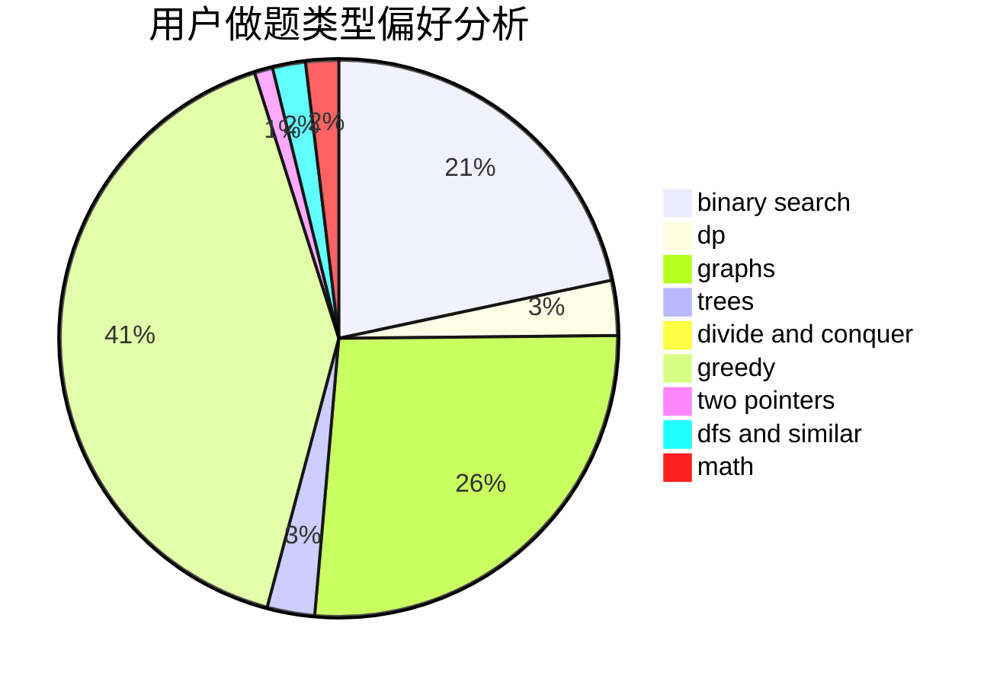

# hx24

<!-- tabs:start -->

#### **用户提交结果分析**

#### **用户做题类型偏好分析**

<!-- tabs:end -->
# 推荐题目
[1099F](https://codeforces.com/contest/1099/problem/F)
[568A](https://codeforces.com/contest/568/problem/A)
[860D](https://codeforces.com/contest/860/problem/D)
[235D](https://codeforces.com/contest/235/problem/D)
[1241B](https://codeforces.com/contest/1241/problem/B)
[87C](https://codeforces.com/contest/87/problem/C)
[1281B](https://codeforces.com/contest/1281/problem/B)
[1071C](https://codeforces.com/contest/1071/problem/C)
[960E](https://codeforces.com/contest/960/problem/E)
[1324B](https://codeforces.com/contest/1324/problem/B)
