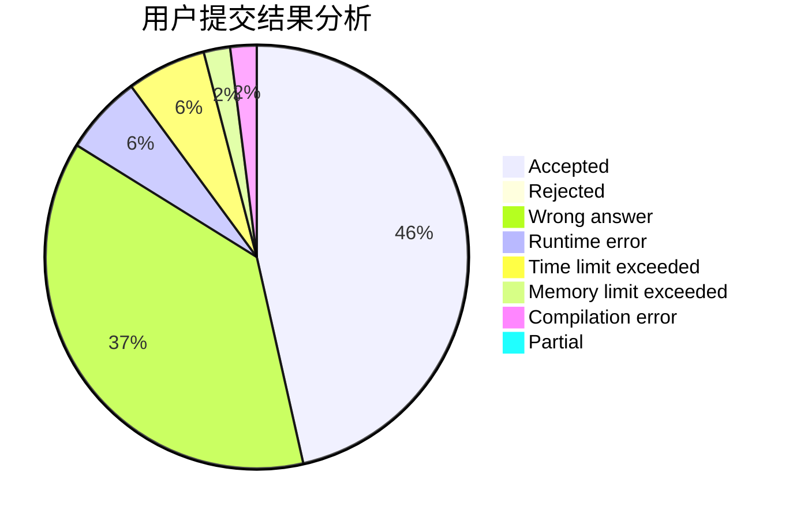
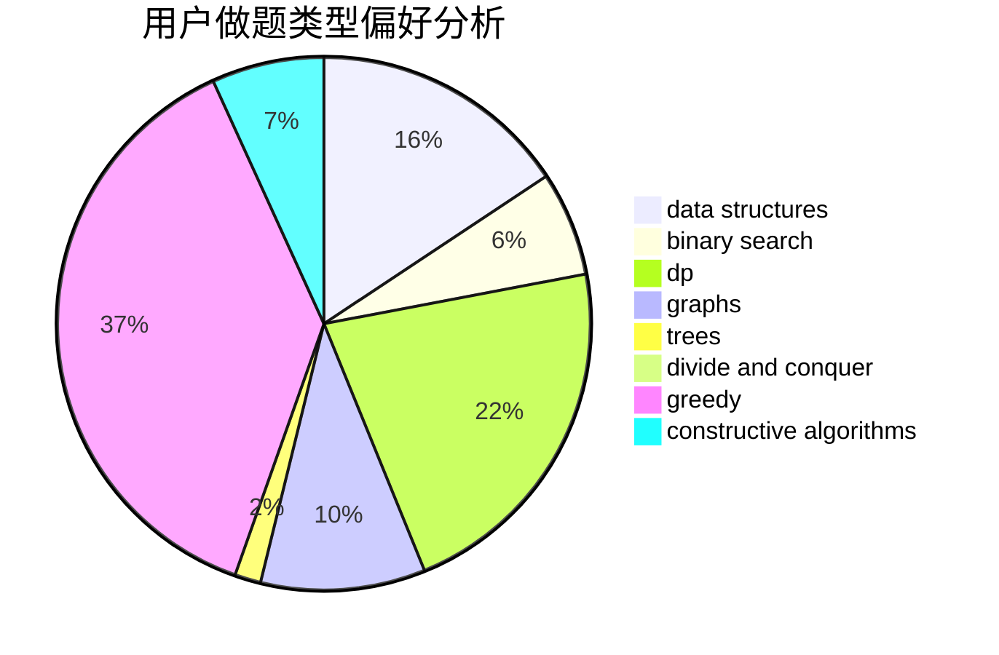
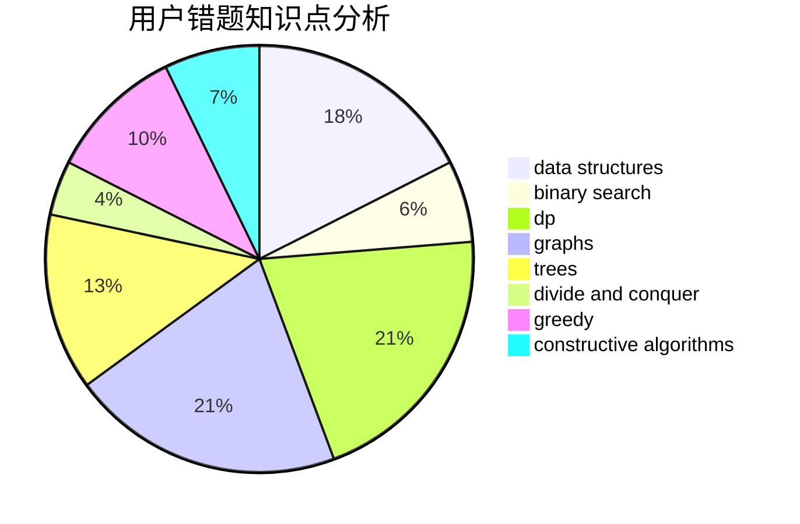

# hychyc

<!-- tabs:start -->

#### **用户提交结果分析**

#### **用户做题类型偏好分析**

#### **用户错题知识点分析**

<!-- tabs:end -->
# 推荐题目
[1375A](https://codeforces.com/contest/1375/problem/A)		constructive algorithms,
                        math		  
[451A](https://codeforces.com/contest/451/problem/A)		implementation		  
[1430F](https://codeforces.com/contest/1430/problem/F)		dp,
                        greedy		  
[814C](https://codeforces.com/contest/814/problem/C)		brute force,
                        dp,
                        strings,
                        two pointers		  
[557C](https://codeforces.com/contest/557/problem/C)		brute force,
                        data structures,
                        dp,
                        greedy,
                        math,
                        sortings		  
[949A](https://codeforces.com/contest/949/problem/A)		greedy		  
[1210D](https://codeforces.com/contest/1210/problem/D)		graphs		  
[685B](https://codeforces.com/contest/685/problem/B)		data structures,
                        dfs and similar,
                        dp,
                        trees		  
[277C](https://codeforces.com/contest/277/problem/C)		games,
                        implementation		  
[254D](https://codeforces.com/contest/254/problem/D)		brute force,
                        dfs and similar,
                        graphs,
                        implementation,
                        shortest paths		  
