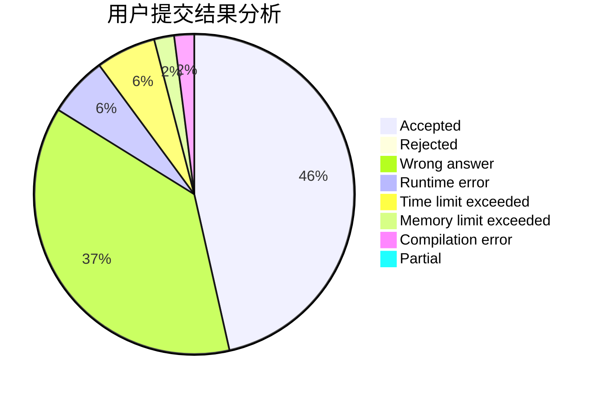
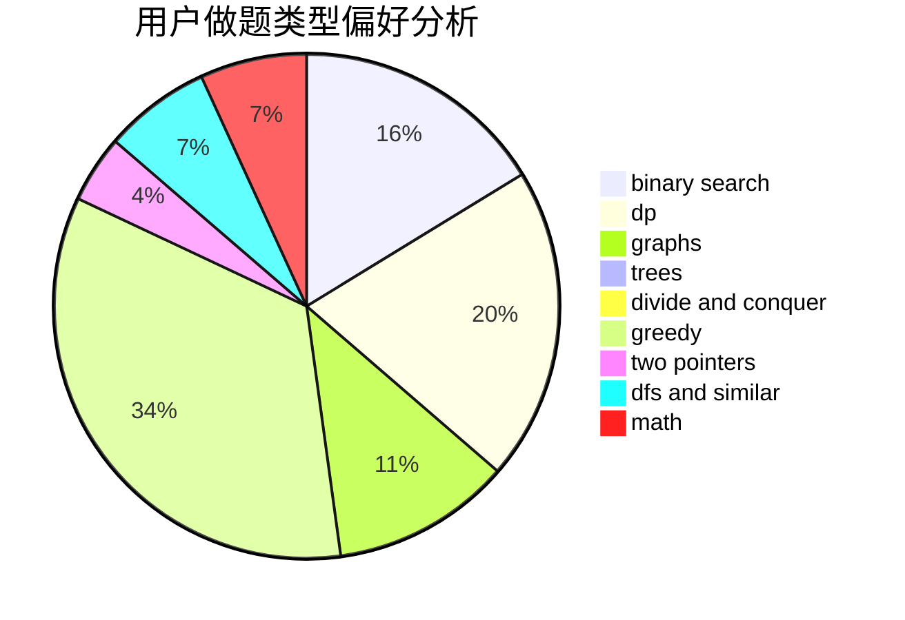

# hychyc

<!-- tabs:start -->

#### **用户提交结果分析**

#### **用户做题类型偏好分析**

<!-- tabs:end -->
# 推荐题目
[13841](https://codeforces.com/contest/1384/problem/1)
[472D](https://codeforces.com/contest/472/problem/D)
[1439D](https://codeforces.com/contest/1439/problem/D)
[833A](https://codeforces.com/contest/833/problem/A)
[580D](https://codeforces.com/contest/580/problem/D)
[965E](https://codeforces.com/contest/965/problem/E)
[1216C](https://codeforces.com/contest/1216/problem/C)
[707D](https://codeforces.com/contest/707/problem/D)
[292D](https://codeforces.com/contest/292/problem/D)
[273D](https://codeforces.com/contest/273/problem/D)
