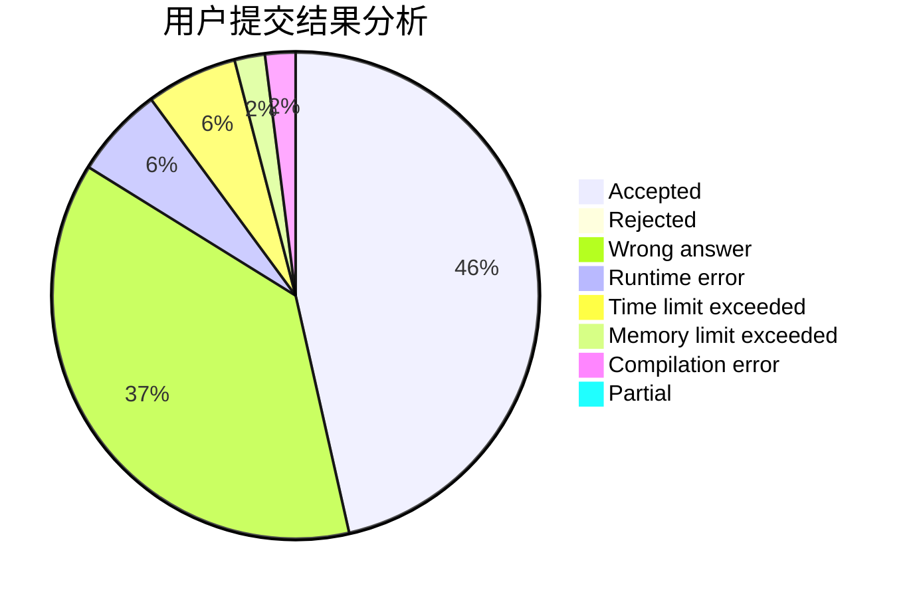
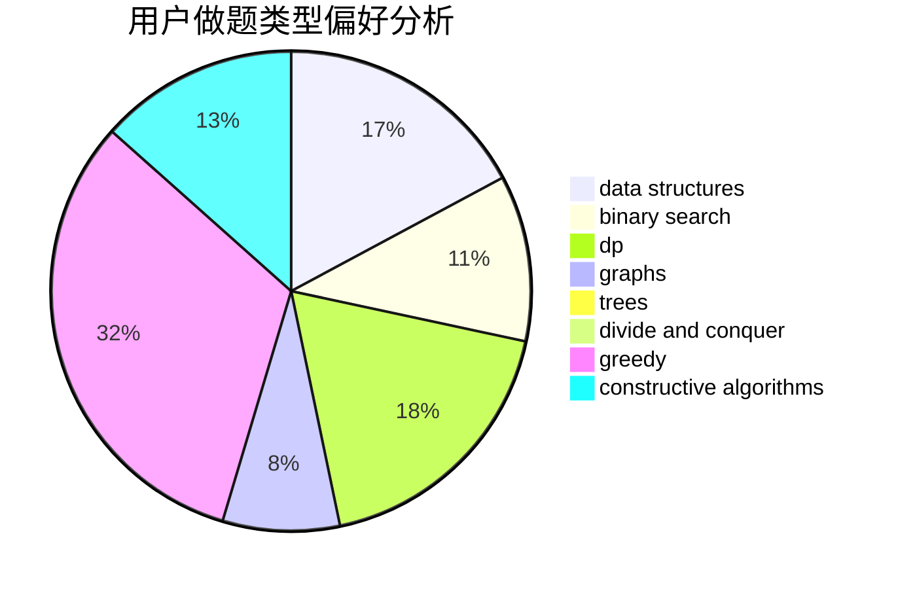
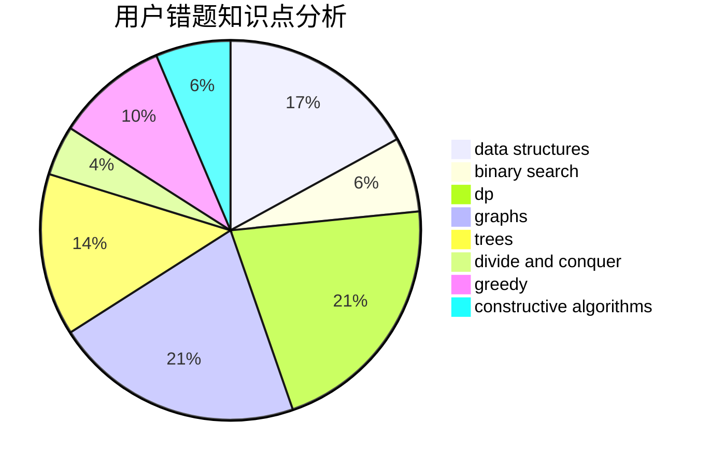

# hychyc

<!-- tabs:start -->

#### **用户提交结果分析**

#### **用户做题类型偏好分析**

#### **用户错题知识点分析**

<!-- tabs:end -->
# 推荐题目
[13841](https://codeforces.com/contest/1384/problem/1)		dsu,graphs,sortings,trees		  
[472D](https://codeforces.com/contest/472/problem/D)		dfs and similar,
                        dsu,
                        shortest paths,
                        trees		  
[1439D](https://codeforces.com/contest/1439/problem/D)		combinatorics,
                        dp,
                        fft		  
[833A](https://codeforces.com/contest/833/problem/A)		math,
                        number theory		  
[580D](https://codeforces.com/contest/580/problem/D)		bitmasks,
                        dp		  
[965E](https://codeforces.com/contest/965/problem/E)		data structures,
                        dp,
                        greedy,
                        strings,
                        trees		  
[1216C](https://codeforces.com/contest/1216/problem/C)		geometry,
                        math		  
[707D](https://codeforces.com/contest/707/problem/D)		bitmasks,
                        data structures,
                        dfs and similar,
                        implementation		  
[292D](https://codeforces.com/contest/292/problem/D)		data structures,
                        dfs and similar,
                        dp,
                        dsu		  
[273D](https://codeforces.com/contest/273/problem/D)		dp		  
