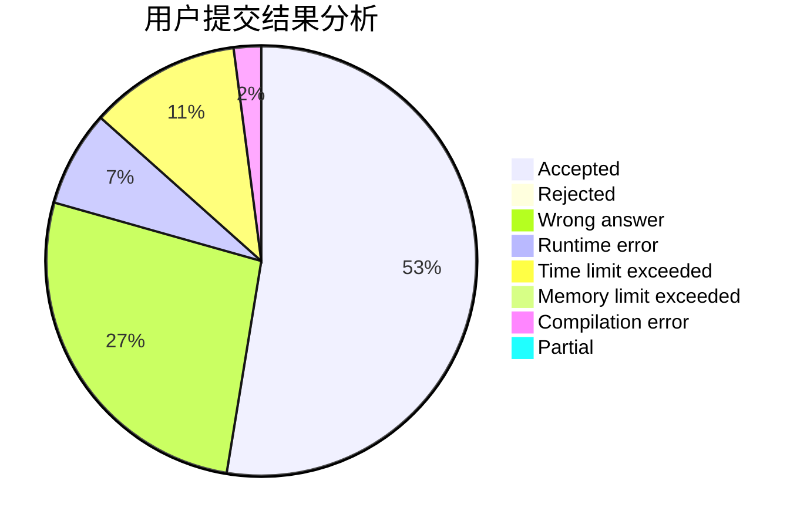
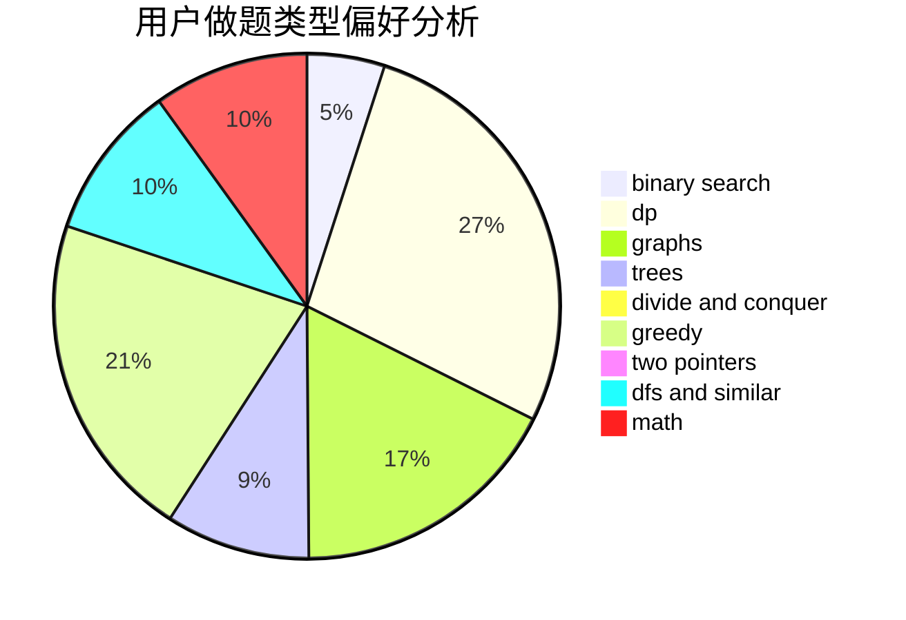

# hyjhyj

<!-- tabs:start -->

#### **用户提交结果分析**

#### **用户做题类型偏好分析**

<!-- tabs:end -->
# 推荐题目
[580D](https://codeforces.com/contest/580/problem/D)
[763D](https://codeforces.com/contest/763/problem/D)
[519B](https://codeforces.com/contest/519/problem/B)
[568A](https://codeforces.com/contest/568/problem/A)
[898C](https://codeforces.com/contest/898/problem/C)
[525C](https://codeforces.com/contest/525/problem/C)
[1393D](https://codeforces.com/contest/1393/problem/D)
[1121A](https://codeforces.com/contest/1121/problem/A)
[876F](https://codeforces.com/contest/876/problem/F)
[520C](https://codeforces.com/contest/520/problem/C)
