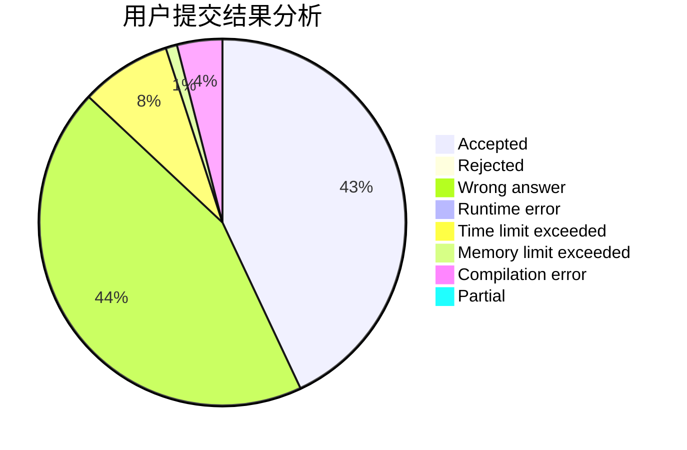
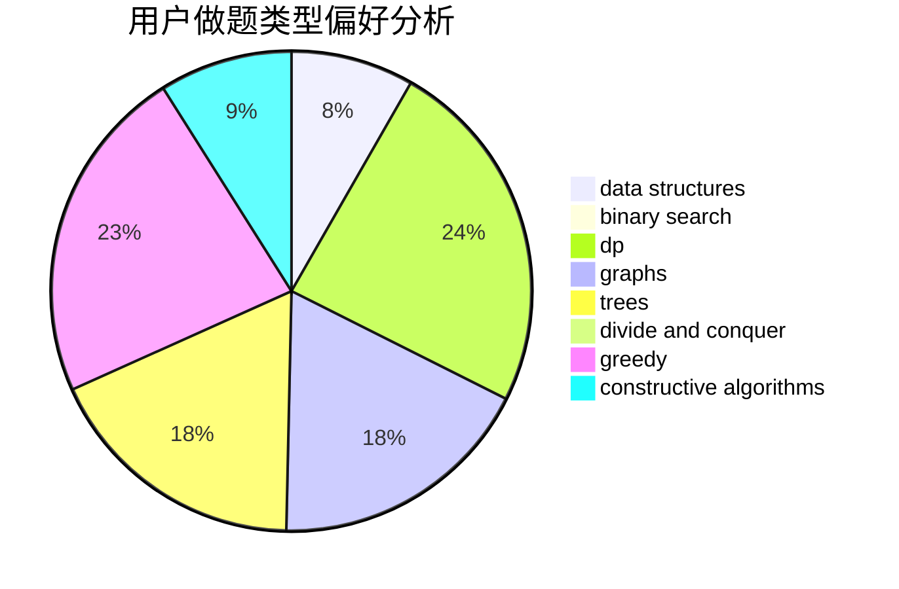
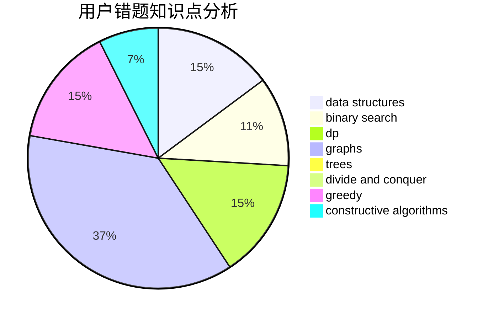

# hyp1231

<!-- tabs:start -->

#### **用户提交结果分析**

#### **用户做题类型偏好分析**

#### **用户错题知识点分析**

<!-- tabs:end -->
# 推荐题目
[380C](https://codeforces.com/contest/380/problem/C)		data structures,
                        schedules		  
[366C](https://codeforces.com/contest/366/problem/C)		dp		  
[1370A](https://codeforces.com/contest/1370/problem/A)		greedy,
                        implementation,
                        math,
                        number theory		  
[1148E](https://codeforces.com/contest/1148/problem/E)		constructive algorithms,
                        greedy,
                        math,
                        sortings,
                        two pointers		  
[1288F](https://codeforces.com/contest/1288/problem/F)		constructive algorithms,
                        flows		  
[44I](https://codeforces.com/contest/44/problem/I)		brute force,
                        combinatorics		  
[1366B](https://codeforces.com/contest/1366/problem/B)		math,
                        two pointers		  
[1030B](https://codeforces.com/contest/1030/problem/B)		geometry		  
[1482E](https://codeforces.com/contest/1482/problem/E)		data structures,
                        divide and conquer,
                        dp		  
[1489D](https://codeforces.com/contest/1489/problem/D)		dsu,graphs,sortings,trees		  
