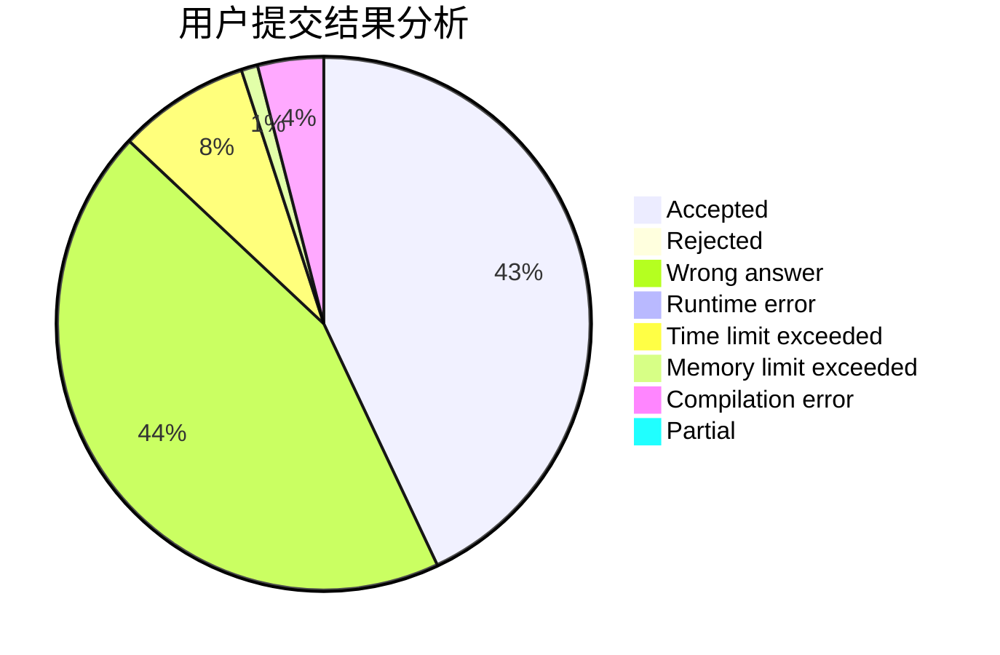
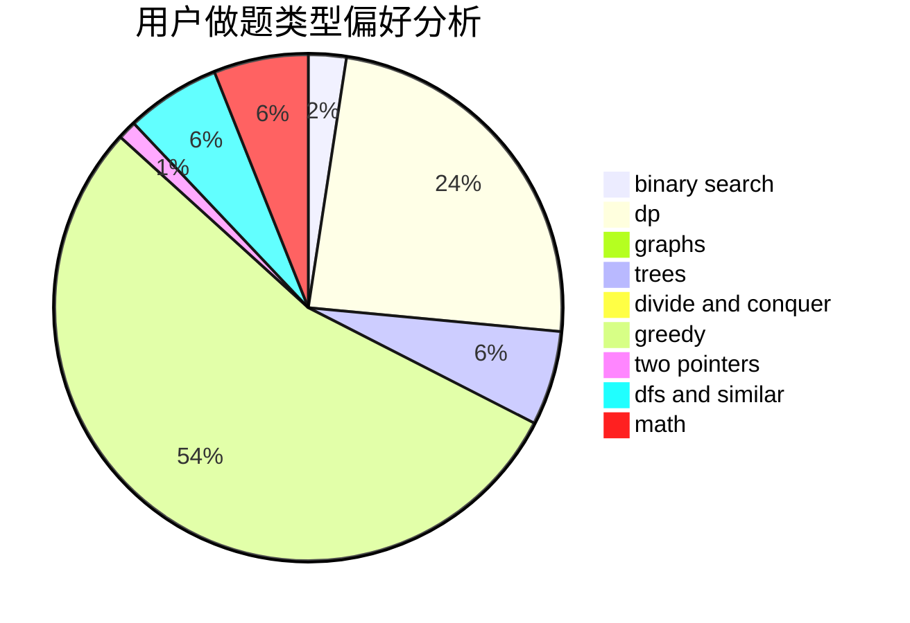

# hyp1231

<!-- tabs:start -->

#### **用户提交结果分析**

#### **用户做题类型偏好分析**

<!-- tabs:end -->
# 推荐题目
[411A](https://codeforces.com/contest/411/problem/A)
[394C](https://codeforces.com/contest/394/problem/C)
[13783](https://codeforces.com/contest/1378/problem/3)
[114E](https://codeforces.com/contest/114/problem/E)
[12962](https://codeforces.com/contest/1296/problem/2)
[472B](https://codeforces.com/contest/472/problem/B)
[1373A](https://codeforces.com/contest/1373/problem/A)
[1030E](https://codeforces.com/contest/1030/problem/E)
[1490C](https://codeforces.com/contest/1490/problem/C)
[1497B](https://codeforces.com/contest/1497/problem/B)
