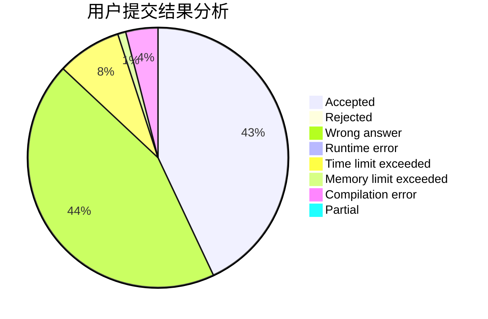
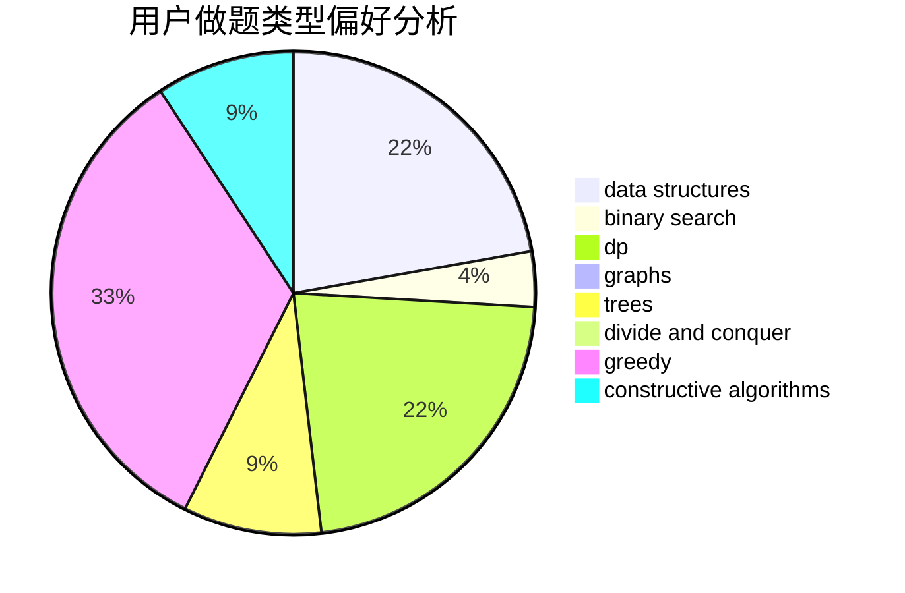
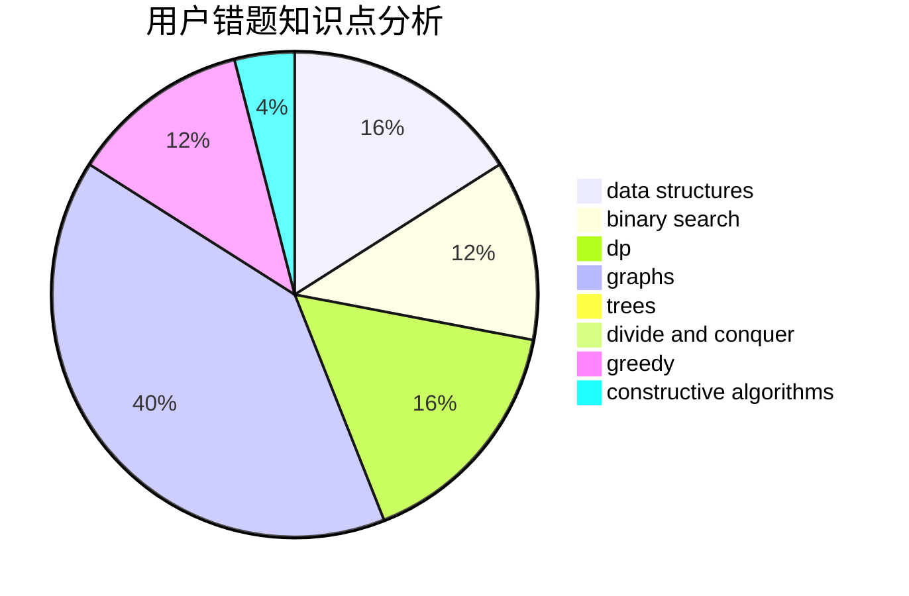

# hyp1231

<!-- tabs:start -->

#### **用户提交结果分析**

#### **用户做题类型偏好分析**

#### **用户错题知识点分析**

<!-- tabs:end -->
# 推荐题目
[411A](https://codeforces.com/contest/411/problem/A)		*special problem,
                        implementation		  
[394C](https://codeforces.com/contest/394/problem/C)		constructive algorithms,
                        greedy		  
[13783](https://codeforces.com/contest/1378/problem/3)		dsu,graphs,sortings,trees		  
[114E](https://codeforces.com/contest/114/problem/E)		dsu,graphs,sortings,trees		  
[12962](https://codeforces.com/contest/1296/problem/2)		dsu,graphs,sortings,trees		  
[472B](https://codeforces.com/contest/472/problem/B)		nan		  
[1373A](https://codeforces.com/contest/1373/problem/A)		greedy,
                        implementation,
                        math		  
[1030E](https://codeforces.com/contest/1030/problem/E)		bitmasks,
                        dp		  
[1490C](https://codeforces.com/contest/1490/problem/C)		binary search,
                        brute force,
                        brute force,
                        math		  
[1497B](https://codeforces.com/contest/1497/problem/B)		constructive algorithms,
                        greedy,
                        math		  
