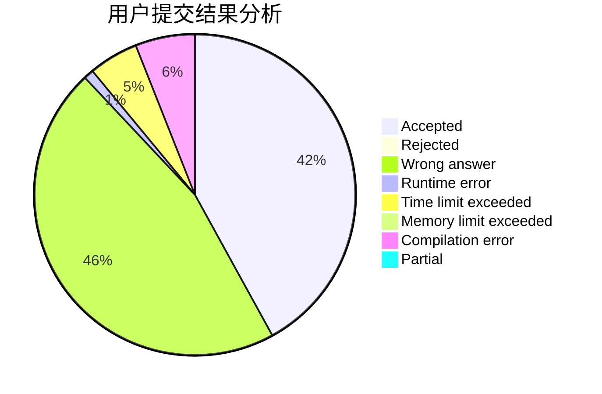
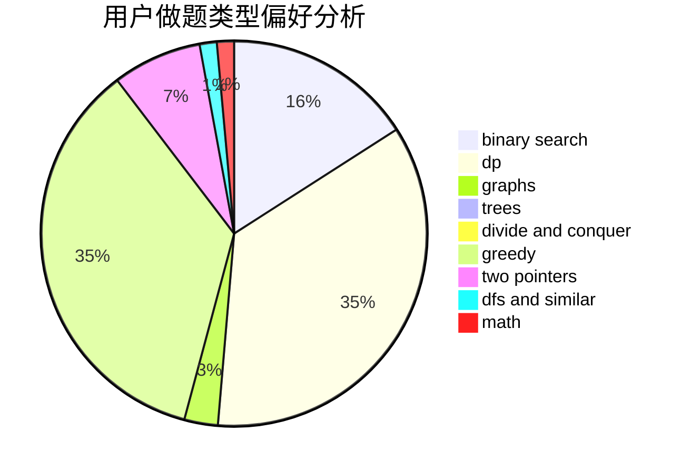

# hyta4982

<!-- tabs:start -->

#### **用户提交结果分析**

#### **用户做题类型偏好分析**

<!-- tabs:end -->
# 推荐题目
[1503D](https://codeforces.com/contest/1503/problem/D)
[1208D](https://codeforces.com/contest/1208/problem/D)
[185A](https://codeforces.com/contest/185/problem/A)
[11881](https://codeforces.com/contest/1188/problem/1)
[850E](https://codeforces.com/contest/850/problem/E)
[1346F](https://codeforces.com/contest/1346/problem/F)
[393C](https://codeforces.com/contest/393/problem/C)
[260E](https://codeforces.com/contest/260/problem/E)
[827C](https://codeforces.com/contest/827/problem/C)
[1201B](https://codeforces.com/contest/1201/problem/B)
