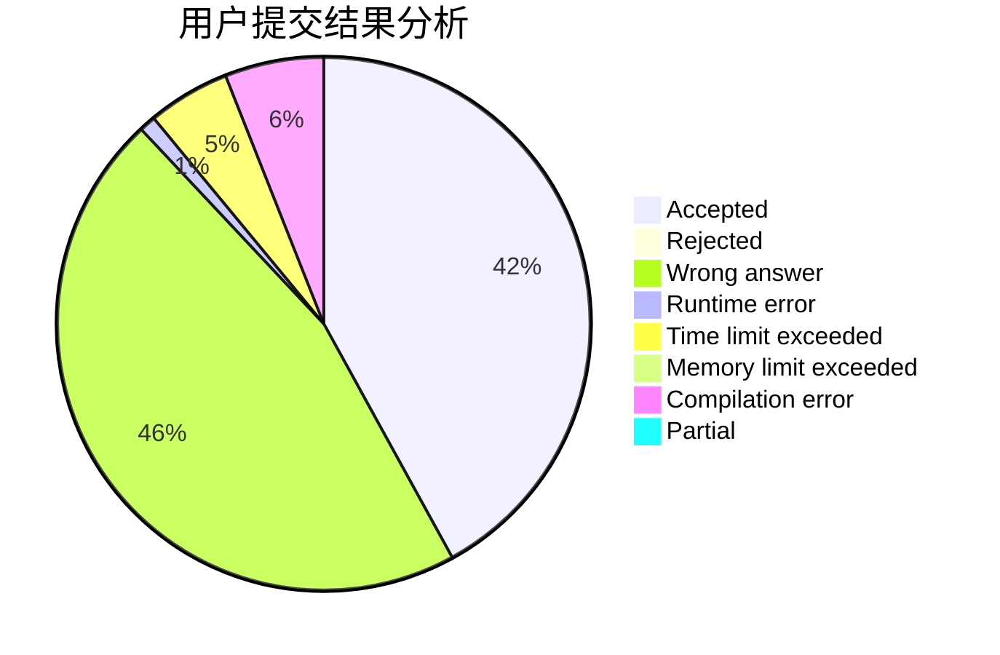
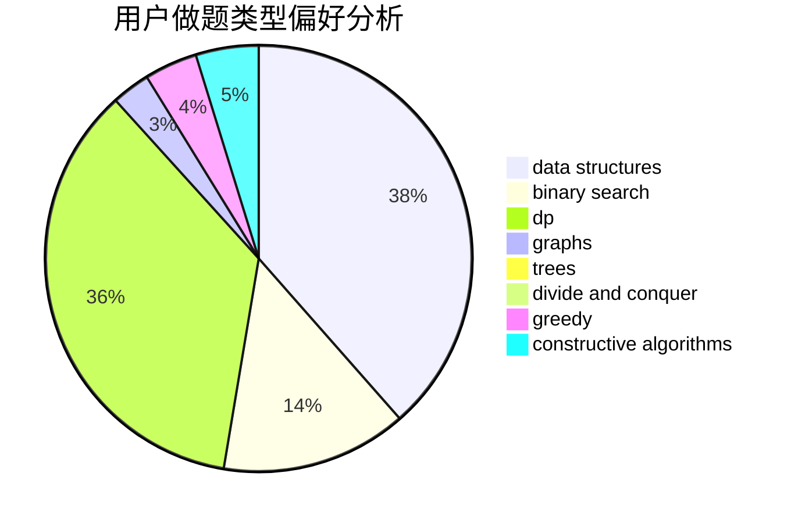

# hyta4982

<!-- tabs:start -->

#### **用户提交结果分析**

#### **用户做题类型偏好分析**

#### **用户错题知识点分析**

<!-- tabs:end -->
# 推荐题目
[1503D](https://codeforces.com/contest/1503/problem/D)		2-sat,
                        constructive algorithms,
                        data structures,
                        greedy,
                        sortings,
                        two pointers		  
[1208D](https://codeforces.com/contest/1208/problem/D)		binary search,
                        data structures,
                        greedy,
                        implementation		  
[185A](https://codeforces.com/contest/185/problem/A)		math		  
[11881](https://codeforces.com/contest/1188/problem/1)		dsu,graphs,sortings,trees		  
[850E](https://codeforces.com/contest/850/problem/E)		bitmasks,
                        brute force,
                        divide and conquer,
                        fft,
                        math		  
[1346F](https://codeforces.com/contest/1346/problem/F)		*special problem,
                        data structures,
                        greedy,
                        math		  
[393C](https://codeforces.com/contest/393/problem/C)		dsu,graphs,sortings,trees		  
[260E](https://codeforces.com/contest/260/problem/E)		binary search,
                        brute force,
                        data structures		  
[827C](https://codeforces.com/contest/827/problem/C)		data structures,
                        strings		  
[1201B](https://codeforces.com/contest/1201/problem/B)		greedy,
                        math		  
