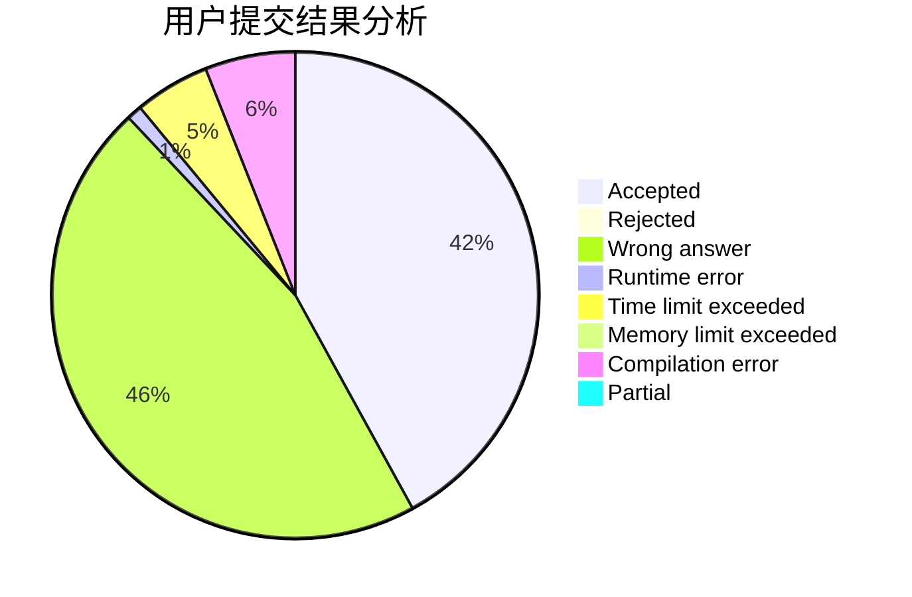
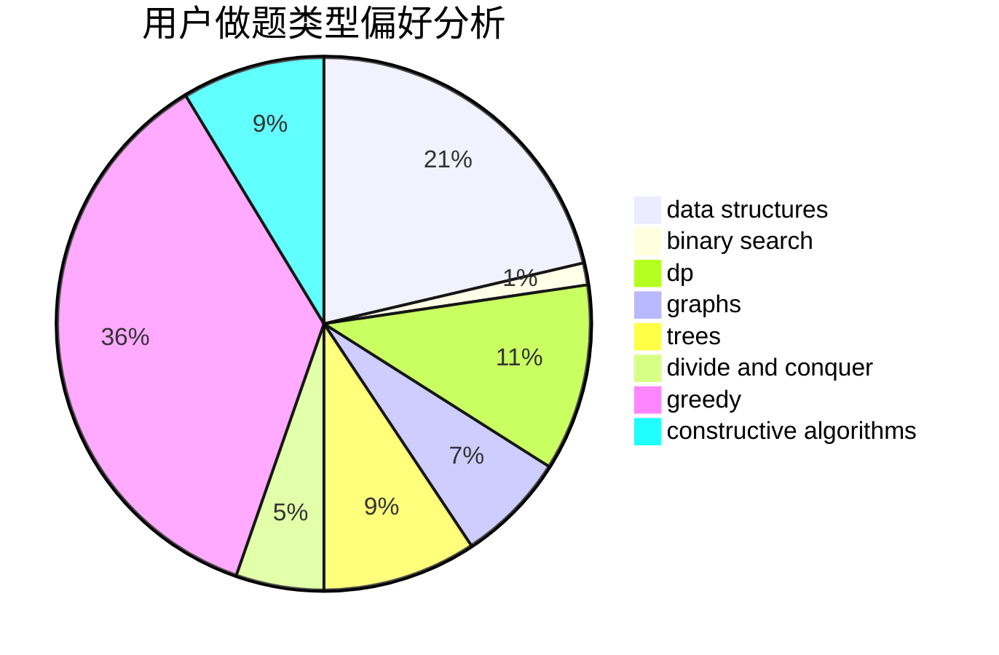

# hyta4982

<!-- tabs:start -->

#### **用户提交结果分析**

#### **用户做题类型偏好分析**

#### **用户错题知识点分析**

<!-- tabs:end -->
# 推荐题目
[1494D](https://codeforces.com/contest/1494/problem/D)		constructive algorithms,
                        data structures,
                        dfs and similar,
                        divide and conquer,
                        dsu,
                        greedy,
                        sortings,
                        trees		  
[1203F1](https://codeforces.com/contest/1203F/problem/1)		greedy		  
[160B](https://codeforces.com/contest/160/problem/B)		greedy,
                        sortings		  
[1184C2](https://codeforces.com/contest/1184C/problem/2)		data structures		  
[832C](https://codeforces.com/contest/832/problem/C)		binary search,
                        implementation,
                        math		  
[1340A](https://codeforces.com/contest/1340/problem/A)		brute force,
                        data structures,
                        greedy,
                        implementation		  
[365A](https://codeforces.com/contest/365/problem/A)		implementation		  
[23C](https://codeforces.com/contest/23/problem/C)		constructive algorithms,
                        sortings		  
[809D](https://codeforces.com/contest/809/problem/D)		data structures,
                        dp		  
[1197E](https://codeforces.com/contest/1197/problem/E)		binary search,
                        combinatorics,
                        data structures,
                        dp,
                        shortest paths,
                        sortings		  
